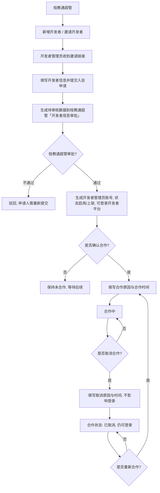
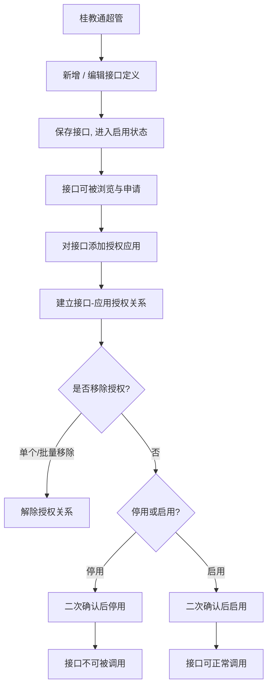
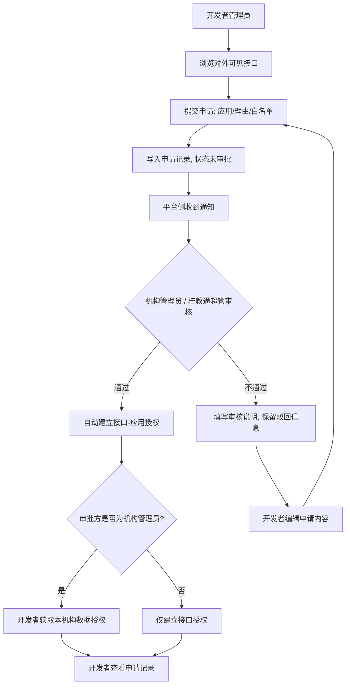
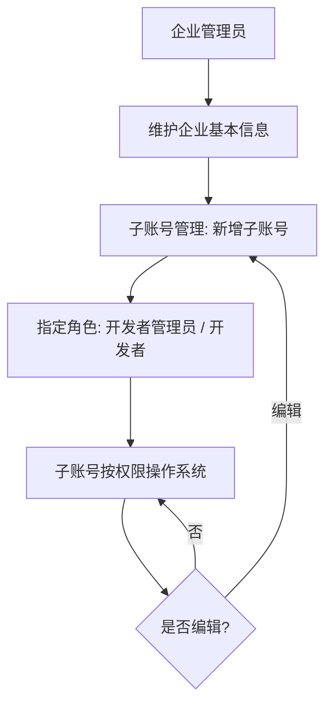
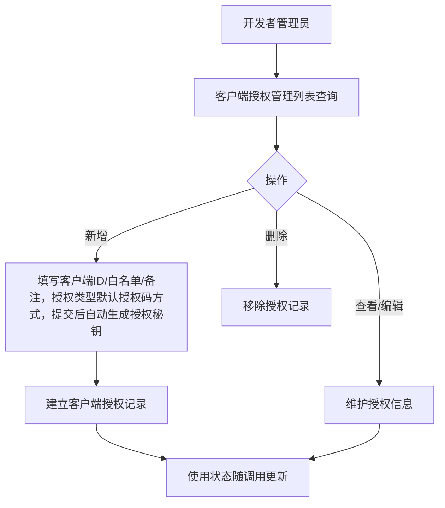
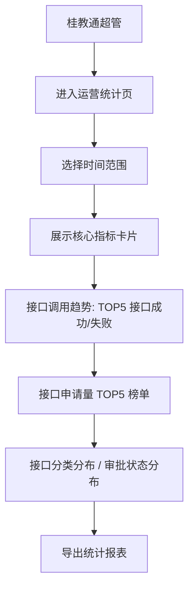
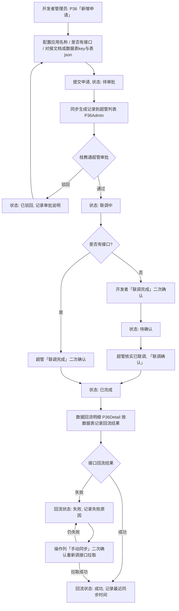

# 能力管理平台 - 设计基线

## 一、文档概述

### 1.1 项目背景

在桂教通平台上建设能力管理模块，作为平台级能力开放枢纽。支持开发者入驻 → 能力上架 → 应用授权 → 接口申请审批 → 调用 的全链路，服务三类角色：机构管理员、桂教通超管、开发者管理员。一期一次交付全部功能。

### 1.2 设计目标

- 定义完整的产品事实基线，作为 PRD 与 Prototype 的唯一事实源
- 覆盖 xlsx 原始 72 个功能点 + 对齐阶段确认的运营统计模块
- 以 8 月底上线为目标，兼顾完整性与落地效率

## 二、范围与建设方式

### 2.1 建设范围

| 模块 | 核心功能 | 涉及角色 |
|------|---------|---------|
| 开发者管理 | 开发者信息 CRUD、邀请注册、联系合作、取消/重新合作 | 桂教通超管 |
| API 接口管理 | 接口 CRUD、接口文档、应用授权、授权/取消授权、接口停用/启用 | 桂教通超管 |
| 接口能力管理 | 能力基础信息维护（新增/编辑）、能力关联接口管理（添加/移出） | 桂教通超管 |
| 接口申请与审批 | 接口申请记录、数据授权记录、申请审批/查看 | 机构管理员、桂教通超管、开发者管理员 |
| 接口调用记录 | 记录各开发者调用接口的调用流水，按接口/开发者/应用ID/调用时间/调用结果筛选 | 桂教通超管 |
| 运营统计 | 接口/开发者/应用统计看板，支持时间范围筛选和导出 | 桂教通超管 |
| 客户端授权管理 | 客户端授权 CRUD、启用/停用 | 桂教通超管 |
| 组织同步申请 | 组织同步申请新增/编辑/删除 | 机构管理员 |
| 开发者账号 | 企业信息管理、企业子账号管理 | 开发者管理员 |
| 开发者接口管理 | 接口列表、文档、申请、申请记录 | 开发者管理员 |
| 接口数据申请管理 | 应用查看/新增、接口申请记录（P08）、数据授权记录（P08Auth）、应用授权关联（应用ID、suiteKey 由桂教通体系提供） | 开发者管理员 |
| 数据回流管理 | 数据回流申请新增、列表查看（含对接文档预览）、联调完成标记、范围配置（API接口对接文档/无接口数据表key与表json）；桂教通超管侧审批与联调确认、数据回流明细台账 | 开发者管理员、桂教通超管 |

### 2.2 明确不做

| 类别 | 项目 | 原因 |
|------|------|------|
| 基础能力 | 登录/认证/注册/密码管理 | 复用桂教通用户体系 |
| 基础能力 | 组织架构/机构树/部门管理 | 复用桂教通组织体系 |
| 基础能力 | 消息通知基础通道 | 复用桂教通消息中心 |
| 基础能力 | 操作审计/操作日志基础能力 | 复用桂教通审计模块 |
| 基础能力 | 角色权限管理（角色定义/菜单分配/数据权限） | 复用桂教通 RBAC 体系 |
| 基础能力 | 门户首页/前台展示 | 复用桂教通门户 |
| 本次不建 | 应用密钥（AppSecret）自管体系 | 应用及其密钥由桂教通开发者应用体系提供，能力管理仅做应用查看、新增关联与授权，不自建密钥管理与轮换 |
| 本次不建 | 接口调用限流/熔断执行 | 调用量配额参数在接口（最大调用量）与申请（按接口维度配置最大调用量/日）中配置，限流执行与熔断由网关侧负责，一期不建独立限流模块 |
| 本次不建 | 租户管理（租户 CRUD/导入机构学校） | 一期不建，复用桂教通租户体系；确认合作时由桂教通自动创建租户 |
| 本次不建 | 数据同步（双向同步/签字授权/AppKey 分配） | 一期不建，不在本期能力管理建设范围 |
| 本次不建 | 在线调试/Swagger UI | 一期不建 |
| 本次不建 | 沙箱/测试环境 | 一期不建 |

### 2.3 建设方式

**类型：iteration（在桂教通平台上扩展）**

挂载点：
- 桂教通超管 → 超管后台 → 能力管理
- 机构管理员 → 组织中心 → 能力管理
- 开发者管理员 → 开发者后台 → 接口管理

侧栏菜单结构（二级，不含一级包裹）：

| 角色 | 侧栏顶层菜单 | 二级菜单项 |
|------|-------------|-----------|
| 机构管理员 | 数据授权记录 | 数据授权记录（P08Auth，顶层菜单） |
| 机构管理员 | 组织同步申请 | 组织同步申请（P32，与数据授权记录同层级，顶层菜单） |
| 桂教通超管 | 开发者管理 | 开发者管理（P01）、开发者信息审批（P01a） |
| 桂教通超管 | 能力管理 | API接口管理（P04）、接口能力管理（P35）、接口分类管理（P04a）、应用管理（P28All，查看所有厂商应用并执行接口/数据授权、取消授权）、接口调用记录（P27）、运营统计（P13） |
| 桂教通超管 | 授权管理 | 客户端授权管理（P30）、数据回流管理（P36Admin）、数据回流明细（P36Detail） |
| 开发者管理员 | 账号管理 | 企业信息管理（P16）、企业子账号管理（P17） |
| 开发者管理员 | 接口管理 | API接口管理（P19） |
| 开发者管理员 | 接口数据申请管理 | 应用管理（P28）、接口申请记录（P08）、数据授权记录（P08Auth） |
| 开发者管理员 | 数据回流管理 | 数据回流管理（P36） |
| 桂教通超管 | 审批管理 | 接口申请审批（P08，原「接口申请记录」入口迁移至本菜单并更名）、组织同步审批（P41） |

## 三、角色定义

| 角色 | 职责 | 数据范围 | 入口 |
|------|------|---------|------|
| 机构管理员 | 处理本机构数据授权的申请审批：查看数据授权记录（P08Auth）、审批（P09Auth）、查看（P10Auth）；组织同步申请（P32）新增/编辑/删除（草稿、已驳回可编辑，草稿可删除） | 本机构数据授权申请数据、本机构的组织同步申请数据 | 组织中心 → 能力管理 |
| 桂教通超管 | 管理全平台能力：开发者管理、接口管理、应用管理（P28All，查看所有厂商应用并执行接口授权/数据授权/取消授权）、客户端授权管理、接口申请审批（P08，位于审批管理下）、组织同步审批（P41，审批机构管理员提交的组织同步申请，通过后自动生成客户端授权记录）、运营统计、数据回流管理（P36Admin，审批/联调完成/联调确认）、数据回流明细（P36Detail，台账查看） | 全平台数据 | 超管后台 → 开发者管理 / 能力管理 / 授权管理 / 审批管理 |
| 开发者管理员 | 开发者方管理员：企业信息维护、子账号管理、两步申请（先接口申请后数据授权，接口申请记录与数据授权记录均位于接口数据申请管理菜单下）、数据回流申请（P36）与联调完成 | 本企业数据 | 开发者后台 → 接口管理 / 接口数据申请管理 / 数据回流管理 |

## 四、模块定义

### 4.1 开发者管理模块

- **职责**：覆盖开发者从入驻邀请到合作全生命周期管理，包括开发者信息审批（入驻申请与企业信息变更）、开发者信息维护、合作状态变更
- **包含页面**：开发者列表页、开发者信息审批页、新增/编辑开发者页、开发者详情页
- **涉及角色**：桂教通超管（全平台开发者）
- **关键规则**：新增开发者或邀请方式提交的入驻信息、开发者通过企业信息提交的变更，均生成待审核数据，经桂教通超管审批通过后才生效（入驻申请通过后生成开发者管理员账号，方可登录开发者平台）

### 4.2 API 接口管理模块

- **职责**：覆盖机构自建 API 接口的全生命周期管理，包括接口分类定义、接口定义、接口文档、应用授权
- **包含页面**：接口分类管理页、接口列表页、新增/编辑接口页、接口文档查看页、接口信息查看页、应用授权页
- **涉及角色**：桂教通超管（全平台接口）

### 4.2a 接口能力管理模块

- **职责**：维护平台接口能力维度，支持能力基础信息（名称、说明）的增删改，以及能力-接口关联关系的添加与移出
- **包含页面**：接口能力管理页（P35，左右分栏：左侧能力列表 + 右侧关联接口列表）、新增/编辑能力页（P35Form，新界面，能力说明必填+富文本编辑器，内容铺满容器）、能力详情页（P35View，只读查看界面，富文本按图文样式渲染，内容铺满容器）
- **涉及角色**：桂教通超管（全平台能力）

### 4.3 接口申请与审批模块

- **职责**：管理外部开发者对平台接口的申请记录与审批流程（两步流程第一步）
- **包含页面**：接口申请记录/审批页（P08，开发者侧菜单「接口申请记录」、桂教通超管侧菜单「审批管理 → 接口申请审批」）、数据授权记录页（P08Auth）、接口申请审批页（P09）、数据授权审批页（P09Auth）、接口申请记录查看页（P10）、数据授权记录查看页（P10Auth）
- **涉及角色**：机构管理员、桂教通超管、开发者管理员
- **关键规则**：桂教通超管审批入口调整至一级菜单「审批管理」下，入口更名「接口申请审批」（开发者侧仍为「接口申请记录」）；P08 查询条件新增「应用名称」「应用ID」

### 4.5 运营统计模块

- **职责**：提供平台运营数据看板，覆盖接口、开发者、应用多维度统计
- **包含页面**：运营统计看板页
- **涉及角色**：桂教通超管（全平台数据）

### 4.7 开发者账号模块

- **职责**：管理开发者方企业信息与子账号体系
- **包含页面**：企业信息管理页（P16）、企业子账号管理页（P17，新增子账号改为弹窗）
- **涉及角色**：开发者管理员

### 4.8 开发者接口管理模块

- **职责**：面向开发者管理员提供接口浏览、文档查看、接口申请能力
- **包含页面**：开发者接口列表页、开发者接口文档页、接口信息查看页、开发者接口申请页
- **涉及角色**：开发者管理员

### 4.10 接口调用记录模块

- **职责**：记录各开发者调用桂教通平台接口的调用流水（调用时间、接口名称、开发者名称、调用应用、应用ID、调用结果、状态码、耗时），支持按接口名称/开发者名称/应用ID/调用时间（时间区间，默认当天）/调用结果筛选（不展示调用总次数、成功、失败、成功率等汇总统计）
- **包含页面**：接口调用记录页
- **涉及角色**：桂教通超管

### 4.11 客户端授权管理模块

- **职责**：桂教通超管维护 OAuth 客户端与平台的授权关联关系（客户端ID/秘钥、授权范围、回调地址、令牌有效期），授权类型不展示、固定为 authorization_code（授权码）方式，支持启用/停用
- **包含页面**：客户端授权管理列表页（P30）、数据授权配置页（P31，新开表单）、接口授权配置页（P31B，新开表单）
- **涉及角色**：桂教通超管（菜单：授权管理 → 客户端授权管理）

> 数据授权配置（是否全部数据/同步范围类型/学校名称/机构名称/授权截止时间，已删除是否包含下级）由列表操作列「数据授权」按钮跳转数据授权配置页（P31，新开表单）维护；接口授权配置（是否全部接口/授权接口，已删除是否包含下级）由列表操作列「接口授权」按钮跳转接口授权配置页（P31B，新开表单）维护。数据授权与接口授权分开维护，二者互不耦合。「是否全部数据」选择「是」时授权数据为全区数据，不展示同步范围类型、学校名称与机构名称；选择「否」时展示。同步范围类型可多选（学校/教育局）：勾选「学校」时展示学校名称（必填，多个学校用英文分号(;)隔开，如：南宁市教育局;南宁市第三中学）；勾选「教育局」时展示机构名称（必填，多个机构用英文分号(;)隔开，如：南宁市教育局;桂林市教育局）。授权截止时间必填（时间控件，不可选择当前时间之前的时间，只能选择当前时间的三年内的时间）。「是否全部接口」选择「是」时授权的是全部接口，不展示授权接口；选择「否」时展示授权接口（弹窗多选）。列表授权范围字段由数据授权页配置拼出，未维护时为空。列表操作列「数据授权」（跳转数据授权配置页 P31）、「接口授权」（跳转接口授权配置页 P31B）与「查看」（打开「客户端信息查看」新界面 P30View，以表单文本只读展示客户端信息[含白名单、备注] + 授权信息[是否全部数据/是否全部接口/同步范围类型/学校名称/机构名称/授权接口/授权截止时间]，样式同申请记录查看 P10；无授权信息则不展示授权信息区块）。
>
> P31 新增/编辑弹窗：授权类型不展示、新增固定为 authorization_code（授权码）、编辑沿用原类型；客户端ID 新增时必填手动输入（文本，只能输入数字、英文字母和下划线）、编辑时只读展示；授权秘钥不在表单中填写，提交时系统自动生成（可在「查看」查看）；新增「白名单」（必填，多行文本输入，每行一个地址[域名或完整回调地址]，不提供协议前缀选择；支持填写 * 表示放行不限制）与「备注」（选填，最长 500 字）。授权配置页字段与规则见上段说明。

### 4.12 组织同步管理模块

- **职责**：机构管理员维护本机构的组织同步申请（新增/编辑/删除）；桂教通超管在「审批管理 → 组织同步审批」下审批机构管理员提交的组织同步申请，审批通过后自动生成客户端授权记录（含客户端ID与客户端秘钥，clientType 为「机构申请」）
- **包含页面**：组织同步申请列表页（P32，机构管理员，菜单：接口申请记录同层级的「组织同步申请」）、组织同步审批页（P41，桂教通超管，菜单：审批管理 → 组织同步审批）
- **涉及角色**：机构管理员（新增/编辑/删除）、桂教通超管（审批/查看）

> 机构管理员菜单已删除「API接口管理」一级菜单，接口申请记录（P08）提升为顶层菜单，组织同步申请（P32）与其同层级；本页面用于申请密钥，将组织中心数据同步回到桂教通组织中心。组织同步申请列表（P32）展示申请机构名称、申请机构ID、申请人、申请时间、业务系统名称、业务系统对接人、对接人联系电话、白名单、状态（审批中/已驳回/已通过/草稿）；草稿与已驳回的数据可编辑，草稿状态数据可删除；新增/编辑弹窗必填业务系统名称、业务系统对接人、对接人联系电话、白名单，白名单支持新增多个（样式交互同新增应用白名单配置），支持「保存草稿」与「提交申请」。
> 组织同步审批（P41，桂教通超管）：查询条件（申请机构名称/业务系统名称/状态）；列表展示（序号、申请机构名称、申请机构ID、申请人、申请时间、业务系统名称、业务系统对接人、对接人联系电话、白名单、状态、操作）；操作列（审核[仅审批中状态展示]、查看[所有状态]）。审核弹窗：审批结果（通过/不通过）、审批说明（不通过时必填）；通过后状态变为「已通过」，自动生成客户端ID与客户端秘钥，并同步生成一条 clientType 为「机构申请」的客户端授权记录到 P30 列表，状态为「启用」；不通过后状态变为「已驳回」。查看弹窗：以描述列表展示全部字段，含审批信息（审批人、审批时间、审批说明）与客户端凭证（客户端ID、客户端秘钥，支持复制）。白名单列以蓝色链接展示，点击可复制完整白名单地址。

### 4.14 数据回流管理模块

- **职责**：开发者管理员提交本企业的数据回流申请（列表查看、新增申请、无接口场景的联调完成标记）：有接口时上传对接文档（PDF/PPT/Word/照片）并填写认证key（加密存储）与对接域名，无接口时输入数据表key 并在表 json（JSON 编辑器 + 输出预览）中维护表结构；桂教通超管在「授权管理 → 数据回流管理」下对开发者提交的数据回流申请进行审批与联调确认（开发者与超管共享同一份数据回流数据，开发者提交后即出现在超管列表；超管本页不提供新增申请入口），并在「授权管理 → 数据回流明细」下台账式查看各开发者回流数据的明细
- **包含页面**：数据回流管理列表页（P36，开发者）、新增数据回流申请页（P36Form，新开表单，开发者/超管查看复用）、数据回流管理列表页（P36Admin，桂教通超管）、数据回流明细页（P36Detail，桂教通超管，只读台账）、回流明细查看页（P36DetailView，桂教通超管，只读）
- **涉及角色**：开发者管理员（菜单：数据回流管理 → 数据回流管理）、桂教通超管（菜单：授权管理 → 数据回流管理 / 数据回流明细）
- **状态机**：待审批（开发者提交后）→ 联调中（超管审批通过）→ 已完成；其中无接口场景：联调中 →（开发者「联调完成」）→ 待确认 →（超管核实联调成功后「联调确认」）→ 已完成；审批驳回则状态为「已驳回」
- **业务流程**：见「五、核心业务流程 → 5.7 数据回流流程」

> P36 列表（开发者）：查询条件（名称、联调状态）；列表列（名称、应用名称、是否有接口、数据表、对接文档、联调状态、申请时间）；操作列（联调完成[仅是否有接口为「否」且状态为「联调中」时展示，点击后二次确认，状态变为「待确认」]、查看）。有接口时不展示「联调完成」按钮（由超管联调完成）。对接文档列：是否有接口为「是」时展示对接文档名称列表，点击文档名弹窗预览；为「否」时展示「—」。数据表列：有接口时展示「接口对接」（对接文档独立成列）；无接口时展示数据表key（多个以英文逗号隔开，如「tbl_student_base,tbl_score_detail」）。
> P36Admin 列表（桂教通超管）：查询条件（名称、开发者名称、联调状态）；列表列（名称、应用名称、开发者名称、是否有接口、数据表、对接文档、联调状态、申请时间）；操作列（审批[待审批]、联调完成[联调中且有接口]、联调确认[待确认]、查看）；**工具栏无「新增申请」按钮**（本页不提供新增入口，开发者自行提交）。审批点击后弹窗（审批结果：通过/驳回；驳回时审批说明必填）：通过后状态变为「联调中」，驳回后状态变为「已驳回」并记录审批意见；联调完成点击后二次确认，状态变为「已完成」；联调确认点击后二次确认（确认数据已联调成功），状态变为「已完成」。数据表列：有接口时展示「接口对接」，无接口时展示数据表key（多个以英文逗号隔开，同 P36）。
> P36Form 新增页：名称（文本必填）、应用名称（下拉选择，根据应用名称模糊匹配，最多展示 30 个匹配应用，必填）、是否有接口（单选是/否）。选「是」时展示对接文档（附件上传，多附件，支持 PDF/PPT/Word/照片）与新增字段：认证key（文本必填，加密存储，查看态显示为「••••••（已加密）」）、对接域名（文本选填，需以 http:// 或 https:// 开头，否则校验不通过）。选「否」时展示同步数据表区域（多个数据表卡片，每个卡片含「数据表key」文本框[必填，英文标识]与「表 json」JSON 编辑器[工具栏含「格式化」「清空」「复制结果」，支持 Text/Tree/Table 视图，格式化将文本输出为标准 JSON 到「输出预览（只读）」框，校验未通过时预览框红字提示错误]；可添加多个数据表卡片，底部「+ 添加数据表key」按钮）。申请理由（多行文本，最多 500 字符）。免责声明（「我已阅读并同意」+ 可点击的《数据使用免责申明》链接，点击弹窗展示全文，内容同数据授权申请的免责声明，弹窗内可一键勾选同意）。超管模式（由 P36Admin 进入）额外展示「开发者」字段（下拉选择，根据开发者名称模糊匹配，最多展示 30 个，必填），提交的记录归属所选开发者；开发者模式自动带出当前开发者名称。提交校验：名称必填、应用名称必选、超管模式开发者必选、有接口时至少上传一个文档且认证key 必填（对接域名若存在须 http/https 前缀）、无接口时每个数据表卡片的数据表key 必填且表 json 为合法 JSON 对象、申请理由必填、免责声明必须勾选。提交后状态为「待审批」，并同步生成一条待审批记录到桂教通超管数据回流列表（P36Admin）；查看模式只读展示（含应用名称、开发者名称）。
> P36Detail 明细页（桂教通超管）：只读台账，按接口/数据表维度记录各开发者回流数据的明细（一个数据表记录一行）。查询条件（开发者名称、应用名称、回流状态）；列表列（序号、开发者名称、应用名称、数据表key、接口名称、同步数据量、回流状态、失败原因、最近同步时间）；操作列（手动同步、查看）。数据表key列：无接口时展示该数据表的表key（如 tbl_student_base），有接口时展示「—」；接口名称列：无接口时展示数据表key，有接口时展示「平台接口回流（对接文档）」；同步数据量列：展示本次回同步的数据条数（如「1,804 条」）；回流状态列（成功/失败，标签展示）；失败原因列（失败时红色展示原因，成功展示「—」）；最近同步时间列：未同步展示「—」，已同步展示最近一次同步时间。操作列「手动同步」：仅是否有接口为「是」且回流状态为「失败」时展示，点击二次确认弹窗（提示将手动调用接口拉取回流数据），确认后模拟调用接口并更新为「成功」、清空失败原因、刷新最近同步时间；「查看」跳转回流明细查看（P36DetailView）只读页（返回本页）。回流明细查看页（P36DetailView）：按明细行类别展示与该行一致的查看信息——接口回流展示接口名称（「平台接口回流（对接文档）」）与对接文档列表（点击「预览」弹窗查看文档图片）；数据表回流展示数据表key 与表 json（只读展示原始 JSON）；基本信息含开发者名称、应用名称、回流类别、同步数据量、回流状态（标签）、最近同步时间、失败原因（失败红色展示）；操作仅「返回」。与 P36 / P36Admin 共享同一份数据源，除手动同步更新回流结果外不修改审批状态。

### 4.15 应用管理模块

- **职责**：开发者管理员维护本企业应用（应用是两步申请的前提载体：先「接口申请」再「数据授权」）；桂教通超管在「能力管理 → 应用管理」查看所有厂商的应用，并对应用执行接口授权、数据授权与取消授权
- **包含页面**：应用管理列表页（P28，开发者）、新增/编辑/查看应用页（P29）、应用管理页（P28All，桂教通超管）、应用接口授权页（P28ApiAuth）、应用数据授权页（P28DataAuth）、应用取消授权页（P28AuthCancel）、应用授权记录查看页（P28AuthView）
- **涉及角色**：开发者管理员（新增/编辑/接口申请/授权申请/联调完成）、桂教通超管（接口授权/数据授权/取消授权/查看）
- **关键规则**：超管应用管理（P28All）与开发者应用管理（P28）为同一份应用数据（含各厂商/开发者归属），列表展示内容一致（Logo、应用名称、应用ID、suiteKey、应用分类、应用属性、适用机构、学段），超管侧另展示「开发者名称」列，**不展示「状态」列**（工具栏仍可按状态查询，应用状态机不变）；超管侧无新增应用入口（应用维护仍由对应开发者在其应用管理完成），操作列含「查看 / 接口授权 / 数据授权 / 取消授权」：查看（P28AuthView）打开该应用的授权记录查看页（只读，界面同取消授权页但不含操作列）；接口授权（P28ApiAuth）候选接口为平台对外可见且需授权（「是否需要授权=是」）的接口、保存即生效无审批；数据授权（P28DataAuth）应用名称预选只读，按当前应用维护数据授权记录（可新增/编辑/启用/停用），一次录入多个学校/机构时按机构拆分（一个学校/教育局一条记录），应用级数据授权统一在应用管理（P28All）本页维护，与应用申请审批、客户端授权（P30）等流程相互独立；取消授权（P28AuthCancel）按应用双 Tab（接口授权记录 / 数据授权记录）逐条二次确认把对应授权置为「停用」（记录保留、数据仍在，可重新启用），停用期间厂商将不可调用对应接口 / 不可获取对应机构或学校的数据

> 原授权管理下的独立「数据授权管理」入口已移除，相关数据授权能力统一在应用管理（P28All）按应用维护。

## 五、核心业务流程

### 5.1 开发者入驻与合作流程



### 5.2 API 接口授权流程



### 5.3 接口申请与审批流程



### 5.4 开发者账号与子账号管理流程



### 5.5 客户端授权管理流程



### 5.6 接口调用与运营监控流程



### 5.7 数据回流流程

开发者管理员在 P36「新增申请」填写应用名称、是否有接口（有接口上传对接文档并填写认证key与对接域名，无接口输入数据表key 并在表 json（JSON 编辑器 + 输出预览）中维护表结构）并提交，状态为「待审批」，同时同步生成一条记录到桂教通超管数据回流列表（P36Admin）；超管审批通过后进入「联调中」，有接口场景由超管「联调完成」直接进入「已完成」，无接口场景由开发者「联调完成」进入「待确认」、超管核实数据已联调成功后「联调确认」进入「已完成」；审批驳回则进入「已驳回」（记录审批说明），开发者可重新提交。回流执行结果按数据表维度记录在数据回流明细（P36Detail）：成功记录最近同步时间，失败记录失败原因；有接口回流失败时，明细页操作列出现「手动同步」，超管二次确认后重新调用接口拉取数据。




### 6.0 通用页面约定

> **列表分页**：平台所有结果列表（含页面主列表、弹窗内子列表/选择器、详情明细表）均支持分页，表格底部统一展示「共 N 条」与页码导航（上一页/页码/下一页）；切换页码、筛选或切换 Tab 后自动回到第 1 页。默认每页条数以各页面专项说明为准（多数主列表每页 20 条，审批/查看类申请接口明细每页 5 条）。

### 6.1 开发者管理模块

| 页面编号 | 页面名称 | 所属模块 | 主要功能 | 适用角色 | 信息密度 |
|---------|---------|---------|---------|---------|---------|
| P01 | 开发者列表 | 开发者管理 | 查询、查看开发者列表（审批通过即启用/上架，可登录；停用后其管理员及子账号均不可登录，取消合作不影响登录）、新增开发者、邀请开发者、操作列（查看/编辑/确认合作/启用停用） | 桂教通超管 | 中 |
| P01a | 开发者信息审批 | 开发者管理 | 审批入驻申请（新增/邀请注册提交）与企业信息变更（开发者 P16 提交）：查看（单开厂商信息界面，同开发者详情查看界面）、审批（参考接口申请审批界面布局，展示厂商信息或修改前后记录及审批意见，通过/不通过整合为一次审批）；入驻申请审批通过后生成开发者管理员账号（状态启用/上架，可登录开发者平台）并进入开发者列表，企业信息变更审批通过后修改生效 | 桂教通超管 | 轻 |
| P02 | 新增/编辑开发者 | 开发者管理 | 维护开发者信息（名称、类型、管理员、联系信息等）；新增/邀请注册提交后生成入驻申请待审核数据，审批通过后才生成开发者账号并进入开发者列表；编辑（已审批通过的开发者）直接保存 | 桂教通超管 | 中 |
| P03 | 开发者详情 | 开发者管理 | 查看开发者完整信息，含合作状态变更操作（确认合作/重新合作） | 桂教通超管 | 中 |

### 6.2 API 接口管理模块

| 页面编号 | 页面名称 | 所属模块 | 主要功能 | 适用角色 | 信息密度 |
|---------|---------|---------|---------|---------|---------|
| P04a | 接口分类管理 | API 接口管理 | 树形分类维护（新增/编辑/删除/启用/停用），最多五层，作为接口分类字段的来源 | 桂教通超管 | 轻 |
| P04 | 接口列表 | API 接口管理 | 查询、查看接口列表、新增接口、操作列（查看文档/编辑/应用授权/停用/启用） | 桂教通超管 | 中 |
| P05 | 新增/编辑接口 | API 接口管理 | 维护接口基础信息（含版本号、文档链接），单表单 | 桂教通超管 | 中 |
| P06 | 接口文档查看 | API 接口管理 | 查看接口完整文档（含请求地址、响应示例） | 桂教通超管 | 中 |
| P22 | 接口信息查看 | API 接口管理 | 只读查看接口基础信息（与新增/编辑一致，不展示审核信息） | 桂教通超管、开发者管理员 | 轻 |
| P07 | 应用授权 | API 接口管理 | 管理接口已授权应用列表，仅展示生态应用中未分配（未授权给当前接口）的授权，授权后接口数据范围=应用上架范围；添加/移除/批量移除授权 | 桂教通超管 | 中 |
| P35 | 接口能力管理 | 接口能力管理 | 左右分栏：左侧展示平台全部能力列表（卡片形式，含能力名称、能力说明摘要），顶部「新增能力」按钮（打开新增能力新界面），点击能力后高亮，鼠标经过能力项显示「详情」「编辑」按钮（分别打开能力详情新界面、编辑能力新界面）；右侧展示该能力关联的接口列表（接口名称/接口服务名称/数据敏感等级/接口路径/文档链接），顶部「添加接口」按钮，操作列「移出」（二次确认） | 桂教通超管 | 中 |
| P35Form | 新增/编辑能力 | 接口能力管理 | 新界面表单页（非弹窗，内容铺满容器）：能力名称（必填，≤20字符）+ 能力说明（必填，富文本编辑器，支持加粗/标题/列表/链接/图片等）；保存后返回来源页 | 桂教通超管 | 轻 |
| P35View | 能力详情 | 接口能力管理 | 只读查看界面（内容铺满容器）：能力名称（只读文本）+ 能力说明（富文本 HTML 按图文格式渲染，加粗/标题/列表/链接/图片等与编辑样式对应）；展示内容与编辑界面一致；返回来源页 | 桂教通超管 | 轻 |

### 6.3 接口申请与审批模块

| 页面编号 | 页面名称 | 所属模块 | 主要功能 | 适用角色 | 信息密度 |
|---------|---------|---------|---------|---------|---------|
| P08 | 接口申请记录 / 接口申请审批 | 接口申请与审批 | 两步流程第一步：记录开发者接口申请（应用名称+授权接口），查询条件含应用名称、应用ID；桂教通超管在「审批管理 → 接口申请审批」审批（开发者侧入口仍为「接口申请记录」，位于接口数据申请管理下），操作列（审批/查看），开发者可重新提交 | 桂教通超管、开发者管理员 | 轻 |
| P08Auth | 数据授权记录 | 接口申请与审批 | 单一列表展示全部记录（不再分Tab）：开发者申请的所有记录合并展示（申请时一个机构为一条数据，如一次申请输入四个机构则生成四条授权记录，含未审批/已审批/已驳回），列表字段含申请时间、审批时间、授权截止时间、审批状态。排序规则：未审批记录优先，未审批与已审批均按最新时间优先。操作列审批[机构管理员，仅未审批]/查看 | 机构管理员、开发者管理员 | 中 |
| P09 | 接口申请审批 | 接口申请与审批 | 桂教通超管审批接口申请：申请信息 + 申请接口列表（最大调用量/日可编辑，最终值以审批时填写为准，文档链接蓝色超文本展示，分页每页5条）+ 审批意见 | 桂教通超管 | 中 |
| P09Auth | 数据授权审批 | 接口申请与审批 | 机构管理员审批数据授权：申请信息 + 申请接口列表（最大调用量/日只读，以接口申请审批时填写为准，文档链接蓝色超文本展示，分页每页5条）+ 机构授权凭证上传 + 审批意见 | 机构管理员 | 中 |
| P10 | 接口申请记录查看 | 接口申请与审批 | 查看接口申请信息 + 申请接口列表（只读，文档链接蓝色超文本展示，分页每页5条），已审批时展示审批信息 | 桂教通超管、开发者管理员 | 中 |
| P10Auth | 数据授权记录查看 | 接口申请与审批 | 查看数据授权申请信息 + 申请接口列表（最大调用量只读，文档链接蓝色超文本展示，分页每页5条）；审批信息以列表展示（机构名称/审批人/审批状态/审批说明/审批时间/授权凭证[机构管理员审批时上传的附件，支持预览，非授权key]），对应机构未审批时展示为空；申请信息不展示审批状态 | 机构管理员、开发者管理员 | 中 |

### 6.5 运营统计模块

| 页面编号 | 页面名称 | 所属模块 | 主要功能 | 适用角色 | 信息密度 |
|---------|---------|---------|---------|---------|---------|
| P13 | 运营统计看板 | 运营统计 | 数字卡片+图表（一行两列网格），展示接口/开发者/应用统计（含应用维度统计：应用调用趋势/调用量TOP5/授权接口数分布），支持时间范围筛选和导出 | 桂教通超管 | 重（分卡片区/图表区/说明区） |

### 6.7 开发者账号模块

| 页面编号 | 页面名称 | 所属模块 | 主要功能 | 适用角色 | 信息密度 |
|---------|---------|---------|---------|---------|---------|
| P16 | 企业信息管理 | 开发者账号 | 只读展示开发者基础信息、编辑开发者完整信息（基础+财务+开票） | 开发者管理员 | 轻 |
| P17 | 企业子账号管理 | 开发者账号 | 查询（员工姓名/状态）、列表（姓名/手机号/添加时间/状态[启用/停用]）、弹窗新增、启用/停用 | 开发者管理员 | 轻 |

### 6.8 开发者接口管理模块

| 页面编号 | 页面名称 | 所属模块 | 主要功能 | 适用角色 | 信息密度 |
|---------|---------|---------|---------|---------|---------|
| P19 | 开发者接口列表 | 开发者接口管理 | 查询、浏览可查看接口列表，操作列（查看文档、查看）；查看打开接口信息查看页（P22），查看文档打开接口文档页（P06），与桂教通超管 API 接口管理（P04）查看/查看文档一致；无申请、批量申请入口，列表无多选框 | 开发者管理员 | 中 |
| P20 | 开发者接口文档 | 开发者接口管理 | 查看接口详细文档 | 开发者管理员 | 中 |
| P21 | 开发者接口申请 | 开发者接口管理 | 作为数据授权申请页（P28Apply）的基础参考；开发者接口管理入口已迁移至应用管理 P28 | 开发者管理员 | 轻 |
| P28 | 应用管理列表 | 接口数据申请管理 | 查询、浏览本企业已注册应用，操作列（编辑/查看/接口申请/授权申请/联调完成），新增应用入口 | 开发者管理员 | 中 |
| P28All | 应用管理（超管） | 能力管理 | 桂教通超管在「能力管理 → 应用管理」查看并管理所有厂商的应用（与开发者应用管理同一份数据），列表展示内容同开发者应用管理（Logo、应用名称、应用ID、suiteKey[脱敏，可点击显示]、应用分类、应用属性、适用机构、学段，**不展示状态列**），另增「开发者名称」列；查询条件（应用名称、开发者名称、状态、应用分类，状态仅用于查询）；工具栏无「新增」；操作列（查看[跳 P28AuthView 查看该应用授权记录，只读]、接口授权[跳 P28ApiAuth]、数据授权[跳 P28DataAuth]、取消授权[跳 P28AuthCancel]） | 桂教通超管 | 中 |
| P28ApiAuth | 应用接口授权 | 能力管理 | 由 P28All 操作列「接口授权」打开（超管直接授权，无审批，仅当前应用）：应用名称（只读）与所属厂商（只读）、授权接口（弹窗多选、可按接口名称/服务名搜索，候选为平台对外可见且「是否需要授权=是」的接口）、授权截止时间（时间控件必填，不可选择当前时间之前的时间，只能选择当前时间的三年内的时间）；保存即生效并写应用级接口授权记录（独立于接口申请审批 / 客户端授权 / 应用数据授权记录） | 桂教通超管 | 中 |
| P28DataAuth | 应用数据授权 | 能力管理 | 由 P28All 操作列「数据授权」打开（应用名称预选只读、所属厂商只读，按当前应用维护数据授权记录）：新增数据授权录入同步范围类型（学校/教育局可多选，勾选学校展示学校名称、勾选教育局展示机构名称，英文分号(;)隔开，可录入多个）、授权接口（弹窗多选）、授权截止时间（必填，今天~三年）；一次录入多个学校/机构按机构拆分，一个学校/教育局生成一条数据授权记录；已生成记录可编辑、启用/停用（二次确认）；应用级数据授权统一在应用管理（P28All）本页维护，与应用申请审批、客户端授权（P30）等流程相互独立 | 桂教通超管 | 中 |
| P28AuthCancel | 应用取消授权 | 能力管理 | 由 P28All 操作列「取消授权」打开（仅当前应用），两个 Tab：接口授权记录（该应用当前已授权接口，一条记录=一个接口授权：接口名称/接口服务名/数据敏感等级/授权截止时间）与数据授权记录（该应用当前数据授权记录，一条记录=一个机构（学校/教育局）的数据授权，一次数据授权录入多个机构则按机构拆分为多条：范围类型/机构名称/授权的接口/授权截止时间）；两 Tab 均含「状态（启用/停用）」列并分页（每页 5 条）；行内操作：启用状态的记录展示「取消授权」，点击二次确认后将该记录置为「停用」（**记录保留、数据仍在**，停用期间厂商不可调用对应接口 / 不可获取对应机构或学校的数据）；停用状态的记录展示「启用」，点击二次确认后可恢复为启用 | 桂教通超管 | 中 |
| P28AuthView | 应用授权记录查看 | 能力管理 | 由 P28All 操作列「查看」打开（仅当前应用，只读），界面与取消授权页（P28AuthCancel）同构但**不含「操作」列**；两个 Tab：接口授权记录（接口名称/接口服务名/数据敏感等级/授权截止时间/状态）与数据授权记录（范围类型/机构名称/授权的接口/授权截止时间/状态）；分页展示（每页 5 条），仅用于查看该应用的全部授权记录，如需取消/启用授权须在「取消授权」页面操作 | 桂教通超管 | 轻 | | 新增/编辑/查看应用 | 接口数据申请管理 | 填写应用基础信息（Logo/名称/简介/分类/数据同步/打开方式/详情介绍/视频），文本框统一占容器 65%；适用范围（机构/学段）、应用属性固定为"生态应用"且只读、可见性配置（PC/H5角色+**地址改为前缀下拉(http/https)+文本框**，独立小程序时额外展示移动端角色+移动端地址(同格式)+微信appid；**白名单配置**顶部标签仅展示可见性地址(关闭可快速添加到编辑区)，下方手动编辑区含红色删除按钮，最多5个）；查看为文本只读 | 开发者管理员 | 中 |
| P28ApplyApi | 接口申请 | 接口数据申请管理 | 两步流程第一步：为指定应用提交接口申请；界面仅展示当前选择的应用名称（只读）、授权接口（多选弹框，已选接口以分页表格展示：接口名称、接口服务名、数据敏感等级，可单独删除）、授权截止时间（时间控件必填）与免责声明（《API接口调用免责声明》为可点击链接，点击弹窗展示全文，弹窗内可一键同意）；授权接口可选范围为平台开放且需授权的接口，本开发者名下应用已申请审批通过的接口不可重复申请（在选择弹框内置灰不可勾选并提示）；提交后生成接口申请记录（P08），由桂教通超管在「审批管理 → 接口申请审批」审批；界面内容铺满容器，提交/取消按钮居中 | 开发者管理员 | 轻 |
| P28Apply | 数据授权申请 | 接口数据申请管理 | 两步流程第二步：为指定应用提交数据授权申请（内容为原接口申请）；字段：应用名称（只读）、授权接口（可选范围为本开发者名下应用已申请审批通过的接口，即接口申请经桂教通超管审批通过后的接口；多选弹框，已选接口以分页可编辑表格展示：接口名称不可编辑、最大调用量/日按接口维度可编辑）、授权截止时间（时间控件必填）、同步范围类型（学校/教育局可多选，勾选教育局时默认同步其下属机构，可改是否包含下级）、学校名称（勾选学校时展示，必填多行文本框，多个用英文分号(;)隔开）、机构名称（勾选教育局时展示，必填多行文本框，多个用英文分号(;)隔开）、是否包含下级、申请理由、免责声明（《数据使用免责申明》为可点击链接，点击弹窗展示全文，弹窗内可一键同意）；含完整提交校验（白名单已移至应用新增界面）；提交后生成数据授权记录（P08Auth），由机构管理员审批；界面内容铺满容器，提交/取消按钮居中 | 开发者管理员 | 重 |
| P30 | 客户端授权管理列表 | 授权管理 | 查询（客户端ID/客户端类型[平台授权、机构申请]/启用状态[启用、停用]）；列表数据来源两类：①平台授权（桂教通超管在 P30 新增，客户端类型默认「平台授权」）②机构申请（客户端类型为「机构申请」）：机构管理员提交组织同步申请后由桂教通超管在「审批管理 → 组织同步审批」审批，审批通过后自动生成客户端ID与客户端秘钥并同步生成该记录（审批状态为已通过、启用状态为启用）；本列表不提供审批操作；新增/编辑弹窗（客户端名称[文本必填，≤50字符]、客户端ID[仅限数字/英文字母/下划线，新增可填、编辑只读]、客户端类型[下拉：平台授权/机构申请，新增默认平台授权]、回调地址与登出后回调地址仅在客户端类型为平台授权时展示、访问令牌有效期、刷新令牌有效期、白名单、备注；授权秘钥提交后自动生成）；列表展示（客户端ID/客户端名称/客户端类型/秘钥/授权范围/白名单/授权截止时间/登出后回调地址/启用状态/访问令牌有效期/刷新令牌有效期）；操作列按客户端类型区分：平台授权→编辑/启用停用/数据授权/接口授权/查看；机构申请→启用/查看/接口授权；「查看」打开「客户端信息查看」新界面（P30View）以表单文本只读展示[含数据授权列表（同步范围类型/学校名称/机构名称/授权截止时间，仅客户端类型为「平台授权」时展示；机构申请不展示）、接口授权列表（接口名称/接口能力/数据敏感等级/查看文档[跳转接口文档查看页 P06]）]，数据授权与接口授权两个列表均支持分页（每页 5 条），样式同申请记录查看 P10）。列表不提供「申请」「审批」操作入口：平台授权类客户端由工具栏「新增」创建，机构申请类客户端由组织同步审批（P41）通过后自动生成 | 桂教通超管 | 中 |
| P31 | 数据授权配置 | 授权管理 | 新开表单页（由 P30 操作列「数据授权」跳转，携带客户端ID/密钥只读）：是否全部数据（单选是/否，选「是」时授权数据为全区数据，不展示同步范围类型/学校名称/机构名称；选「否」时展示）、同步范围类型（学校/教育局可多选，勾选学校时展示学校名称[必填多行文本框，多个学校用英文分号(;)隔开，如：南宁市教育局;南宁市第三中学]，勾选教育局时展示机构名称[必填多行文本框，多个机构用英文分号(;)隔开，如：南宁市教育局;桂林市教育局]）、授权截止时间（时间控件必填，不可选择当前时间之前，只能选择当前时间的三年内的时间）；仅维护数据授权，与接口授权分开 | 桂教通超管 | 中 |
| P31B | 接口授权配置 | 授权管理 | 新开表单页（由 P30 操作列「接口授权」跳转，携带客户端ID/密钥只读）：是否全部接口（单选是/否，选「是」时不展示授权接口，授权的是全部接口；选「否」时展示授权接口[弹窗多选]）；仅维护接口授权，与数据授权分开 | 桂教通超管 | 中 |
| P32 | 组织同步申请 | 组织同步申请 | 查询（业务系统名称/状态）；列表展示（申请机构名称/申请机构ID/申请人/申请时间/业务系统名称/业务系统对接人/对接人联系电话/白名单/状态）；操作列（编辑[草稿、已驳回]/删除[草稿]/查看[已通过且已生成客户端凭证]）；工具栏「新增」弹窗表单（业务系统名称、业务系统对接人、对接人联系电话、白名单必填，白名单支持新增多个，样式交互同新增应用白名单配置，支持保存草稿/提交申请）；「查看」打开客户端凭证弹窗：业务系统名称、客户端ID 文本只读、客户端秘钥默认脱敏（前4位 + `****` + 后4位），小眼睛图标点击切换脱敏/明文，点击秘钥串可复制 | 机构管理员 | 中 |
| P41 | 组织同步审批 | 组织同步管理 | 桂教通超管审批页：查询（申请机构名称/业务系统名称/状态）；列表展示（序号/申请机构名称/申请机构ID/申请人/申请时间/业务系统名称/业务系统对接人/对接人联系电话/白名单[蓝色链接，点击可复制]/状态[审批中/已驳回/已通过/草稿标签]/操作）；操作列（审核[仅审批中]/查看[所有状态]）。审核弹窗：审批结果（通过/不通过）、审批说明（不通过时必填）；通过后状态变为「已通过」，自动生成客户端ID与客户端秘钥，并同步生成 clientType 为「机构申请」的客户端授权记录（状态「启用」）；不通过后状态变为「已驳回」。查看弹窗：描述列表展示全部字段，含审批信息与客户端凭证（支持复制） | 桂教通超管 | 中 |

### 6.10 接口调用记录模块

| 页面编号 | 页面名称 | 所属模块 | 主要功能 | 适用角色 | 信息密度 |
|---------|---------|---------|---------|---------|---------|
| P27 | 接口调用记录 | 接口调用记录 | 按接口名称/开发者名称/应用ID/调用时间（时间区间，默认当天）/调用结果筛选；调用流水明细（调用时间、接口名称、开发者名称、调用应用、应用ID、调用结果、状态码、耗时）；不展示汇总统计 | 桂教通超管 | 中 |

### 6.11 接口数据申请管理模块

| 页面编号 | 页面名称 | 所属模块 | 主要功能 | 适用角色 | 信息密度 |
|---------|---------|---------|---------|---------|---------|
| P28 | 应用管理列表 | 接口数据申请管理 | 查询条件（应用名称/状态/分类）；列表展示（Logo/名称/ID/分类/属性/适用机构/学段/状态/操作：编辑/查看/联调完成）；新增应用入口 | 开发者管理员 | 中 |
| P29 | 新增/编辑/查看应用 | 接口数据申请管理 | 新增/编辑=四区块表单；查看=文本只读展示，区块内字段一行两列网格布局（整宽字段单独占一行），含应用信息、接入凭证（审批通过后展示应用ID与suiteKey）及审核信息（含审批意见、联调完成时间） | 开发者管理员 | 中 |

#### 应用申请完整流程

1. 开发者在 P28 新增应用 → 提交至桂教通超管审核（状态：待审批）→ 审核通过后生成 appId + SuiteKey（状态：审批通过）
2. 开发者基于该应用进行两步申请：先「接口申请」（P28→P28ApplyApi，桂教通超管审批，通过后进入数据授权）→ 再「授权申请」（P28→P28Apply，机构管理员审批，通过后获取数据授权）；同时进行 SSO 单点对接
3. 对接完成 → 开发者点击"联调完成" → 状态置为"已完成"（联调完成即终态），记录联调完成时间

> 超管的审核在现有应用中心完成，不在本平台内。

#### P28 页面设计要点

- 列表列：Logo(70px)、应用名称(120px)、应用ID(80px)、suiteKey(脱敏,小眼睛图标,170px)、应用分类(100px)、应用属性(130px)、适用机构(120px)、学段(90px)、状态(100px,标签)、操作(280px,固定右侧)
- 状态以 el-tag 展示，状态集合：待审批(warning)、审批通过(success)、已驳回(danger)、已完成(success)
- 操作列：
  - 编辑：仅状态为"待审批"或"已驳回"时显示，跳 P29 编辑（表单同新增）
  - 查看：始终显示，跳 P29 查看（文本只读）
  - 接口申请：始终显示，跳 P28ApplyApi 接口申请页（应用名称只读 + 授权接口选择 + 授权截止时间必填，提交后生成接口申请记录 P08，桂教通超管审批）
  - 授权申请：始终显示，跳 P28Apply 数据授权申请页（原应用接口申请完整表单，新增授权截止时间必填，学校名称/机构名称按同步范围类型分别展示，提交后生成数据授权记录 P08Auth，机构管理员审批）
  - 联调完成：仅状态为"审批通过"时显示，二次确认"确认联调完成？"后记录联调完成时间，状态置为"已完成"（联调完成即终态）
- 工具栏：查询条件 + 重置 + "新增应用"按钮

#### P29 页面设计要点

- 三种模式：新增（无 appId）、编辑（appId+mode=edit，表单同新增）、查看（appId+mode=view，文本只读）
- 新增/编辑：四个 card 区块，每个带标题分隔线
- 基础信息区：Logo(picture-card上传)、名称(20字限+计数)、简介(100字限+textarea)、分类(下拉)、数据同步(radio)、打开方式(checkbox多选)、详情介绍(富文本工具栏+B/I/U/图片/视频/超链接，容器 width:100% 避免横向滚动)、视频(drag拖拽上传最多5个≤10MB)
- 适用范围区：机构(checkbox:学校/上级单位)、学段(radio:所有学段/部分学段→展开grade checkbox)
- 应用属性区：固定为"生态应用"且只读（不可修改）
- 可见性配置区：PC端角色(checkbox组)+**PC端地址**(前缀下拉http/https+文本框，仅PCweb时显)；H5角色(checkbox组)+**H5地址**(同格式，仅H5时显)；独立小程序时额外展示移动端角色+**移动端地址**(同格式)+微信appid；**白名单配置**顶部以标签（Tag）形式展示默认回填项（仅展示，不自动追加到编辑列表，关闭标签可快速添加到下方编辑区），下方为手动编辑区（协议下拉 + 域名输入 + 红色"删除"文字按钮），底部"+ 新增白名单"为 plain 按钮；提示最多可配置 5 个白名单地址（含默认回填）
- 查看区：按区块以"标签+文本"展示；含三块：基础信息、接入凭证（仅状态为审批通过/已完成时展示，含应用ID与suiteKey）、审核信息（审批结果/意见/时间、联调完成时间）
- 容器宽度控制：所有 card 与根节点设置 `max-width:100%; box-sizing:border-box`，`.page-wrap` 增加 `overflow-x:hidden`，消除新增/编辑页横向滚动条

### 6.12 数据回流管理模块

| 页面编号 | 页面名称 | 所属模块 | 主要功能 | 适用角色 | 信息密度 |
|---------|---------|---------|---------|---------|---------|
| P36 | 数据回流管理列表（开发者） | 数据回流管理 | 查询条件（名称/联调状态）；列表展示（名称/应用名称/是否有接口/数据表/对接文档/联调状态/申请时间）；对接文档列：是否有接口为「是」时展示文档名，点击弹窗预览，为「否」时展示「—」；数据表列：有接口时展示「接口对接」，无接口时展示数据表key（多个以英文逗号隔开）；操作列（联调完成[仅是否有接口为「否」且状态为「联调中」时展示，点击二次确认后状态变为「待确认」]、查看），工具栏「新增申请」跳转 P36Form | 开发者管理员 | 中 |
| P36Admin | 数据回流管理列表（桂教通超管） | 数据回流管理 | 查询条件（名称/开发者名称/联调状态）；列表展示（名称/开发者名称/是否有接口/数据表[有接口时「接口对接」，无接口时展示数据表key（多个以英文逗号隔开）]/对接文档[有接口时点击弹窗预览]/联调状态/申请时间）；操作列（审批[待审批，弹窗选择通过/驳回，驳回时审批说明必填，通过→联调中，驳回→已驳回]、联调完成[联调中且有接口，点击二次确认→已完成]、联调确认[待确认，点击二次确认→已完成]、查看）；**工具栏无「新增申请」按钮**（本页不提供新增入口）；与开发者共享同一份数据，开发者提交的申请自动出现在本列表 | 桂教通超管 | 中 |
| P36Detail | 数据回流明细（桂教通超管） | 数据回流管理 | 只读台账，按接口/数据表维度记录各开发者回流数据的明细（一个数据表一行）；查询条件（开发者名称/应用名称/回流状态）；列表展示（序号/开发者名称/应用名称/数据表key/接口名称[无接口为数据表key，有接口为「平台接口回流（对接文档）」]/同步数据量[本次回流同步数据条数]/回流状态[成功/失败标签]/失败原因[失败红色展示，成功「—」]/最近同步时间[未同步「—」]）；操作列（手动同步[有接口且回流状态为失败时展示，二次确认弹窗调用接口拉取数据，确认后更新为成功并刷新最近同步时间]、查看[跳转回流明细查看 P36DetailView 并返回本页]）；与 P36/P36Admin 共享同一份数据源，手动同步仅更新回流结果不改审批状态 | 桂教通超管 | 中 |
| P36DetailView | 回流明细查看（桂教通超管） | 数据回流管理 | 只读页，按明细行类别展示与该行一致的查看信息；基本信息（开发者名称/应用名称/回流类别[接口回流/数据表回流]/同步数据量/回流状态[标签]/最近同步时间/失败原因[失败红色展示]）；类别内容：接口回流（接口名称「平台接口回流（对接文档）」、对接文档列表[点击「预览」弹窗查看文档图片]），数据表回流（数据表key、表 json[只读展示原始 JSON]）；操作仅「返回」 | 桂教通超管 | 低 |
| P36Form | 新增/查看数据回流申请 | 数据回流管理 | 新开表单页：名称（文本必填）、应用名称（下拉选择，根据应用名称模糊匹配，最多展示 30 个匹配应用，必填）、是否有接口（单选是/否）。选「是」展示对接文档（附件上传，多附件，支持PDF/PPT/Word/照片）与新增字段：认证key（文本必填，加密存储，查看态显示「••••••（已加密）」）、对接域名（文本选填，需以 http:// 或 https:// 开头）；选「否」展示同步数据表区域（多个数据表卡片，每个含「数据表key」文本框[必填，英文标识]与「表 json」JSON 编辑器[工具栏含「格式化」「清空」「复制结果」，支持 Text/Tree/Table 视图，格式化将文本输出为标准 JSON 到「输出预览（只读）」框，校验未通过时预览框红字提示错误]；可添加多个数据表卡片，底部「+ 添加数据表key」按钮）。申请理由（多行文本，最多500字符）。免责声明（「我已阅读并同意」+ 可点击的《数据使用免责申明》链接，点击弹窗展示全文，内容同数据授权申请，弹窗内可一键勾选同意）。超管模式（由 P36Admin 进入）额外展示「开发者」字段（下拉选择，根据开发者名称模糊匹配，最多展示 30 个，必填），记录归属所选开发者；开发者模式自动带出当前开发者。提交校验：有接口时至少上传一个文档且认证key 必填（对接域名若存在须 http/https 前缀）、无接口时每个数据表卡片的数据表key 必填且表 json 为合法 JSON 对象。提交后状态为「待审批」，同时生成待审批记录到超管列表（P36Admin）。查看时全表单只读展示（含应用名称、开发者名称）；开发者查看返回 P36，超管查看返回 P36Admin。 | 开发者管理员、桂教通超管 | 中 |

> 无接口数据表key+表json 交互：「是否有接口」选择「否」时展开同步数据表区域；每个数据表卡片含「数据表key」文本框（必填，英文标识）与「表 json」JSON 编辑器（工具栏含「格式化」「清空」「复制结果」，支持 Text/Tree/Table 视图，格式化将文本输出为标准 JSON 到「输出预览（只读）」框，校验未通过时预览框红字提示错误）；可添加多个数据表卡片，底部「+ 添加数据表key」按钮。「是」时展示对接文档与认证key（加密存储）、对接域名（http/https 前缀）。
> 状态机：待审批（开发者提交）→ 联调中（超管审批通过）→ 已完成；无接口场景：联调中 →（开发者联调完成）→ 待确认 →（超管联调确认）→ 已完成；驳回则进入「已驳回」。
> 列表数据表列：有接口时展示「接口对接」（对接文档独立成列）；无接口时展示数据表key（多个以英文逗号隔开，如「tbl_student_base,tbl_score_detail」）。

## 七、字段定义

### 7.1 开发者相关字段

#### 7.1.1 基础信息字段

| 字段 | 类型 | 长度 | 必填 | 默认值 | 枚举值 | 格式 | 业务来源 | 说明 |
|------|------|------|------|--------|--------|------|----------|------|
| 开发者名称 | string | 100 | 是 | — | — | — | 用户输入 | 企业或个人名称 |
| 开发者类型 | string | 10 | 是 | 企业 | 企业、个人 | — | 用户选择 | 开发者主体类型 |
| 法人代表 | string | 50 | 是 | — | — | — | 用户输入 | 企业法定代表人姓名 |
| 管理员 | string | 50 | 是 | — | — | — | 用户输入 | 开发者管理员姓名，列表脱敏展示 |
| 管理员手机号 | string | 11 | 是 | — | — | 11位数字 | 用户输入 | 开发者管理员手机号，列表脱敏展示 |
| 是否归属公海 | boolean | — | 是 | 否 | 是、否 | — | 用户选择 | 是否属于公海开发者 |
| 统一社会信用代码 | string | 18 | 是 | — | — | 18位统一编码 | 用户输入 | 企业统一社会信用代码 |
| 开发者logo | file | — | 是 | — | — | 100×100px, ≤2M | 用户上传 | 开发者标识图片，单张 |
| 营业执照 | file | — | 是 | — | — | jpg/jpeg/png/bmp, ≤500KB | 用户上传 | 营业执照扫描图片，支持多图 |
| 工商注册地址 | string | 500 | 是 | — | — | — | 用户输入 | 工商登记的注册地址 |
| 详细地址 | string | 500 | 是 | — | — | — | 用户输入 | 开发者详细办公地址 |
| 增值税一般纳税人 | boolean | — | 是 | — | 是、否 | — | 用户选择 | 是否为增值税一般纳税人 |
| 开发者简介 | string | 500 | 是 | — | — | — | 用户输入 | 开发者业务简要介绍 |
| 公司电话 | string | 20 | 是 | — | — | — | 用户输入 | 公司座机或联系电话 |
| 营业期限 | date | — | 是 | — | — | YYYY-MM-DD | 用户选择 | 营业执照到期日 |
| 状态 | string | 6 | 是 | 启用 | 启用、停用 | — | 系统记录 | 开发者是否可登录（停用后管理员及子账号不可登录） |
| 合作状态 | string | 10 | 是 | 未合作 | 未合作、合作中、已取消 | — | 系统记录 | 当前合作状态 |
| 是否在门户展示 | boolean | — | 否 | false | — | — | 用户选择 | 是否在门户展示开发者信息 |
| 申请日期 | datetime | — | 是 | 当前时间 | — | YYYY-MM-DD HH:mm | 系统生成 | 开发者信息创建时间 |

#### 7.1.2 合作状态变更字段

| 字段 | 类型 | 长度 | 必填 | 默认值 | 枚举值 | 格式 | 业务来源 | 说明 |
|------|------|------|------|--------|--------|------|----------|------|
| 合作原因 | string | 500 | 是 | — | — | — | 用户输入 | 确认合作时填写 |
| 合作时间 | datetime | — | 是 | — | — | YYYY-MM-DD | 用户选择 | 确认合作的时间 |
| 取消合作原因 | string | 500 | 是 | — | — | — | 用户输入 | 取消合作时填写 |
| 取消合作时间 | datetime | — | 是 | — | — | YYYY-MM-DD | 用户选择 | 取消合作的时间 |
| 重新合作原因 | string | 500 | 是 | — | — | — | 用户输入 | 重新合作时填写 |
| 重新合作时间 | datetime | — | 是 | — | — | YYYY-MM-DD | 用户选择 | 重新合作的时间 |

#### 7.1.3 财务信息字段（选填）

| 字段 | 类型 | 长度 | 必填 | 默认值 | 枚举值 | 格式 | 业务来源 | 说明 |
|------|------|------|------|--------|--------|------|----------|------|
| 银行类别 | string | 50 | 否 | — | — | — | 用户输入 | 开户银行分类 |
| 开户行名称 | string | 100 | 否 | — | — | — | 用户输入 | 开户支行全称 |
| 开户行账号 | string | 50 | 否 | — | — | — | 用户输入 | 银行账号 |
| 账户用途 | string | 100 | 否 | — | — | — | 用户输入 | 账户主要用途说明 |

#### 7.1.4 开票信息字段（选填）

| 字段 | 类型 | 长度 | 必填 | 默认值 | 枚举值 | 格式 | 业务来源 | 说明 |
|------|------|------|------|--------|--------|------|----------|------|
| 单位地址 | string | 200 | 否 | — | — | — | 用户输入 | 开票单位地址 |
| 纳税人识别号 | string | 20 | 否 | — | — | — | 用户输入 | 纳税人识别号 |
| 电话号码 | string | 20 | 否 | — | — | — | 用户输入 | 开票联系电话 |
| 开户银行 | string | 100 | 否 | — | — | — | 用户输入 | 开票开户银行 |
| 银行账户 | string | 50 | 否 | — | — | — | 用户输入 | 开票银行账户 |
| 联行号 | string | 20 | 否 | — | — | — | 用户输入 | 银行联行号 |

### 7.2 API 接口相关字段

| 字段 | 类型 | 长度 | 必填 | 默认值 | 枚举值 | 格式 | 业务来源 | 说明 |
|------|------|------|------|--------|--------|------|----------|------|
| 接口名称 | string | 20 | 是 | — | — | — | 用户输入 | 接口的中文名称 |
| 接口服务名 | string | 50 | 是 | — | — | 英文/数字/下划线，不含中文 | 用户输入 | 接口的服务标识 |
| 数据敏感等级 | string | 10 | 是 | — | 敏感接口、非敏感接口 | — | 用户选择 | 接口的数据敏感等级 |
| 接口平台 | string | 20 | 是 | — | 桂教通平台、第三方平台 | — | 用户选择 | 接口所属平台来源 |
| 授权方式 | string（多选） | 20 | 是 | — | 个人、机构 | — | 用户多选 | 接口的授权主体类型，可多选 |
| 返回数据加密 | string | 4 | 否 | 否 | 是、否 | — | 系统强制 | 数据敏感等级为「敏感接口」时强制为「是」且不可改，敏感接口返回数据须加密传输 |
| 备注 | string | 500 | 否 | — | — | — | 用户输入 | 接口备注说明，多行文本 |
| 最大调用量/日 | int | — | 是 | 10000 | — | 正整数 | 用户输入 | 接口每日最大允许调用次数 |
| 接口请求方式 | string | 10 | 是 | — | POST、GET | — | 用户单选 | 支持的 HTTP 方法，单选 |
| 是否需要授权 | boolean | — | 是 | — | — | — | 用户选择 | 调用是否需要授权 |
| 是否机构审批 | boolean | — | 是 | — | — | — | 用户选择 | 申请时流程是否需要机构审批 |
| 接口请求地址 | string | 200 | 是 | — | — | URL格式 | 用户输入 | 对外暴露的请求地址 |
| 版本号 | string | 20 | 是 | — | — | — | 用户输入 | 接口版本号，如 v1.0 |
| 文档链接 | string | 200 | 是 | — | — | URL超链接（前缀 https://） | 用户输入 | 接口文档链接 |
| 是否对外可见 | boolean | — | 是 | — | — | — | 用户选择 | 是否对开发者平台可见 |
| 接口状态 | string | 10 | 是 | 启用 | 启用、停用 | — | 系统记录 | 接口当前运行状态 |
| 请求路径 | string | 200 | 是 | — | — | — | 系统生成 | 接口的完整请求路径 |


### 7.2.1 接口分类管理字段

分类在接口分类管理页（P04a）维护，作为接口的"接口分类"字段（见 7.2）的引用来源。

| 字段 | 类型 | 长度 | 必填 | 默认值 | 枚举值 | 格式 | 业务来源 | 说明 |
|------|------|------|------|--------|--------|------|----------|------|
| 分类ID | int | — | 是 | — | — | — | 系统生成 | 分类唯一标识 |
| 分类名称 | string | 50 | 是 | — | — | — | 用户输入 | 分类显示名称 |
| 父级分类ID | int | — | 否 | — | — | — | 系统引用 | 父级分类标识，顶级分类为空 |
| 分类编码 | string | 50 | 是 | — | — | — | 用户输入 | 分类全局唯一编码 |
| 排序 | int | — | 否 | 0 | — | 非负整数 | 用户输入 | 同级显示顺序，数值越小越靠前 |
| 分类状态 | string | 10 | 是 | 启用 | 启用、停用 | — | 用户选择 | 分类是否可用 |
| 层级 | int | — | 是 | 1 | — | 1-5 | 系统记录 | 分类在树中的层级，最高五层 |

### 7.3 接口申请与数据授权相关字段

| 字段 | 类型 | 长度 | 必填 | 默认值 | 枚举值 | 格式 | 业务来源 | 说明 |
|------|------|------|------|--------|--------|------|----------|------|
| 申请接口名称 | string | 20 | 是 | — | — | — | 系统引用 | 被申请的接口（多个接口列表） |
| 申请理由 | string | 500 | 否 | — | — | — | 用户输入 | 申请使用接口的原因说明 |
| 最大调用量/日 | int | 8 | 是 | — | — | 正整数 | 用户输入（按接口维度） | 按接口维度分别设置，每个接口各自的最大调用次数上限 |
| 文档链接 | string | 200 | 否 | — | — | URL | 系统引用 | 接口文档地址，在接口能力管理关联接口列表（P35）、接口申请审批（P09）/查看（P10）、数据授权审批（P09Auth）/记录查看（P10Auth）的接口列表中蓝色超文本展示，点击新窗口打开 |
| 同步范围类型 | string | 20 | 是 | 学校 | 学校、教育局 | 逗号分隔可多选 | 用户多选 | 本批次接口调用的同步范围，勾选"教育局"时默认同步其下属机构 |
| 学校名称 | string | 500 | 是（同步范围类型含"学校"时必填） | — | — | 多个学校用英文分号（;）隔开 | 用户输入（多行文本） | 数据授权申请（P28Apply）、客户端授权配置（P31）、应用数据授权（P28DataAuth）勾选「学校」时展示，同步覆盖的学校名称，按名称精确匹配其机构管理员 |
| 机构名称 | string | 500 | 是（同步范围类型含"教育局"时必填） | — | — | 多个机构用英文分号（;）隔开 | 用户输入（多行文本） | 数据授权申请（P28Apply）、客户端授权配置（P31）、应用数据授权（P28DataAuth）勾选「教育局」时展示；同步覆盖的机构名称，按名称精确匹配其机构管理员 |
| 是否包含下级 | string | 2 | 否（同步范围类型含"教育局"时必填） | 是 | 是、否 | — | 用户单选 | 勾选"教育局"时默认同步教育局的下属机构，选择"否"仅同步该教育局本级；仅影响数据范围，审批/待办仍只推送至所列机构管理员 |
| 授权截止时间 | date | — | 是 | — | — | YYYY-MM-DD（时间控件） | 用户选择 | 授权到期时间；接口申请（P28ApplyApi）、数据授权申请（P28Apply）、客户端授权配置（P31）、应用接口授权（P28ApiAuth）、应用数据授权（P28DataAuth）均必填；不可选择当前时间之前的时间，最长不超过当前时间三年 |
| 是否全部数据 | string | 2 | 是 | 否 | 是、否 | — | 用户单选 | 客户端授权配置（P31）专用；选择「是」时授权数据为全区数据，不展示同步范围类型、学校名称与机构名称；选择「否」时展示并必填 |
| 是否全部接口 | string | 2 | 是 | 否 | 是、否 | — | 用户单选 | 客户端授权配置（P31）专用；选择「是」时授权的是全部接口，不展示授权接口；选择「否」时展示授权接口（弹窗多选）并必填 |
| 免责声明已同意 | bool | 1 | 是 | false | true、false | — | 用户勾选 | 必须阅读并同意对应免责声明方可提交：接口申请为《API接口调用免责声明》，数据授权申请与数据回流申请为《数据使用免责申明》 |
| 白名单 | string | 500 | 是 | — | — | 每条含前缀 http/https + 域名，可多条，至少一条 | 用户输入（结构化） | 允许调用的开发者域名白名单，必填 |
| 白名单前缀 | string | 5 | 是 | https | http、https | — | 用户选择 | 每条白名单的前缀协议 |
| 白名单域名 | string | 253 | 是 | — | — | 合法域名，可含端口 | 用户输入 | 可调用该接口的开发者域名，支持多条 |
| 应用ID | string | 50 | 是 | — | — | — | 系统引用 | 申请方的应用ID |
| 接口分类 | string | 20 | 是 | — | — | — | 系统引用 | 接口所属分类，来源接口分类管理 |
| 开发者名称 | string | 100 | 否 | — | — | — | 系统引用 | 申请方开发者 |
| 审批状态 | string | 10 | 是 | 未审批 | 未审批、已审批、已驳回 | — | 系统记录 | 申请当前审批状态 |
| 审批意见 | string | 10 | 是 | — | 通过、不通过 | — | 用户选择 | 审批结论 |
| 审批说明 | string | 500 | 否 | — | — | — | 用户输入 | 不通过时必填，说明原因 |
| 审批人 | string | 50 | 否 | — | — | — | 系统记录 | 执行审批的操作人 |
| 审批时间 | datetime | — | 否 | — | — | YYYY-MM-DD HH:mm | 系统记录 | 审批完成时间 |
| 授权key | string | 32 | 否 | — | — | 应用 suiteKey | 系统生成 | 审批通过时取申请应用对应的 suiteKey 作为授权 key，列表脱敏展示，小眼睛可查看完整值 |

### 7.4 授权相关字段

| 字段 | 类型 | 长度 | 必填 | 默认值 | 枚举值 | 格式 | 业务来源 | 说明 |
|------|------|------|------|--------|--------|------|----------|------|
| 应用名称 | string | 100 | 是 | — | — | — | 桂教通应用体系 | 被授权应用的名称 |
| 应用属性 | string | 20 | 否 | — | 生态应用、原生应用/低代码应用、原生应用/自建应用 | — | 桂教通应用体系 | 应用的属性分类 |

### 7.5 开发者账号相关字段

| 字段 | 类型 | 长度 | 必填 | 默认值 | 枚举值 | 格式 | 业务来源 | 说明 |
|------|------|------|------|--------|--------|------|----------|------|
| 企业名称 | string | 100 | 是 | — | — | — | 用户输入 | 开发者企业全称 |
| 企业联系人 | string | 50 | 是 | — | — | — | 用户输入 | 企业联系人姓名 |
| 企业联系电话 | string | 20 | 是 | — | — | — | 用户输入 | 企业联系电话 |
| 子账号名称 | string | 50 | 是 | — | — | — | 用户输入 | 子账号登录名 |
| 子账号角色 | string | 20 | 是 | — | — | — | 用户选择 | 子账号权限角色 |

### 7.7 通用字段（非页面落点，内部字段）

| 字段 | 原因 |
|------|------|
| 开发者 ID | 内部关联主键，不在页面展示 |
| 接口 ID | 内部关联主键，不在页面展示 |
| 申请 ID | 内部关联主键，不在页面展示 |
| 企业 ID | 内部关联主键，不在页面展示 |
| 子账号 ID | 内部关联主键，不在页面展示 |
| 创建人 | 审计字段，系统留痕 |
| 更新人 | 审计字段，系统留痕 |
| 更新时间 | 审计字段，系统留痕 |

## 八、页面与字段落点

### P01 — 开发者列表

| 区域/动作 | 字段 |
|------|------|
| 查询条件 | 开发者名称、开发者类型 |
| 页面提示 | 列表上方提示"本列表展示审批通过的开发者（审批通过即启用/上架，可登录开发者平台）；停用后其开发者管理员及对应子账号均不可登录开发者平台，取消合作不影响登录" |
| 列表展示 | 开发者名称、开发者类型、管理员（脱敏+小眼睛）、管理员手机号（脱敏+小眼睛）、合作状态、状态（启用/停用）、是否在门户展示、申请日期 |
| 操作列—查看 | 跳转开发者详情页 |
| 操作列—编辑 | 跳转编辑开发者页（已审批通过的开发者均可编辑，直接保存生效） |
| 操作列—确认合作 | 弹窗确认合作 |
| 操作列—启用/停用 | 二次确认后切换状态（停用后其管理员及子账号不可登录开发者平台） |
| 操作列—分配应用 | 合作中时可操作；弹窗展示所有生态应用列表（应用名称、应用ID、应用分类），支持多选，确认后分配给该开发者 |
| 新增开发者按钮 | 跳转新增开发者页 P02（表单字段量大，含基础信息/财务信息/开票信息三个可折叠区）；提交后生成入驻申请待审核数据 |
| 邀请开发者按钮 | 弹窗提示"邀请链接已复制，可将此链接发给开发商进行注册；开发商注册提交的入驻信息需经审批通过后，方可登录开发者平台"（蓝色对勾图标），底部按钮"我知道了"关闭弹窗、"查看链接"在新浏览器页签中打开新增开发者页 P02（无头部导航栏和侧栏） |

### P01a — 开发者信息审批

| 区域/动作 | 字段 |
|------|------|
| 页面提示 | 顶部提示"新增开发者或邀请注册提交的入驻信息、开发者修改企业信息提交的变更申请，均在此审批；入驻申请审批通过后生成开发者管理员账号，方可登录开发者平台" |
| 查询条件 | 申请类型（全部/入驻申请/企业信息变更） |
| 列表展示 | 开发者名称、申请类型（标签：入驻申请/企业信息变更）、提交时间、申请来源（新增/邀请注册/企业信息变更）、状态（待审核）、操作（查看/审批） |
| 查看 | 单开厂商信息界面（新页面），厂商信息以只读表单（form-item）方式展示，内容同开发者管理的查看界面（P03 只读）：入驻申请展示提交的入驻信息（开发者名称、开发者类型、是否归属公海、统一社会信用代码、法人代表、管理员、管理员手机号、公司电话、营业期限、是否在门户展示、工商注册地址、详细地址、开发者简介、营业执照[简介下方一行多图，文件名下方展示]）；企业信息变更展示当前（变更前）厂商信息；仅查看，不提供审批操作 |
| 审批 | 打开新界面，布局参考「接口申请审批」（P09）：顶部申请信息（开发者名称、申请类型、申请来源、提交时间、审批状态）；入驻申请展示厂商信息（同查看界面，只读表单 form-item 方式），企业信息变更展示修改前后记录对照表（变更字段/原值/新值）；底部审批意见（通过/不通过单选）与审批说明（不通过时必填），提交审批后按结论执行：通过 → 入驻申请生成开发者管理员账号（可登录开发者平台）并进入开发者列表（P01）/ 企业信息变更覆盖生效，申请从待审核列表移除；不通过 → 驳回，申请从待审核列表移除，入驻/修改不生效（申请人可重新提交） |

### P02 — 新增/编辑开发者

页面为三段可折叠区表单，分基础信息（必填集中）、财务信息（选填）、开票信息（选填）。

**邀请链接 standalone 模式**：当通过邀请链接打开时，页面不展示头部导航栏和侧栏，提交成功后展示成功图文提示，不显示返回按钮。

| 区域/动作 | 字段 |
|------|------|
| 折叠区 1：基础信息 | 开发者名称*、是否归属公海*、开发者类型*、统一社会信用代码*、法人代表*、管理员*、管理员手机号*、开发者logo*（与营业执照同行）、营业执照*（与logo同行）、工商注册地址*、详细地址*、增值税一般纳税人*、开发者简介*、公司电话*、营业期限*、是否在门户展示（单选：是/否） |
| 折叠区 2:财务信息（选填） | 银行类别、开户行名称、开户行账号、账户用途 |
| 折叠区 3:开票信息（选填） | 单位地址、纳税人识别号、电话号码、开户银行、银行账户、联行号 |
| 页面提示（新增模式） | 新增模式（非 standalone）顶部提示"提交的入驻信息将生成待审核数据，经桂教通超管在「开发者信息审批」中审批通过后，才生成开发者管理员账号并展示在开发者列表" |
| 底部操作 | 保存（校验基础信息全部必填项）、返回（standalone 模式下无返回按钮）；新增/邀请注册提交后生成入驻申请待审核数据；编辑（已审批通过的开发者）直接保存生效 |
| 成功提示（standalone 模式） | 圆形渐变背景 + 白色对勾图标（图文）+ 提示文案"恭喜您已提交入驻申请，麻烦您耐心等待桂教通超管审批，审批通过后即可登录开发者平台"。 |

### P03 — 开发者详情

展示方式从描述列表改为表单只读模式，分两个可折叠区：开发者基础信息、合作信息。

| 区域/动作 | 字段 |
|------|------|
| 折叠区 1：开发者基础信息（只读表单） | 开发者名称、开发者类型、法人代表、统一社会信用代码、管理员姓名（脱敏+小眼睛）、管理员手机号（脱敏+小眼睛）、工商注册地址、详细地址、公司电话、营业期限、增值税一般纳税人、是否公海、开发者简介、开发者logo（图片展示）、营业执照（多图展示）、是否在门户展示、申请日期 |
| 折叠区 2：合作信息（只读表单） | 合作状态、状态（启用/停用）、合作时间、合作原因、取消合作时间、取消合作原因、重新合作时间、重新合作原因 |
| 确认合作操作 | 确认合作按钮 → 弹窗（合作原因*、合作时间*） |
| 重新合作操作 | 重新合作按钮 → 弹窗（重新合作原因*、重新合作时间*），已取消才可操作 |

### P04a — 接口分类管理

| 区域/动作 | 字段 |
|------|------|
| 查询条件 | 分类名称、分类状态（启用/停用） |
| 树形列表 | 分类名称、分类编码、排序、分类状态 |
| 操作列 | 新增子分类、编辑、启用/停用（弹窗二次确认）、删除（弹窗二次确认） |
| 新增顶级分类按钮 | 弹窗新增顶级分类，父级分类为空 |
| 新增/编辑弹窗 | 父级分类（树形选择，选填，顶级可不选）、分类名称*（文本）、分类编码*（文本，全局唯一不可重复）、排序（数字，选填，默认 0，非负整数） |
| 提交操作 | 校验必填项与分类编码唯一性；所选父级已达第五层时禁止新增子分类并提示 |

> 树形分类最多五层；删除分类时该分类须无子分类且未被接口引用，删除前二次确认；分类停用后本分类及其子孙分类不可再被接口选用，已选用接口不受影响。

### P04 — 接口列表

| 区域/动作 | 字段 |
|------|------|
| 查询条件 | 接口名称、数据敏感等级、接口平台 |
| 列表展示 | 序号、接口名称、请求路径、接口平台、数据敏感等级、最大调用量/日、接口状态 |
| 操作列—查看文档 | 跳转接口文档查看页（P06） |
| 操作列 | 编辑、应用授权、停用/启用（弹窗二次确认） |
| 新增按钮 | 桂教通超管可见，跳转新增接口页 |

> 桂教通超管对全平台接口（含平台接口）拥有完整管理权限（新增/编辑/应用授权/停用启用）；本页不提供批量授权，单个接口的授权应用在操作列「应用授权」（P07）中维护。
> 机构管理员不访问本页（机构管理员的接口审批、数据授权、组织同步入口见 P08/P08Auth/P32）；开发者接口列表（P19）不提供申请与批量申请入口（见 P19 章节）。

### P05 — 新增/编辑接口

| 区域/动作 | 字段 |
|------|------|
| 接口基础信息 | 接口名称*、接口服务名*、数据敏感等级*（敏感接口/非敏感接口）、接口分类*（单选，来源接口分类管理）、接口平台*（下拉选择：桂教通平台/第三方平台）、授权方式*（多选，必填，枚举：个人/机构）、返回数据加密（数据敏感等级为「敏感接口」时强制为「是」且不可改，否则不展示）、版本号*（文本框，如 v1.0）、最大调用量/日*（数字输入框，正整数，必填）、接口请求方式*、是否需要授权*（radio 必选：是/否，标记调用时是否需要申请才可使用）、是否机构审批*（radio 必选：是/否，标记申请时流程是否需要机构审批）、接口请求地址*（全局唯一，重复时禁止保存）、文档链接（前缀 https:// + 文本框，非必填，与"是否对外可见"同处一行）、是否对外可见*（radio 必选：是/否）、备注（多行文本，最多 500 字符，非必填）；注：「接口签名类型」「调用身份」字段已删除 |
| 提交操作 | 保存（校验必填字段） |

### P06 — 接口文档查看

| 区域/动作 | 字段 |
|------|------|
| 蓝色文档头 | 接口名称（大标题）、使用场景描述（接口名称+服务名） |
| 权限说明表格 | 权限项（应用白名单、用户凭证、机构凭证）、说明、备注 |
| 请求信息 | 请求方式（GET/POST HTTPS）、请求地址（可点击超链接） |
| 提示文字 | 全量查询注意事项、推荐请求地址 |
| 返回参数表格 | 基础返回字段（errcode/errmsg）与 data 对象字段 |
| 请求示例 | 代码块展示完整请求示例 |
| 返回示例 | JSON 代码块展示返回数据示例 |

### P22 — 接口信息查看

| 区域/动作 | 字段 |
|------|------|
| 接口基础信息（只读） | 接口名称、接口服务名、数据敏感等级、接口分类、接口平台、授权方式、返回数据加密、版本号、最大调用量/日、接口请求方式、是否需要授权、是否机构审批、接口请求地址、文档链接、是否对外可见、备注 |
| 返回操作 | "返回"回来源列表（从 P04 进入回 P04，从 P19 进入回 P19，默认开发者回 P19、超管/机构回 P04） |

### P07 — 应用授权

| 区域/动作 | 字段 |
|------|------|
| 页面标题 | 接口名称（只读展示） |
| 查询条件 | 应用名称、应用ID |
| 已授权应用列表 | 多选框、应用ID、应用名称、应用属性、数据范围（应用上架范围，格式"适用机构 / 适用学段"）；仅展示生态应用中未分配（未授权给当前接口）的 |
| 操作列—移除授权 | 弹窗二次确认 |
| 添加授权按钮 | 弹窗选择应用（仅展示生态应用中未分配的；左侧表格：应用名称、应用ID、应用属性，支持搜索和分页多选；右侧已选面板：展示已选应用列表，可逐项 × 移除）；确认后系统自动将应用上架范围作为接口拉取的数据范围 |
| 批量移除授权按钮 | 弹窗展示已选应用名称，确认移除 |

### P08 — 接口申请记录（两步流程第一步）

| 区域/动作 | 字段 |
|------|------|
| 定位 | 记录开发者从应用管理（P28）「接口申请」提交的接口申请（仅含应用名称与授权接口）；开发者侧菜单名「接口申请记录」，桂教通超管侧更名「接口申请审批」并迁移至一级菜单「审批管理」下审批 |
| 查询条件 | 应用名称、应用ID、接口名称、审批状态（未审批/已审批/已驳回） |
| 列表展示 | 应用名称、开发者名称（桂教通超管可见）、授权接口、申请时间、授权截止时间、审批状态 |
| 操作列—审批 | 跳转接口申请审批页（P09）（仅未审批数据，桂教通超管可见） |
| 操作列—查看 | 跳转接口申请记录查看页（P10） |
| 操作列—重新提交 | 开发者对已驳回记录可重新提交，跳转接口申请页（P28ApplyApi）并带出原应用与授权接口 |
| 排序规则 | 最新未审批数据排最前 |

### P08Auth — 数据授权记录（两步流程第二步）

| 区域/动作 | 字段 |
|------|------|
| 定位 | 记录开发者从应用管理（P28）「授权申请」提交的数据授权申请（含数据范围、机构、最大调用量），由机构管理员审批；审批通过后开发者获取数据授权 |
| 页面结构 | 单一列表展示全部记录（含未审批/已审批/已驳回），不再分Tab |
| 查询条件 | 接口名称、应用ID、审批状态（未审批/已审批/已驳回） |
| 拆分规则 | 申请时一个机构为一条数据：一次申请可输入多个机构名称（英文分号分隔），提交后按机构拆分生成多条授权记录，每条记录机构名称为单个机构 |
| 列表展示 | 应用名称、同步数据范围、机构名称（单机构）、申请理由、申请时间、审批时间、授权截止时间、审批状态 |
| 操作列—审批 | 跳转数据授权审批页（P09Auth）（仅未审批数据，机构管理员可见） |
| 操作列—查看 | 跳转数据授权记录查看页（P10Auth）（审批通过的记录操作仅「查看」） |
| 驳回后重新申请 | 数据授权记录被驳回后，开发者可重新通过应用管理（P28）操作列「授权申请」打开数据授权申请页（P28Apply）发起新的数据授权申请 |
| 排序规则 | 未审批记录优先展示，未审批与已审批均按最新时间（申请时间/审批时间）优先 |

### P09 — 接口申请审批（桂教通超管）

| 区域/动作 | 字段 |
|------|------|
| 定位 | 桂教通超管审批接口申请；接口申请仅申请当前应用可调用的接口，不涉及数据范围；各接口最大调用量/日由审批时填写，最终值以审批通过时填写为准 |
| 页面布局 | 先展示"申请信息"区块，再展示"申请接口"列表（位于申请信息下方） |
| 申请信息（只读表单） | 应用名称、开发者名称、申请时间、授权截止时间、审批状态 |
| 申请接口列表 | 接口名称、接口服务名、接口平台、数据敏感等级、接口分类、最大调用量/日（可编辑，正整数，必填）、文档链接（蓝色超文本展示，点击新窗口打开接口文档）；分页展示，每页默认 5 条 |
| 审批操作 | 审批意见*（通过/不通过）、审批说明（占满宽度，不通过时必填） |
| 提交操作 | 提交审批（各接口最大调用量/日以本次审批填写为准）；通过后申请状态变为已审批，开发者可对该应用发起数据授权申请；不通过时开发者可在接口申请记录中重新提交 |

### P09Auth — 数据授权审批（机构管理员）

| 区域/动作 | 字段 |
|------|------|
| 定位 | 机构管理员审批数据授权；审批通过后开发者获取本机构数据授权，可调用接口获取数据 |
| 页面布局 | 先展示"申请信息"区块，再展示"申请接口"列表（位于申请信息下方） |
| 申请信息（只读表单） | 应用名称、开发者名称、同步范围类型、机构名称、是否包含下级、授权截止时间、申请理由、白名单域名 |
| 申请接口列表 | 接口名称、接口服务名、接口平台、数据敏感等级、接口分类、最大调用量/日（按接口维度只读展示，以接口申请审批时填写为准）、文档链接（蓝色超文本展示，点击新窗口打开接口文档）；分页展示，每页默认 5 条 |
| 审批操作 | 审批意见*（通过/不通过）、审批说明（占满宽度，不通过时必填）、机构授权凭证（非必填，图片上传，支持多个，单个图片不可超过 10MB） |
| 提交操作 | 提交审批；审批通过时系统自动取申请应用对应的 suiteKey 作为授权key，并标记开发者已获取本机构数据授权（可获取数据）；机构授权凭证随审批记录留存 |
| 授权key 生成规则 | 授权key = 申请应用 suiteKey（如 app_1003 → gjt_7d2e9a1c4b8f3056） |
| 数据授权 | 机构管理员审批通过即生效：开发者获得当前机构的数据授权，可调用接口获取数据；机构授权凭证随审批记录留存 |

### P10 — 接口申请记录查看

| 区域/动作 | 字段 |
|------|------|
| 定位 | 接口申请记录的只读查看页（桂教通超管 / 开发者） |
| 页面布局 | 先展示"申请信息"区块，再展示"申请接口"列表（位于申请信息下方） |
| 申请信息（文本只读） | 应用名称、开发者名称、申请时间、授权截止时间、审批状态 |
| 申请接口列表 | 接口名称、接口服务名、接口平台、数据敏感等级、接口分类、文档链接（蓝色超文本展示，点击新窗口打开接口文档）；分页展示，每页默认 5 条 |
| 审批信息（审批状态为已审批时展示） | 审批人、审批时间、审批意见、审批说明 |

### P10Auth — 数据授权记录查看

| 区域/动作 | 字段 |
|------|------|
| 定位 | 数据授权记录的只读查看页（机构管理员 / 开发者） |
| 页面布局 | 先展示"申请信息"区块，再展示"申请接口"列表（位于申请信息下方） |
| 申请信息（文本只读） | 应用名称、开发者名称、同步范围类型、机构名称、是否包含下级、授权截止时间、申请理由、白名单域名、申请时间（不展示审批状态） |
| 申请接口列表 | 接口名称、接口服务名、接口平台、数据敏感等级、接口分类、最大调用量/日（按接口维度只读展示）、文档链接（蓝色超文本展示，点击新窗口打开接口文档）；分页展示，每页默认 5 条 |
| 审批信息（列表展示，按机构逐条） | 机构名称、审批人、审批状态、审批说明、审批时间、授权凭证（机构管理员审批时上传的附件，点击可预览，非授权key）；对应机构未审批时相关字段展示为空 |

### P13 — 运营统计看板

| 区域/动作 | 字段 |
|------|------|
| 时间范围筛选 | 今日/近7天/近30天/自定义时间范围 |
| 数字卡片区 | 共 7 张卡片：接口总数、接口申请量、接口授权量、开发者总数、已授权应用数、应用调用总次数、应用调用成功率；仅展示当前统计值，不含下钻明细 |
| 图表区排版 | 图表按一行两列网格排列：每行 2 个图表卡片，共 3 行 6 个图表，依次为接口调用趋势、接口申请量 TOP5 排行榜、接口分类分布、应用调用趋势、应用调用量 TOP5 排行榜、应用授权接口数分布 |
| 接口分类分布区 | 按接口分类（基础服务/业务服务/数据服务）展示接口数量分布 |
| 接口调用趋势区 | 横坐标为接口名称，统计申请量 TOP5 接口的调用量，区分成功数（蓝）与失败数（红）堆叠展示，悬停 tooltip 显示「接口名：成功X，失败Y，共Z」；时间范围切换联动：今日取当日量，近7天/近30天/自定义取近7天累计量 |
| 接口申请量 TOP5 排行榜 | 按申请量降序列出 TOP5 接口（接口名称 + 申请量 + 占比进度条） |
| 应用维度统计区 | 以"应用"为聚合维度展示三类统计：①应用调用趋势区（TOP5 应用成功/失败堆叠调用量，悬停 tooltip 同接口维度）；②应用调用量 TOP5 排行榜（应用名+调用次数+占比进度条）；③应用授权接口数分布（应用名+授权接口数+占比进度条）；时间范围口径与接口维度一致 |
| 统计口径说明区 | 说明各维度统计口径与时间范围统计方式：时间范围口径（今日=自然日；近7天/近30天=不含今日的最近N个自然日；自定义=所选起止日期含首尾）；存量指标（接口总数、开发者总数、已授权应用数、接口分类分布、应用调用总次数、应用调用成功率）取当前实时值不随时间范围变化；期间指标（接口申请量、接口授权量、接口申请量TOP5）按所选时间范围统计，今日取当日、近7天/近30天取区间累计、自定义取所选区间累计；接口调用趋势统计TOP5接口在所选时间范围内的成功/失败调用量；应用维度统计以"应用"为聚合维度统计TOP5应用的成功/失败调用量、调用量榜单、各应用授权接口数，时间范围口径与接口维度一致 |
| 维度统计说明区 | 解释各统计维度的聚合口径与用途：①接口维度（面向单个接口，覆盖接口总数/分类分布/申请量TOP5/调用趋势，识别高频与异常接口）；②开发者维度（面向开发者，覆盖开发者总数/接口授权量，掌握生态开发者结构）；③应用维度（面向授权应用，覆盖已授权应用数/应用调用总次数/应用调用成功率及三类应用统计，识别高活跃应用） |
| 导出按钮 | 导出当前统计报表 |

### P16 — 企业信息管理

| 区域/动作 | 字段 |
|------|------|
| 查看模式（只读） | 基础信息：企业LOGO（单图展示），开发者名称、开发者类型、是否归属公海、统一社会信用代码、法人代表、管理员、管理员手机号、增值税一般纳税人、公司电话、营业期限、工商注册地址、详细地址、是否在门户展示、开发者简介（纯文本只读，与邀请开发者填写的基础信息一致）、营业执照（位于开发者简介下方，多个执照一行展示，含文件名） |
| 编辑模式 | 开发者完整信息 = 基础信息（含企业LOGO、营业执照上传位于开发者简介下方，其余同查看可编辑，新增是否在门户展示选填）+ 财务信息（银行类别、开户行名称、开户行账号、账户用途）+ 开票信息（单位地址、纳税人识别号、电话号码、开户银行、银行账户、联行号） |
| 提交操作 | 编辑后不直接生效，提交生成企业信息变更待办到桂教通超管「开发者信息审批」；校验必填项与手机号/信用代码格式通过后，提示「编辑已提交，待桂教通超管在『开发者信息审批』中审批通过后生效」 |
| 待审批状态 | 存在待审批的企业信息变更时，查看模式顶部提示「存在待桂教通超管审批的企业信息修改申请」，编辑按钮置灰不可编辑 |
| 审批生效 | 桂教通超管在「开发者信息审批」（P01a）审批：审批通过→企业信息更新生效；审批不通过→本次编辑不生效，企业信息维持原状，可重新编辑提交 |

### P17 — 企业子账号管理

| 区域/动作 | 字段 |
|------|------|
| 查询条件 | 员工姓名、状态（启用/停用） |
| 列表展示 | 员工姓名、员工手机号、添加时间、状态（启用/停用） |
| 操作列—启用/停用 | 二次确认后切换状态（停用后该子账号不可登录开发者平台） |
| 新增子账号按钮 | 弹窗填写：员工姓名*（文本）、员工手机号*（文本，校验11位手机号格式），保存后状态默认为启用 |
### P19 — 开发者接口列表（API接口管理）

| 区域/动作 | 字段 |
|------|------|
| 查询条件 | 接口名称、数据敏感等级（敏感接口/非敏感接口）、接口平台（桂教通平台/第三方平台）、接口分类 |
| 列表展示 | 序号、接口名称、请求路径、接口平台、数据敏感等级、最大调用量/日、接口状态（接口维度，与桂教通超管 API 接口管理 P04 一致） |
| 操作列—查看文档 | 跳转接口文档查看页（P06，与桂教通超管一致） |
| 操作列—查看 | 跳转接口信息查看页（P22，只读展示接口完整信息，与桂教通超管一致） |
| 备注 | 开发者管理员可见全部对外可见接口；仅提供查看/查看文档，无申请、批量申请入口，列表无多选框；查看/查看文档与超管 P04 完全一致 |

### P20 — 开发者接口文档

| 区域/动作 | 字段 |
|------|------|
| 蓝色文档头 | 接口名称（大标题）、使用场景描述（接口名称+服务名） |
| 权限说明表格 | 权限项（应用白名单、用户凭证、机构凭证）、说明、备注 |
| 请求信息 | 请求方式（GET/POST HTTPS）、请求地址（可点击超链接） |
| Query参数表格 | 蓝色表头，固定首行 access_token（接口调用凭证，必填），下方展示接口自有参数（参数名、类型、必填、说明） |
| 提示文字 | 全量查询注意事项 |
| 返回参数表格 | 两张表格——第一张基础返回字段（errcode/errmsg）；第二张完整返回结构含 data 对象及其子字段 |
| 请求示例 | 代码块展示完整请求示例 |
| 返回示例 | JSON 代码块展示返回数据示例 |

### P21 — 开发者接口申请

| 区域/动作 | 字段 |
|------|------|
| 接口信息展示 | 接口名称、接口服务名（只读引用） |
| 申请表单 | 应用名称*（下拉选择，开发者仅展示已申请且通过审核的应用；其他角色展示全部应用）、白名单*（至少一条；每条含前缀下拉 http/https + 域名文本框，支持动态新增多条）、申请理由 |
| 提交操作 | 弹窗二次确认"确认提交该接口的申请？提交后将进入审批流程"，确认后提交成功并提示，返回来源列表 |
| 备注 | 本页作为数据授权申请页（P28Apply）的基础参考；开发者接口列表（P19）不再提供申请入口 |

## 九、规则与状态定义

### 9.1 开发者合作状态机

```text
[未合作] ──确认合作──→ [合作中] ──取消合作──→ [已取消]
                           ↑                    │
                           └──重新合作───────────┘
```

- 入驻审批通过后：生成开发者管理员账号（状态启用/上架，可登录开发者平台）并进入开发者列表；确认合作仅记录合作状态（合作原因、合作时间），不涉及登录权限变更
- 停用开发者：其开发者管理员及对应子账号均不可登录开发者平台；启用后恢复登录
- 取消合作后：不影响登录权限（仍可登录），仅停用状态会影响登录
- 重新合作后：合作状态回到合作中，登录权限不受影响

> 注：开发者详情页（P03）不提供"取消合作"按钮，取消合作仅可在开发者列表（P01）操作。

### 9.2 接口状态机

```text
[启用] ←──→ [停用]
```

- 停用/启用前均需弹窗二次确认
- 停用后接口不可被调用，已授权应用不受影响但调用失败

### 9.3 接口申请与数据授权状态机

```text
[未审批] ──审批──→ [已审批]
[已审批] ──审批不通过──→ [已驳回]
```

- 接口申请（P08）与数据授权（P08Auth）共用该状态机
- 审批结论：通过/不通过；不通过时审批说明必填
- 接口申请审批通过（桂教通超管）：各接口最大调用量/日以审批通过时填写为准，开发者可对该应用发起数据授权申请，不直接建立授权
- 数据授权审批通过（机构管理员）：为申请方应用建立接口授权关系，授权 key 取申请应用对应 suiteKey
- 驳回后开发者管理员可重新编辑重新提交
- 上线/下线操作需二次确认

### 9.4 组织同步申请状态机

```text
[草稿] ──提交──→ [审批中] ──审批通过──→ [已通过]
  ↑                    │
  └──────编辑保存──────┘
[审批中] ──审批不通过──→ [已驳回] ──编辑重新提交──→ [审批中]
```

- 状态：草稿、审批中、已通过、已驳回
- 草稿、已驳回可编辑；草稿可删除（二次确认）；已驳回编辑后可重新提交进入审批
- 审批结论：通过/不通过，不通过时审核说明必填
- 通过后：为该机构开通对应业务系统的组织同步授权，系统自动生成客户端ID与客户端秘钥；机构管理员在 P32 操作列「查看」弹窗查看凭证（秘钥脱敏可切换明文、点击秘钥串可复制）

### 9.5 应用状态机（P28/P29）

```text
[待审批] ──超管审批通过──→ [审批通过] ──联调完成──→ [已完成]
    │
    └──超管审批驳回──→ [已驳回] ──编辑重新提交──→ [待审批]
```

- 状态：待审批、审批通过、已驳回、已完成
- 审批通过后开发者应用管理展示接入凭证（suiteKey 脱敏可查看）；驳回时审批说明必填
- 联调完成仅审批通过状态可操作，二次确认后直接变为已完成（应用上线），无超管联调验证与上架环节；已完成即终态

### 9.6 客户端授权状态机（P30/P31）

```text
[启用] ──停用（二次确认）──→ [停用] ──启用──→ [启用]
```

- 状态：启用、停用
- 停用需二次确认；停用后该客户端不可再调用授权接口；启用后恢复调用权限

### 9.7 数据回流状态机（P36/P36Admin）

```text
[待审批] ──超管审批通过──→ [联调中] ──联调完成──→ [已完成]
    │                       │
    │                       └─开发者联调完成──→ [待确认] ──超管联调确认──→ [已完成]
    └──超管审批驳回──→ [已驳回] ──编辑重新提交──→ [待审批]
```

- 状态：待审批、联调中、待确认、已完成、已驳回
- 待审批 → 联调中：超管审批通过；待审批 → 已驳回：超管审批驳回（审批说明必填），已驳回可编辑后重新提交
- 联调中 → 待确认：开发者「联调完成」（仅是否有接口为「否」时展示，二次确认）
- 联调中 → 已完成：超管「联调完成」（仅联调中且有接口时展示，二次确认）
- 待确认 → 已完成：超管「联调确认」（二次确认）

### 9.8 开发者信息审批状态机（P01a）

```text
[待审批] ──审批通过──→ [已通过]
    │
    └──审批驳回（审批说明必填）──→ [已驳回] ──重新提交/重新编辑提交──→ [待审批]
```

- 状态：待审批、已通过、已驳回
- 审批通过：入驻申请类生成开发者管理员账号，企业信息变更类使修改生效
- 审批驳回：入驻申请类申请人需重新提交，企业信息变更类维持原企业信息、可重新编辑提交

### 9.9 业务规则

| 规则编号 | 规则内容 | 触发条件 | 适用范围 |
|---------|---------|---------|---------|
| R01 | 开发者管理员姓名和手机号在列表中脱敏展示，点击小眼睛可查看完整 | 列表渲染 | 开发者列表 |
| R02 | 已审批通过的开发者均可编辑，编辑保存直接生效（不走入驻申请审批） | 编辑操作 | 开发者管理 |
| R03 | 合作状态为"未合作"的开发者可直接确认合作（无"确认联系"前置环节） | 确认合作按钮 | 开发者管理 |
| R04 | 入驻审批通过后开发者管理员可登录开发者平台（租户体系复用桂教通）；确认合作仅记录合作状态（合作原因、合作时间），不涉及登录权限变更 | 入驻审批通过、确认合作完成 | 开发者管理 |
| R05 | 取消合作不影响登录权限（开发者管理员及子账号仍可登录）；仅"停用"状态会导致开发者管理员及对应子账号不可登录开发者平台，启用后恢复登录 | 取消合作完成、启用/停用 | 开发者管理 |
| R06 | 接口新增时参数列表至少有一条记录 | 提交校验 | 接口管理 |
| R07 | 接口授权仅允许选择本机构/平台的应用 | 添加授权弹窗 | 授权管理 |
| R08 | 接口申请记录/数据授权记录按最新未审批数据排最前 | 列表排序 | 申请记录 |
| R09 | 审批不通过时审批说明必填 | 提交校验 | 审批 |
| R10 | 数据授权审批通过后系统自动为申请方建立接口授权关系 | 数据授权审批通过 | 数据授权 |
| R11 | 驳回后申请人可重新编辑并重新提交 | 驳回操作 | 接口申请/数据授权 |
| R12 | 数据授权审批通过后授权 key 取申请应用对应的 suiteKey | 数据授权审批通过 | 数据授权 |
| R13 | 接口最大调用量/日以接口申请审批通过时填写为准，数据授权审批界面只读展示 | 数据授权审批（P09Auth） | 接口申请/数据授权 |
| R14 | 接口分类树最多五层，所选父级已达第五层时禁止新增子分类 | 新增子分类 | 接口分类管理 |
| R15 | 分类编码全局唯一，重复时禁止保存 | 新增/编辑分类提交 | 接口分类管理 |
| R16 | 删除分类须无子分类且未被接口引用；分类停用后其分类（含子孙）不可再被接口选用 | 删除/启停操作 | 接口分类管理 |
| R19 | 开发者数据授权记录审批信息中的授权凭证为机构管理员审批时上传的附件（支持预览），不展示授权key | 数据授权审批（P09Auth） | 数据授权记录查看（P10Auth） |
| R20 | 接口能力管理（P35）新增/编辑能力以新界面方式打开（P35Form，非弹窗），新增/编辑界面内容铺满容器；能力名称必填且不超过20个字符；能力说明必填，使用富文本编辑器；能力项「详情」按钮打开只读查看界面（P35View），展示内容同编辑界面，富文本按图文格式渲染，内容铺满容器；添加接口时至少选择一个接口；移出接口需二次确认 | 新增/编辑能力提交、能力详情查看、添加接口、移出接口 | 接口能力管理 |
| R21 | 接口能力管理（P35）关联接口列表、接口申请审批（P09）/记录查看（P10）、数据授权审批（P09Auth）/记录查看（P10Auth）的接口列表均展示「文档链接」列，蓝色超文本展示，点击新窗口打开对应接口文档 | 接口列表展示、文档链接点击 | 接口能力管理、接口申请与审批 |
| R22 | 数据授权记录（P08Auth）以单一列表展示全部记录（含未审批/已审批/已驳回），不再分Tab；审批通过的记录操作仅有查看；申请时一个机构为一条数据，一次申请输入多个机构名称（英文分号分隔）则按机构拆分生成多条授权记录 | 数据授权记录列表展示 | 数据授权记录 |
| R23 | 接口申请（P28ApplyApi）与数据授权申请（P28Apply）均必填「授权截止时间」（时间控件）；不可选择今天之前的时间，最长不超过当前时间三年 | 授权截止时间选择与提交校验 | 接口申请、数据授权申请 |
| R24 | 数据授权申请（P28Apply）按同步范围类型展示名称输入：勾选「学校」时展示「学校名称」（必填多行文本框，多个学校用英文分号(;)隔开，如：南宁市教育局;南宁市第三中学）；勾选「教育局」时展示「机构名称」（必填多行文本框，多个机构用英文分号(;)隔开，如：南宁市教育局;桂林市教育局） | 同步范围类型切换、提交校验 | 数据授权申请 |
| R25 | 接口申请记录查看（P10）、接口申请审批（P09）、数据授权记录查看（P10Auth）、数据授权审批（P09Auth）的申请信息均展示「授权截止时间」 | 查看/审批展示 | 接口申请、数据授权申请 |
| R26 | 客户端授权配置（P31）为新增授权新开表单页：①是否全部数据（单选是/否，选「是」时授权数据为全区数据，不展示同步范围类型、学校名称与机构名称；选「否」时展示）②是否全部接口（单选是/否，选「是」时不展示授权接口、授权全部接口；选「否」时展示）③同步范围类型勾选「学校」展示「学校名称」、勾选「教育局」展示「机构名称」（多行文本框，英文分号隔开）④授权接口（弹窗多选）⑤授权截止时间（不可选择今天之前的时间，只能选择当前时间的三年内的时间）；不包含「是否包含下级」 | 授权配置表单展示与提交校验 | 客户端授权 |
| R27 | 接口申请记录（P08）、数据授权记录（P08Auth）、客户端授权管理（P30）三个列表均新增「授权截止时间」列（YYYY-MM-DD，无值时展示"—"） | 列表展示 | 接口申请与审批、数据授权记录、客户端授权管理 |
| R28 | 开发者入驻申请审批：新增开发者（P02）或邀请方式提交入驻信息后，生成一条待审核数据到桂教通超管「开发者信息审批」（P01a）；审批通过后生成开发者管理员账号，方可登录开发者平台；审批不通过则驳回（申请人需重新提交）；开发者列表（P01）仅展示审批通过的开发者 | 入驻申请提交与审批 | 开发者管理 |
| R29 | 开发者企业信息变更审批：开发者通过企业信息管理（P16）提交信息修改后，生成一条待办到桂教通超管「开发者信息审批」（P01a），审批通过后修改才生效，审批不通过则维持原状（可重新编辑提交）；存在待审批变更时查看模式提示且编辑按钮置灰；企业信息查看样式：营业执照位于开发者简介下方，多个执照可以一行展示 | 企业信息修改提交与审批、展示样式 | 开发者账号、开发者管理 |
| R30 | 数据回流管理（P36/P36Admin/P36Form/P36Detail）：开发者列表（P36）查询支持名称模糊匹配与联调状态筛选（待审批/联调中/待确认/已完成），超管列表（P36Admin）查询支持名称、开发者名称模糊匹配与联调状态筛选；数据表列有接口时展示「接口对接」，无接口时展示数据表key（多个以英文逗号隔开）；对接文档列有接口时展示对接文档名称列表且可点击弹窗预览，无接口时展示「—」；新增页「是否有接口」单选控制展示区域，选「是」时展示对接文档上传（多附件，PDF/PPT/Word/照片），选「否」时展示同步数据表区域（多个数据表卡片，每个含「数据表key」文本框[必填，英文标识]与「表 json」JSON 编辑器[工具栏含「格式化」「清空」「复制结果」，格式化将文本输出为标准 JSON 到「输出预览（只读）」框，校验未通过时预览框红字提示错误]，可添加多个数据表卡片）；名称必填、申请理由必填最多 500 字符、免责声明必须勾选；有接口时至少上传一个文档，无接口时每个数据表卡片的数据表key 必填且表 json 为合法 JSON 对象；提交后状态为「待审批」，并同步生成一条待审批数据到超管数据回流列表；开发者「联调完成」仅是否有接口为「否」且状态为「联调中」时可点击（有接口时不展示），二次确认后状态变为「待确认」；超管「审批」仅待审批可操作（弹窗通过/驳回，驳回时审批说明必填，通过→联调中，驳回→已驳回）；超管「联调完成」仅联调中且有接口时展示，二次确认后状态变为「已完成」；超管「联调确认」仅待确认时展示，二次确认后状态变为「已完成」；数据回流明细（P36Detail）为超管台账，按接口维度一行一条记录，与开发者/超管列表共享同一份数据，查询支持开发者名称、应用名称模糊匹配与回流状态（成功/失败）筛选；列表含序号、开发者名称、应用名称、数据表key、接口名称（无接口为数据表key，有接口为「平台接口回流（对接文档）」）、同步数据量、回流状态（成功/失败标签）、失败原因（失败红色展示）、最近同步时间（未同步「—」）；操作列「手动同步」仅是否有接口为「是」且回流状态为「失败」时展示，二次确认后手动调接口拉取数据并更新为成功、「查看」跳转回流明细查看（P36DetailView）只读页，按明细行类别展示与该行一致的查看信息（接口回流：接口名称与对接文档预览；数据表回流：数据表key、表 json） | 列表查询、新增/查看、审批、联调完成、联调确认 | 数据回流管理 |

| R31 | 桂教通超管应用管理列表（P28All）不展示「状态」列（工具栏仍可按状态查询），应用状态机不变 | 列表渲染/查询 | 超管应用管理 |
| R32 | 应用接口授权（P28ApiAuth）：授权接口候选为平台对外可见且需授权（「是否需要授权=是」）的接口，保存即生效（无审批），按应用写应用级接口授权记录 | 接口授权保存 | 超管应用管理 |
| R33 | 应用级数据授权统一在应用管理（P28All）本页维护，与应用申请审批、客户端授权（P30）等流程相互独立：P28All 操作列「数据授权」跳 P28DataAuth（应用名称预选只读），按当前应用维护数据授权记录（可新增/编辑/启用/停用，停用需二次确认）；一次录入多个学校/机构时按机构拆分，一个学校/教育局生成一条记录（同数据授权记录按机构拆分布局） | 数据授权保存/维护 | 超管应用管理 |
| R34 | 取消接口授权需二次确认；取消即把该接口授权状态置为「停用」（记录保留、数据仍在），停用期间厂商将不可调用对应接口；停用记录可重新「启用」恢复 | 取消授权（接口授权记录） | 超管应用管理 |
| R35 | 取消数据授权需二次确认；取消即把该数据授权状态置为「停用」（记录保留、数据仍在），停用期间厂商将不可获取对应机构或学校的数据；停用记录可重新「启用」恢复 | 取消授权（数据授权记录） | 超管应用管理 |

## 十、权限定义

### 10.1 默认权限规则

| 页面 | 机构管理员 | 桂教通超管 | 开发者管理员 |
|------|-----------|-----------|-----------|
| 开发者列表（P01） | — | 全平台开发者 | — |
| 开发者信息审批（P01a） | — | 全平台开发者信息审批 | — |
| 厂商信息查看（P01aView） | — | 全平台开发者信息只读查看 | — |
| 开发者信息审批操作（P01aApprove） | — | 全平台开发者信息审批 | — |
| 新增/编辑开发者（P02） | — | 全平台开发者 | — |
| 开发者详情（P03） | — | 全平台开发者 | — |
| 接口列表（P04） | — | 全平台接口 | — |
| 接口能力管理（P35） | — | 全平台能力及能力-接口关联 | — |
| 新增/编辑能力（P35Form） | — | 全平台能力基础信息维护 | — |
| 能力详情（P35View） | — | 全平台能力详情只读查看 | — |
| 接口分类管理（P04a） | — | 全平台接口分类 | — |
| 新增/编辑接口（P05） | — | 全平台接口 | — |
| 接口文档查看（P06） | — | 全平台接口 | — |
| 接口信息查看（P22） | — | 全平台接口 | 可见所有对外可见接口 |
| 应用授权（P07） | — | 全平台接口 | — |
| 接口申请记录列表（P08） | — | 全平台接口申请 | 本企业接口申请 |
| 数据授权记录列表（P08Auth） | 本机构数据授权 | — | 本企业数据授权 |
| 接口申请审批（P09） | — | 全平台接口申请 | — |
| 数据授权审批（P09Auth） | 本机构数据授权 | — | — |
| 接口申请记录查看（P10） | — | 全平台接口申请 | 本企业接口申请 |
| 数据授权记录查看（P10Auth） | 本机构数据授权 | 全平台数据授权 | 本企业数据授权 |
| 运营统计看板（P13） | — | 全平台数据 | — |
| 企业信息（P16） | — | — | 本企业 |
| 子账号管理列表（P17） | — | — | 本企业子账号 |
| 新增子账号（P17 弹窗） | — | — | 本企业 |
| 开发者接口列表（P19） | — | — | 可见所有对外可见接口 |
| 开发者接口文档（P20） | — | — | 可见所有对外可见接口 |
| 开发者接口申请（P21） | — | — | 本企业（无入口，基础参考页） |

| 应用管理列表（P28） | — | — | 本企业应用 |
| 新增/编辑应用（P29） | — | — | 本企业应用 |
| 应用管理（P28All，超管） | — | 全平台应用（查看 + 接口授权/数据授权/取消授权） | — |
| 应用接口授权（P28ApiAuth） | — | 全平台应用接口授权（无审批） | — |
| 应用数据授权（P28DataAuth） | — | 全平台应用数据授权 | — |
| 应用取消授权（P28AuthCancel） | — | 全平台应用授权记录（接口/数据） | — |
| 应用授权记录查看（P28AuthView） | — | 全平台应用授权记录（只读） | — |
| 接口调用记录（P27） | — | 全平台 | — |
| 客户端授权管理列表（P30） | — | 全平台客户端 | — |
| 新增/编辑客户端授权（P31） | — | 全平台客户端 | — |
| 授权配置（P31 新开表单页） | — | 全平台客户端 | — |
| 组织同步申请列表（P32） | 本机构组织同步申请 | — | — |
| 组织同步审批（P41） | — | 全平台组织同步申请 | — |
| 数据回流管理列表（P36） | — | — | 本企业数据回流申请 |
| 数据回流管理列表（P36Admin） | — | 全平台数据回流申请 | — |
| 数据回流明细（P36Detail） | — | 全平台数据回流明细（只读台账） | — |
| 回流明细查看（P36DetailView） | — | 回流明细行查看（只读，按类别展示） | — |
| 新增/查看数据回流申请（P36Form） | — | — | 本企业数据回流申请 |

### 10.2 字段级权限例外

**开发者列表（P01）——管理员姓名、手机号码脱敏字段**

| 角色 | 默认显示 | 点击小眼睛后 |
|------|---------|------------|
| 桂教通超管 | 脱敏（如 张**） | 显示完整 |

**接口列表（P04）——接口文档列**

| 角色 | 权限 |
|------|------|
| 桂教通超管 | 可见全平台接口文档链接 |

**开发者接口列表（P19）——对外可见性控制**

| 接口字段 | 权限 |
|---------|------|
| 接口名称、接口服务名、接口平台、数据敏感等级、请求方式 | 开发者管理员可见所有"对外可见"的接口 |
| 是否需要授权 | 对开发者管理员不可见 |
| 是否对外可见=否的接口 | 对开发者管理员完全不可见 |


| 角色 | 权限 |
|------|------|
| 桂教通超管 | 可见 SecretKey 完整值 |
| 开发者管理员 | 可见 AppKey，SecretKey 脱敏展示 |

### 10.3 操作权限矩阵

| 操作 | 机构管理员 | 桂教通超管 | 开发者管理员 | 条件 |
|------|-----------|-----------|-----------|------|
| 新增开发者 | — | ✅ | — | — |
| 编辑开发者 | — | ✅ | — | — |
| 查看开发者详情 | — | ✅ | — | — |
| 启用/停用开发者 | — | ✅ | — | 需二次确认；停用后开发者管理员及子账号不可登录 |
| 确认合作 | — | ✅ | — | 合作状态为"未合作" |
| 取消合作 | — | ✅ | — | 合作中 |
| 分配应用 | — | ✅ | — | 合作中 |
| 重新合作 | — | ✅ | — | 已取消 |
| 新增接口 | — | ✅ | — | — |
| 编辑接口 | — | ✅（全平台接口） | — | — |
| 新增接口分类 | — | ✅ | — | — |
| 编辑接口分类 | — | ✅ | — | 父级不可选为自身或子孙 |
| 删除接口分类 | — | ✅ | — | 无子分类且未被接口引用 |
| 停用/启用接口分类 | — | ✅ | — | 需二次确认；停用后分类不进入接口分类选项 |
| 查看接口文档 | — | ✅ | ✅ | 开发者仅可见对外可见接口 |
| 查看接口信息 | — | ✅ | ✅ | 只读查看，开发者仅可见对外可见接口 |
| 授权应用（应用授权） | — | ✅（全平台接口） | — | — |
| 添加授权 | — | ✅（全平台接口） | — | — |
| 移除授权 | — | ✅（全平台接口） | — | — |
| 批量移除授权 | — | ✅（全平台接口） | — | — |
| 接口停用/启用 | — | ✅（全平台接口） | — | 需二次确认 |
| 接口申请（两步流程第一步） | — | ✅（审批接口申请） | ✅（提交接口申请） | 开发者通过应用管理（P28）操作列"接口申请"打开 P28ApplyApi（应用名称+授权接口）提交，桂教通超管在「审批管理 → 接口申请审批」P08 审批 |
| 数据授权申请（两步流程第二步） | ✅（审批数据授权） | — | ✅（提交数据授权申请） | 开发者通过应用管理（P28）操作列"授权申请"打开 P28Apply（含数据范围/机构/最大调用量）提交，机构管理员在 P08Auth 审批，通过后可获取数据授权 |
| 管理企业信息 | — | — | ✅ | — |
| 管理子账号 | — | — | ✅ | — |
| 提交接口申请 | — | — | ✅ | — |
| 组织同步申请新增 | ✅ | — | — | 弹窗必填业务系统名称/对接人/联系电话/白名单，可保存草稿或提交申请 |
| 组织同步申请编辑 | ✅ | — | — | 仅草稿、已驳回状态可编辑 |
| 组织同步申请删除 | ✅ | — | — | 仅草稿状态可删除，需二次确认 |
| 组织同步申请查看客户端凭证 | ✅ | — | — | 审批通过且已生成客户端凭证的记录可查看；凭证弹窗展示业务系统名称、客户端ID与客户端秘钥，秘钥脱敏可切换明文并可复制 |
| 新增客户端授权 | — | ✅ | — | P30 列表工具栏「新增」打开 P31 新增弹窗 |
| 编辑客户端授权 | — | ✅ | — | P30 列表操作列「编辑」打开 P31 编辑弹窗 |
| 客户端授权配置 | — | ✅ | — | P30 列表操作列「授权」跳转 P31 授权配置新开表单页 |
| 客户端授权信息查看 | — | ✅ | — | P30 列表操作列「查看」打开 P30View 新界面只读展示 |
| 客户端授权启用/停用 | — | ✅ | — | 需二次确认；停用后该客户端不可再调用授权接口 |
| 数据回流申请新增 | — | — | ✅ | 新开表单页提交，校验名称/应用名称/是否有接口/对接文档或数据表key与表json/申请理由/免责声明；提交后状态为待审批并同步到超管列表 |
| 数据回流联调完成（开发者） | — | — | ✅ | 仅是否有接口为「否」且状态为「联调中」可点击，二次确认后状态变为待确认 |
| 数据回流审批 | — | ✅ | — | 待审批状态弹窗审批（通过→联调中，驳回→已驳回，驳回时审批说明必填） |
| 数据回流联调完成（超管） | — | ✅ | — | 联调中且有接口时展示，二次确认后状态变为已完成 |
| 数据回流联调确认（超管） | — | ✅ | — | 待确认状态展示，确认数据已联调成功后二次确认，状态变为已完成 |
| 数据回流查看 | — | ✅ | ✅ | 跳转 P36Form 只读模式 |
| 数据回流明细查看（超管） | — | ✅ | — | 数据回流明细（P36Detail）台账页只读查看，支持按开发者名称/应用名称/回流状态筛选；行内「查看」跳转回流明细查看（P36DetailView） |
| 数据回流手动同步（超管） | — | ✅ | — | 数据回流明细页操作列，仅是否有接口为「是」且回流状态为「失败」时展示；二次确认弹窗后手动调接口拉取数据，确认后回流状态更新为成功并刷新最近同步时间 |
| 应用接口授权（超管） | — | ✅ | — | P28All 操作列「接口授权」跳 P28ApiAuth：授权接口候选为平台对外可见且「是否需要授权=是」的接口，保存即生效（无审批），写应用级接口授权记录 |
| 应用数据授权（超管） | — | ✅ | — | P28All 操作列「数据授权」跳 P28DataAuth（应用名称预选只读），按应用维护数据授权记录（可新增/编辑/启用/停用）；应用级数据授权统一在应用管理（P28All）维护，与应用申请审批、客户端授权（P30）等流程相互独立 |
| 取消应用接口授权（超管） | — | ✅ | — | P28All 操作列「取消授权」→ 接口授权记录 Tab，二次确认「取消后厂商将不可调用对应接口」后将记录状态置为停用（记录保留，可重新启用） |
| 查看应用授权记录（超管） | — | ✅ | — | P28All 操作列「查看」→ P28AuthView（只读），界面同取消授权页但不含操作列，展示该应用全部接口授权记录与数据授权记录 |
| 取消应用数据授权（超管） | — | ✅ | — | P28All 操作列「取消授权」→ 数据授权记录 Tab，二次确认「取消后厂商将不可获取对应机构或学校的数据」后将记录状态置为停用（记录保留，可重新启用） |