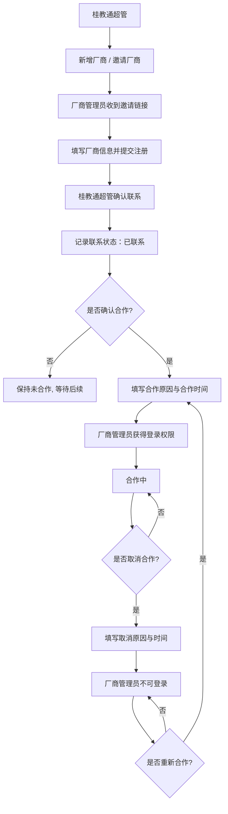
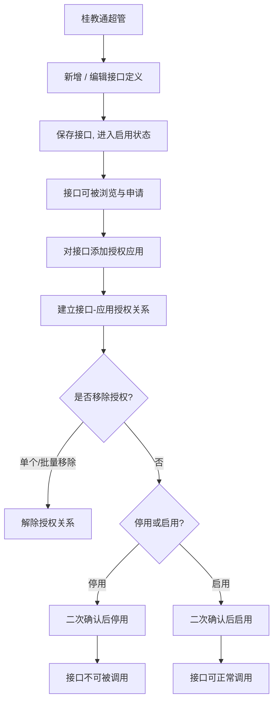
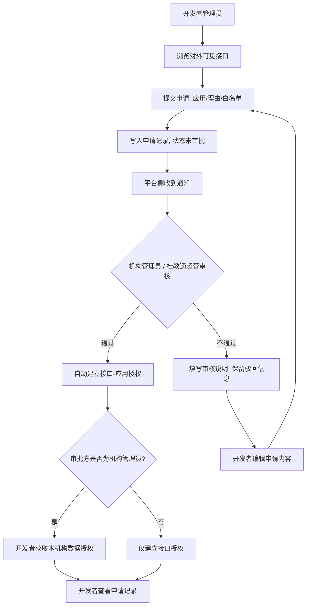
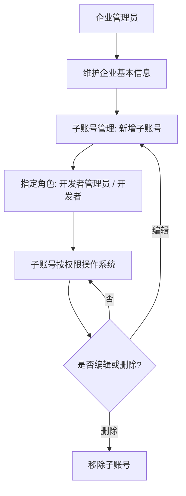
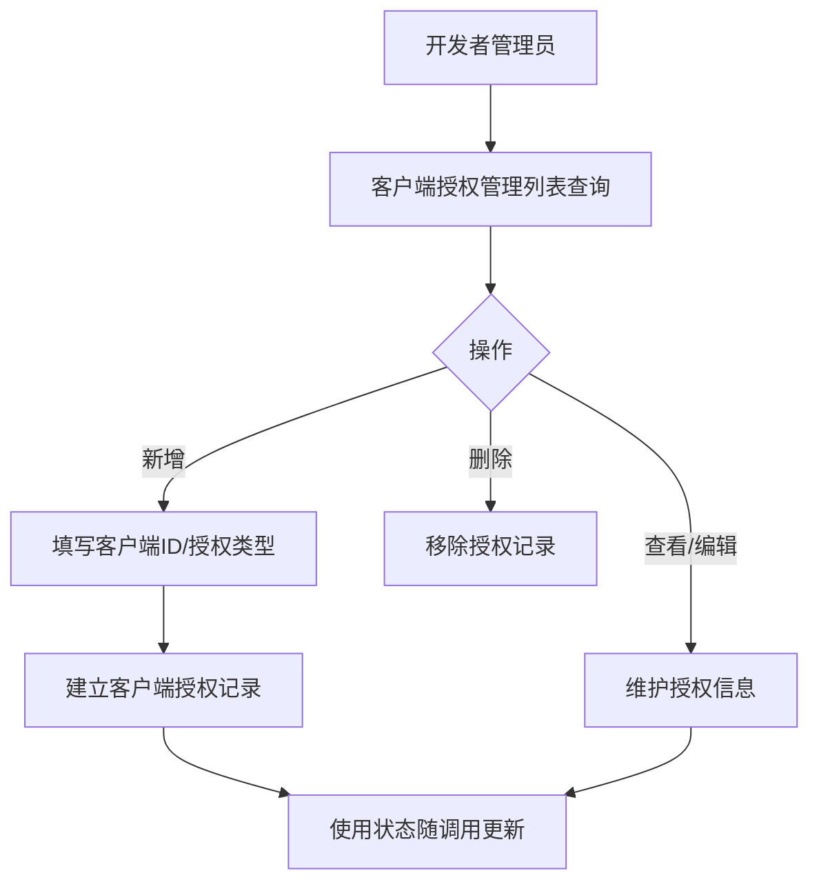
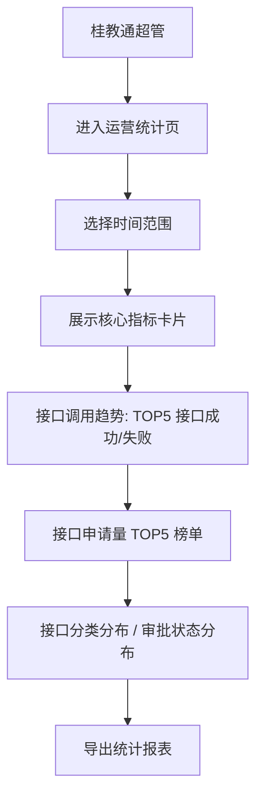

# 能力管理平台 — 产品需求文档（PRD）

## 一、文档概述

本 PRD 依据已确认的设计基线（`output/design/design.md`）展开，是研发、测试与评审的规格依据。设计基线中的字段定义、状态定义、权限定义与业务规则是唯一事实源，本 PRD 只做展开说明，不新增、不改写任何已确认语义。

本平台在桂教通平台上以迭代方式扩展建设，作为平台级能力开放枢纽，覆盖厂商入驻、能力上架、应用授权、接口申请审批与调用的全链路，服务机构管理员、桂教通超管、开发者管理员三类角色。一期一次交付全部功能，目标 2026 年 8 月底上线。

本文档章节构成：范围、业务流程、详细需求说明（按模块、页面、动作组织）、权限汇总、数据字典、状态机、验收标准汇总、风险与待确认。

## 二、范围

### （一）建设范围

| 模块 | 核心功能 | 涉及角色 |
|------|---------|---------|
| 厂商管理 | 厂商信息 CRUD、邀请注册、联系合作、取消/重新合作 | 桂教通超管 |
| API 接口管理 | 接口 CRUD、接口文档、应用授权、授权/取消授权、接口停用/启用 | 桂教通超管 |
| 接口申请与审批 | 接口申请记录、申请审核/查看 | 机构管理员、桂教通超管、开发者管理员 |
| 接口调用记录 | 记录各厂商调用接口的调用流水（按接口/厂商/结果筛选、汇总统计） | 桂教通超管 |
| 运营统计 | 接口/厂商/应用统计看板，支持时间范围筛选和导出 | 桂教通超管 |
| 客户端授权管理 | 客户端授权 CRUD、启用/停用 | 桂教通超管 |
| 开发者账号 | 企业信息管理、企业子账号管理 | 开发者管理员 |
| 开发者接口中心 | 接口列表、文档、申请、申请记录 | 开发者管理员 |
| 应用管理 | 应用查看/新增、应用授权关联（应用ID、suiteKey 由桂教通体系提供） | 开发者管理员 |

### （二）建设方式

建设类型为 iteration，在桂教通平台上扩展，挂载点如下。

- 桂教通超管 → 超管后台 → 能力管理
- 机构管理员 → 组织中心 → 能力管理
- 开发者管理员 → 开发者后台 → 接口中心

进入模块后，侧栏直接展示二级菜单（不含一级包裹）：

- 机构管理员：API接口管理（→接口申请记录 P08）
- 桂教通超管：能力管理（→厂商管理 P01、API接口管理 P04、接口分类管理 P04a、接口申请记录 P08、接口调用记录 P27、运营统计 P13）、授权管理（→客户端授权管理 P30）
- 开发者管理员：账号管理（→P16/P17）、接口中心（→P19/P08）、应用管理（→P28）

用户体系、组织树、消息通知、审计日志、角色权限、门户、开发者应用实体与密钥等基础能力均复用桂教通现有体系，本平台只新增能力管理业务模块与页面。

## 三、业务流程

> 本章梳理平台全部核心业务场景流程，并为每个流程提供流程图（mermaid）。流程涉及角色：桂教通超管、厂商管理员、机构管理员、开发者管理员、开发者。

### （一）厂商入驻与合作流程

厂商入驻与合作流程分为邀请注册、联系跟进、确认合作、取消合作、重新合作五个阶段，由平台侧（桂教通超管）与厂商方协作完成（取消合作入口仅提供于厂商列表页，厂商详情页不提供该按钮）。

1. 平台侧新增厂商，或通过"邀请厂商"向厂商管理员发送邀请链接；厂商管理员收到链接后填写厂商信息并提交注册。
2. 平台侧确认联系，记录联系状态为已联系；确认联系不改变合作状态。
3. 确认合作时填写合作原因与合作时间；确认合作后厂商管理员获得开发者平台登录权限（租户体系复用桂教通）。
4. 取消合作时填写取消合作原因与时间；取消后厂商管理员手机号不可再登录开发者平台（入口在厂商列表页）。
5. 已取消的厂商可重新合作，重新合作后合作状态回到合作中，并恢复厂商管理员登录权限。

· 确认合作的前提是已确认联系。
· 厂商管理员姓名与手机号在列表中默认脱敏展示，点击小眼睛可查看完整值。

### （二）API 接口授权流程

桂教通超管新增或编辑接口定义并发布后，对已授权应用建立授权关系，接口可停用/启用。

1. 桂教通超管新增或编辑接口基础信息与参数定义，保存后接口进入启用状态，可被开发者浏览与申请。
2. 对接口添加授权应用，在接口与应用之间建立授权关系；已授权应用可单个移除，也可勾选多条后批量移除。
3. 接口停用或启用前均需二次确认；停用后接口不可被调用，已授权应用不受影响但调用失败。

· 接口授权仅允许选择本机构/平台的应用。
· 接口新增时参数列表至少保留一条记录。

### （三）接口申请与审批流程

接口申请与审批流程由开发者管理员发起，平台侧审核，覆盖申请、审批、授权建立与结果查看；机构管理员审批通过后开发者即获取该机构的数据授权。

1. 开发者管理员在开发者接口中心浏览对外可见接口，提交接口使用申请，填写应用、申请理由与白名单域名。
2. 申请写入接口申请记录，审核状态为未审批，平台侧收到申请通知。
3. 机构管理员（本机构接口）或桂教通超管（全平台接口）审核，结论为通过或不通过；不通过时审核说明必填。
4. 审核通过后系统自动为申请方应用建立接口授权关系；若为机构管理员审批通过，则开发者获取当前机构的数据授权，可获取数据；不通过则保留驳回信息。
5. 开发者管理员在申请记录中查看审核结果与审核信息（含机构授权凭证等）。

· 申请记录按最新未审批数据排最前。
· 审核不通过的申请记录，开发者可在申请记录列表点击「重新提交」进入申请界面编辑后再次提交（保留原申请所选接口，可修改应用、同步范围、机构、白名单、申请理由等内容）。

### （四）开发者账号与子账号管理流程

开发者企业管理员维护企业基本信息与子账号，子账号按角色权限使用平台功能。

1. 企业管理员在开发者企业信息页维护企业基本信息（企业名称、统一社会信用代码、联系人等）。
2. 企业管理员在子账号管理页新增子账号，指定角色（开发者管理员 / 开发者）。
3. 子账号使用被分配的权限操作系统，企业管理员可编辑或删除子账号。

### （五）客户端授权管理流程

开发者管理员维护客户端授权，按应用与授权类型建立客户端级授权关系。

1. 开发者管理员在客户端授权管理列表查询客户端授权（按客户端ID、使用状态、授权类型筛选）。
2. 点击新增，填写客户端ID、授权类型等信息，建立客户端授权记录。
3. 对已有记录可查看、编辑或删除；使用状态随实际调用情况更新（使用中 / 未使用）。

### （六）接口调用与运营监控流程

平台侧通过运营统计监控接口调用情况，按申请量 TOP5 接口统计成功/失败数，并按分类、审批状态分布掌握全局运行状况。

1. 桂教通超管进入运营统计页，选择时间范围（今日 / 近7天 / 近30天 / 自定义）。
2. 系统展示核心指标卡片、接口调用趋势（TOP5 接口成功/失败堆叠）、接口申请量 TOP5、接口分类分布、申请审批状态分布。
3. 超管可导出当前统计报表用于复盘。

### （一）厂商入驻与合作

本模块覆盖厂商从入驻邀请到合作的全生命周期，含厂商信息维护、联系跟进与合作状态变更，对应设计基线模块 4.1（厂商管理）。包含厂商列表（P01）、新增/编辑厂商（P02）、厂商详情（P03）三个页面。桂教通超管可见全平台厂商。

#### 厂商列表（P01）

页面由查询区、结果列表与行操作区组成。用户进入页面后应先能判断当前有哪些厂商、各自处于什么合作阶段，并直接发起新增、邀请或对单条厂商的联系、合作操作。

（1）查询厂商

列表展示当前筛选条件下的厂商记录，供用户快速判断厂商身份与合作状态。列表列包含：厂商名称、厂商类型、管理员姓名、手机号码、是否已联系、合作状态、是否在门户展示、申请日期。

- 管理员姓名与手机号码默认脱敏展示（姓名如"张**"，手机号保留部分位数），点击行内"小眼睛"图标查看完整值，再次点击恢复脱敏；两种角色脱敏规则一致。
- 支持按厂商名称、厂商类型筛选，查询后列表刷新。
- 列表默认按申请日期倒序排列，每页 20 条。
- 无匹配数据时列表区域显示"暂无厂商数据"；查询失败时显示失败提示并提供重试入口。

（2）新增厂商

点击右上角"新增厂商"跳转新增厂商页 P02，页面为三段可折叠区表单（基础信息 / 财务信息 / 开票信息），填写流程见页面 2 的（1）。

（3）邀请厂商

点击"邀请厂商"弹出邀请成功弹窗，弹窗内容为蓝色对勾图标 + 提示文字"邀请链接已复制，可将此链接发给开发商进行注册"，底部两个按钮：

- "我知道了"：关闭弹窗。
- "查看链接"：在新浏览器页签中打开新增厂商页（P02），该页面不显示头部导航栏和侧栏菜单（standalone 模式），厂商管理员收到链接后填写厂商信息完成注册。注册成功后厂商出现在列表中，合作状态为"未合作"、申请日期为注册完成时间。

- standalone 模式下保存成功后展示成功提示界面（圆形渐变背景 + 白色对勾图标 + 提示文案"恭喜您已申请加入【机构名称；桂教通后台显示"桂教通"】，麻烦您耐心等待【机构名称；桂教通后台显示"桂教通"】审批"），不显示返回按钮。

（4）查看厂商

点击行尾"查看"跳转厂商详情页，进入流程见页面 3 的（1）。

（5）编辑厂商

点击行尾"编辑"跳转编辑厂商页。仅"是否已联系=否"的厂商可编辑；已确认联系的厂商行不显示"编辑"按钮，只能查看。

（6）确认联系

点击行尾"确认联系"弹出确认框，确认后该厂商"是否已联系"置为"是"，合作状态保持不变。

（7）确认合作

点击行尾"确认合作"弹出确认框，填写合作原因与合作时间后确认。仅"是否已联系=是"的厂商可执行确认合作，未确认联系的厂商该按钮不可点击。

- 确认合作成功后，厂商管理员获得开发者平台登录权限（租户体系复用桂教通）；合作状态变为"合作中"。

（8）分配应用

厂商合作状态为"合作中"时，操作列展示"分配应用"按钮。点击后弹出分配应用弹窗，弹窗以列表形式展示所有生态应用，展示字段：应用名称、应用ID、应用分类。支持多选（checkbox），选中后点击"确认分配"完成应用分配。

- 至少选择一个应用才可确认分配。

#### 新增/编辑厂商（P02）

页面为厂商信息表单，用于新建厂商或维护未确认联系厂商的信息。整体分为三个可折叠区：基础信息（必填集中）、财务信息（选填）、开票信息（选填）。页面底部提供保存与返回按钮。

（1）新增厂商

**基础信息区（可折叠，默认展开）**——采用左右两列布局，全部字段必填：

左列字段：
- 厂商名称：文本输入，最多 100 字符。
- 厂商类型：单选，企业 / 个人。
- 法人代表：文本输入，最多 50 字符。
- 管理员：文本输入，最多 50 字符。
- 产品材料：附件上传，文件数量不超过 10 个，单个附件大小不得超过 20M。
- 工商注册地址：多行文本输入，最多 500 字符。
- 增值税一般纳税人：单选，是 / 否。
- 详细地址：多行文本输入，最多 500 字符。

右列字段：
- 是否归属公海：单选，是 / 否。
- 统一社会信用代码：文本输入，18 位统一编码。
- 管理员手机号：文本输入，11 位数字。
- 厂商简介：多行文本输入，最多 500 字符。
- 公司电话：文本输入。
- 营业期限：日期选择控件。
- 是否在门户展示：单选，是 / 否，选填，默认否。

厂商logo 与营业执照字段采用同行布局：
- 厂商logo：图片上传，建议尺寸 100×100px，大小不超过 2M。
- 营业执照：多图上传，支持 jpg / jpeg / png / bmp 格式，单张图片大小不超过 500KB。

**财务信息区（可折叠，默认展开，全部选填）**：银行类别、开户行名称、开户行账号、账户用途，四个字段左右两列展示。

**开票信息区（可折叠，默认展开，全部选填）**：单位地址、纳税人识别号、电话号码、开户银行、银行账户、联行号，六个字段左右两列展示。

保存时校验：
- 基础信息区全部必填项非空；
- 管理员手机号 11 位数字格式；
- 统一社会信用代码 18 位；
- 厂商logo 大小 ≤2M；
- 产品材料 ≤10 个，单个 ≤20M；
- 营业执照单张 ≤500KB；
- 校验不通过时对应字段标红并提示，页面不关闭、不跳转。

- 保存成功后跳转厂商列表，新厂商合作状态为"未合作"、申请日期为当前时间。
- 保存失败（如网络异常）时保留已填写内容，提示"保存失败，请重试"。

（2）编辑厂商

仅"是否已联系=否"的厂商可进入编辑。表单结构与新增一致并回显当前值，保存规则同新增；已确认联系的厂商不可再编辑，只能通过厂商详情页 P03 查看。

（2）编辑厂商

仅"是否已联系=否"的厂商可进入编辑。表单字段与新增一致并回显当前值，保存规则同新增；已确认联系的厂商不可再编辑。

#### 厂商详情（P03）

页面以只读表单形式展示厂商完整信息，分为两个可折叠区（厂商基础信息、合作信息），并承载联系、合作、重新合作状态变更操作（取消合作入口在厂商列表页，详情页不提供该按钮）。

（1）查看厂商详情

**折叠区 1：厂商基础信息（可折叠，默认展开）**

展示字段：厂商名称、厂商类型、法人代表、统一社会信用代码、管理员姓名、管理员手机号、工商注册地址、详细地址、公司电话、营业期限、增值税一般纳税人、是否公海、厂商简介、厂商logo（图片展示）、营业执照（多图展示）、产品材料（文件标签列表）、是否在门户展示、申请日期。

- 管理员姓名与手机号码默认脱敏展示，点击字段右侧"小眼睛"图标查看完整值。

**折叠区 2：合作信息（可折叠，默认展开）**

展示字段：是否已联系、联系时间、合作状态、合作时间、合作原因、取消合作时间、取消合作原因、重新合作时间、重新合作原因。

- 合作状态以标签形式展示（未合作/合作中/已取消）。

（2）确认联系

点击"确认联系"弹出确认框，确认后"是否已联系"置为"是"，"联系时间"记录当前时间。仅未联系厂商可操作。

（3）确认合作

点击"确认合作"弹出确认框，填写合作原因（必填）、合作时间（必填）后确认。仅"是否已联系=是"的厂商可操作。

（4）重新合作

点击"重新合作"弹出确认框，填写重新合作原因（必填）、重新合作时间（必填）后确认。仅"已取消"状态可操作。

- 确认后合作状态变为"合作中"，开通厂商管理员登录权限（租户体系复用桂教通）。

### （二）API 接口定义与授权

本模块覆盖机构自建 API 接口的全生命周期，含接口分类定义、接口定义、接口文档与应用授权，对应设计基线模块 4.2（API 接口管理）。包含接口分类管理（P04a）、接口列表（P04）、新增/编辑接口（P05）、接口文档查看（P06）、接口信息查看（P22）、应用授权（P07）六个页面。桂教通超管管理全平台接口。

#### 接口分类管理（P04a）

页面为树形分类维护页，桂教通超管维护接口分类树（最多五层），作为接口新增/编辑时"接口分类"字段的选项来源。支持新增、编辑、删除、启用/停用。

（1）查看分类树

页面顶部为查询区，支持按分类名称（文本，模糊匹配）、分类状态（下拉：启用/停用）筛选；下方树形列表展示分类：分类名称、分类编码、排序、分类状态。分类按父子层级展开显示，同级按排序值从小到大排列；工具栏含"新增顶级分类"按钮。查询命中子节点时自动展开其父级路径，未命中时展示"暂无匹配分类"。

（2）新增分类

点击"新增顶级分类"或行内"新增子分类"打开弹窗填写：

- 父级分类：树形选择，选填。新增顶级分类时可为空；新增子分类时自动带入当前分类。
- 分类名称（必填，文本输入）
- 分类编码（必填，文本输入，全局唯一不可重复）
- 排序（选填，默认 0，非负整数）

提交校验：所选父级分类已达第五层时禁止新增子分类并提示"最多支持五层分类"；分类编码重复时提示"编码已存在"。

（3）编辑分类

点击行内"编辑"打开弹窗并回显当前值，字段与新增一致；父级分类不可选择自身或其子孙分类。保存规则同新增。

（4）停用/启用分类

点击行内"停用"弹出二次确认框，确认后分类状态变为"停用"，按钮变为"启用"。停用后该分类及其子孙分类不再出现在接口新增/编辑时的分类选项中，已选用该分类的接口不受影响。

（5）删除分类

点击行内"删除"弹出二次确认框。该分类存在子分类或被接口引用时禁止删除并提示"存在子分类或被接口引用，无法删除"。删除后分类从树中移除。

#### 接口列表（P04）

页面由查询区、结果列表与行操作区组成。用户进入页面后应先能判断当前有哪些接口、处于什么运行状态，并直接查看文档、编辑、授权或停用/启用。

（1）查询接口

列表展示当前筛选条件下的接口记录，列包含：序号、接口名称、请求路径、接口能力、调用身份、数据敏感等级、最大调用量/日、接口状态。支持按接口名称、数据敏感等级、接口能力筛选。

- 操作列"查看文档"跳转接口文档查看页，开发者管理员不显示该按钮。
- 桂教通超管视角：列表展示桂教通平台接口 + 机构新增接口，拥有完整管理权限。
- 列表默认按创建时间倒序排列，每页 20 条。
- 无匹配数据时显示"暂无接口数据"；查询失败时显示失败提示并提供重试入口。

（2）新增接口

点击右上角"新增接口"跳转新增接口页，填写流程见页面 5 的（1）。桂教通超管可见并可新增。

（3）查看文档

点击行尾"查看文档"跳转接口文档查看页，进入流程见页面 6 的（1）。开发者管理员不显示该按钮。

（4）编辑接口

点击行尾"编辑"跳转编辑接口页，填写流程见页面 5 的（2）。桂教通超管对全平台接口可编辑。

（5）应用授权

点击行尾"应用授权"跳转应用授权页，进入流程见页面 7。桂教通超管对全平台接口可授权。

（6）停用/启用接口

点击行尾"停用"或"启用"弹出二次确认框，确认后接口状态在启用、停用间切换。停用后接口不可被调用，已授权应用不受影响但调用失败。桂教通超管对全平台接口可操作。

- 取消确认时接口状态保持不变。
- 操作失败时提示失败原因并保留原状态。

（7）批量申请（多选新增申请）

机构管理员 / 开发者管理员在接口列表勾选一个或多个接口（列表新增复选框列，仅申请角色可见），点击工具栏"新增申请（N）"按钮（N 为已选接口数，未勾选时禁用），跳转批量接口申请页（P21m）。点击后带出所选接口，进入流程见页面 21m 的（1）。

- 开发者管理员：在开发者接口列表（P19）勾选平台接口后点"新增申请"。
- 机构管理员：在 API 接口管理（P04）勾选桂教通平台接口后点"新增申请"（本机构新增接口不可申请，保留行内单个"申请"入口跳转 P21）。
- 桂教通超管：为管理方，不显示复选框列与"新增申请"按钮，仅拥有编辑 / 授权 / 停用启用等管理操作。
- 无勾选任何接口时按钮显示"新增申请（0）"且不可点击，点击后提示"请先勾选至少一个接口"。

#### 新增/编辑接口（P05）

页面为接口编辑表单，包含接口基础信息。信息密度较高，用户需完整填写接口定义后保存。

（1）新增接口

接口基础信息包含：接口名称（必填）、接口服务名（必填，英文/数字/下划线，不含中文）、数据敏感等级（必填，单选：敏感接口/非敏感接口）、接口分类（必填，单选下拉，来源接口分类管理）、接口能力（必填，单选下拉：待办/用户信息/组织信息等，以能力维度分组）、调用身份（必填，单选：机构/个人）、版本号（必填，文本框，如 v1.0）、最大调用量/日（必填，数字输入框，正整数）、接口请求方式（必填，单选：POST/GET）、接口签名类型（必填，签名鉴权/AccessToken鉴权）、是否需要授权（必填，radio 单选：是/否，标记接口调用时是否需要申请才可使用）、是否需要学校审批（必填，radio 单选：是/否，标记接口申请时流程是否需要学校审批）、接口请求地址（必填，URL 格式）、文档链接（必填，前缀 https:// + 文本框）、是否对外可见（必填，radio 单选：是/否，与"文档链接"同处一行）。

- 保存时校验：必填项齐全（含数据敏感等级、接口分类、接口能力、调用身份、版本号、最大调用量/日、是否需要学校审批、文档链接）；校验不通过时对应项标红并提示。
- 保存成功后跳转接口列表，接口状态为"启用"，请求路径由系统生成。
- 保存失败时保留已填写内容，提示"保存失败，请重试"。

（2）编辑接口

表单字段与新增一致并回显当前值，保存规则同新增。

#### 接口文档查看（P06）

页面为接口文档的只读展示页，以专业 API 文档风格呈现接口定义与调用说明。

（1）查看接口文档

页面顶部蓝色文档头展示接口名称（大标题）和使用场景描述（含服务名）。下方依次排列以下区域：

- **权限说明表格**：展示三行权限项——"应用是否需要申请白名单"（根据接口配置显示需要/不需要）、"用户凭证"（未支持）、"机构凭证"（支持），各含说明和备注列。
- **请求信息**：展示请求方式（GET/POST + HTTPS）和请求地址（可点击超链接）。
- **返回参数表格**：展示基础返回字段（errcode、errmsg、data 对象）。
- **请求示例**：代码块展示完整请求命令。
- **返回示例**：JSON 代码块展示返回数据示例。

- 文档内容较长时支持页面滚动查看。

#### 应用授权（P07）

页面管理接口已授权的应用列表，标题展示当前接口名称（只读）。支持添加、移除、批量移除授权。

（1）查看已授权应用

已授权应用列表展示：多选框、应用ID、应用名称、应用属性。支持按应用名称、应用ID 筛选。

- 列表默认按添加时间倒序排列，每页 20 条。
- 无已授权应用时显示"暂无已授权应用"。

（2）添加授权

点击"添加授权"打开应用选择弹窗，左侧为应用列表表格（应用名称、应用ID、应用属性），支持按应用名称、应用ID、应用属性搜索筛选，表格可多选，支持分页（10/20/50 条每页），表头全选当前页；右侧展示已选应用面板，每项可点击 × 移除。点击确认后所选应用进入已授权列表并刷新。

（3）移除授权

勾选已授权应用后点击行尾"移除授权"，弹出二次确认框，确认后该应用解除与当前接口的授权关系。

- 取消确认时授权关系保持不变。

（4）批量移除授权

勾选多个已授权应用后点击"批量移除授权"，弹窗展示所选应用名称，确认后批量解除授权关系。

- 未勾选任何应用时批量移除按钮不可点击。

### （三）接口申请与审批

本模块管理外部开发者对本机构/平台接口的申请记录与审批流程，对应设计基线模块 4.3。包含接口申请记录列表（P08）、申请审批（P09）、申请记录查看（P10）三个页面。机构管理员与桂教通超管可审核，开发者管理员可查看本企业申请。

#### 接口申请记录列表（P08）

页面由查询区、结果列表与行操作区组成。用户进入页面后应先能判断当前有哪些申请、各自处于什么审批状态，并决定是否需要处理。

（1）查询申请记录

列表展示当前筛选条件下的申请记录，列包含：接口名称、接口能力、应用ID、数据敏感等级、厂商名称、接口分类、申请时间、审批状态。支持按接口名称、应用ID、审批状态筛选。

- 列表按最新未审批数据排最前，其余按申请时间倒序排列，每页 20 条。
- 无匹配数据时显示"暂无申请记录"。

（2）审核申请

点击行尾"审核"跳转申请审批页。仅审核状态为"未审批"的记录显示"审核"按钮；已审批记录不显示审核按钮。

（3）查看申请记录

点击行尾"查看"跳转申请记录查看页，进入流程见页面 10。

#### 申请审批（P09）

页面供审批方查看接口申请详情并作出审核结论，含接口基础信息只读表单与审批操作区。

（1）查看接口申请详情

接口基础信息区以只读表单展示：接口名称、接口服务名、数据敏感等级、接口分类、接口能力、调用身份、版本号、最大调用量/日、接口请求方式、接口签名类型、是否需要授权、是否需要学校审批、接口请求地址、文档链接、是否对外可见、应用ID，另展示申请理由与白名单域名。供审批方判断申请内容是否合规。

（2）提交审批

审批操作区填写：审核意见（必填，通过/不通过）、审核说明（文本框占满宽度，不通过时必填）、机构授权凭证（非必填，图片上传，支持多个，单个图片不可超过 10MB）。点击"提交审批"完成审核。

- 审核通过后，授权 key 自动取申请应用对应的 suiteKey（如应用 app_1003 → gjt_7d2e9a1c4b8f3056），审核状态变为已审批，并标记开发者已获取当前机构的数据授权，可调用接口获取数据；机构授权凭证随审批记录留存。
- 审核说明超长时支持滚动展示；提交失败时保留已填意见并提示重试。

#### 申请记录查看（P10）

页面为接口申请记录的只读查看页，以文本只读方式展示，分为"接口基础信息""申请信息""审批信息"三个区块。

（1）查看申请记录

接口基础信息区块（始终展示，取自接口本身，与新增/编辑接口字段一致）：接口名称、接口服务名、数据敏感等级、接口分类、接口能力、调用身份、版本号、最大调用量/日、接口请求方式、接口签名类型、是否需要授权、是否需要学校审批、接口请求地址、文档链接、是否对外可见。

申请信息区块（始终展示）：应用ID、厂商名称、接口分类（申请侧）、申请理由、白名单域名、申请时间、审批状态。

审批状态为"已审批"时，额外展示审批信息区块：审批人、审批时间、审批意见、审批说明、授权key、机构授权凭证（如有）。

### （五）运营统计

本模块提供平台运营数据看板，对应设计基线模块 4.5。包含运营统计看板（P13）一个页面。桂教通超管统计全平台数据。

#### 运营统计看板（P13）

页面由时间范围筛选区、数字卡片区、趋势图与排行榜区组成，按接口、厂商、应用四个维度展示统计。

（1）查看统计看板

时间范围筛选支持今日、近7天、近30天、自定义时间范围；切换范围后各统计区同步刷新。

- 接口统计卡片区：接口总数、按类型分布（敏感/非敏感）、接口申请量、审核通过率、接口授权量、被授权应用数。
- 厂商统计卡片区：厂商总数、合作状态分布（未合作/合作中/已取消）。
- 应用统计卡片区：已授权应用数、授权接口数。
- 接口分类分布区：按接口分类（基础服务/业务服务/数据服务）展示接口数量分布。
- 申请审批状态分布区：按审批状态（待审核/已通过/已驳回）展示申请笔数分布，并标注本月新增与审核通过率。
- 接口调用趋势图：横坐标为接口名称，统计申请量 TOP5 接口的调用量并区分成功数与失败数（堆叠展示，图例含成功数/失败数），鼠标悬停 tooltip 展示「接口名：成功X，失败Y，共Z」；时间范围联动：今日取当日量，近7天/近30天/自定义取近7天累计量，可直观查看高申请量接口的稳定性。

- 各统计数值按当前时间范围计算，来源于系统统计；无数据时显示 0。
- 排行榜条目较长时截断展示，悬停显示完整名称。

（2）导出统计报表

点击"导出"导出当前统计报表，报表内容与当前筛选时间范围一致。

- 导出进行中按钮进入加载态，完成后恢复可点击；导出失败时提示"导出失败，请重试"。

### （六）开发者账号

本模块管理厂商方企业信息与子账号体系，对应设计基线模块 4.7。包含企业信息管理（P16）、企业子账号管理（P17）两个页面，仅开发者管理员使用。

#### 企业信息管理（P16）

页面展示开发者企业信息。默认查看模式展示的内容为邀请厂商时填写的厂商基础信息，纯文本只读；点击"编辑"展示厂商完整信息（基础信息 + 财务信息 + 开票信息）。

（1）查看模式（只读）

展示基础信息：企业LOGO（单图只读展示）、营业执照（多图只读展示，含文件名）；厂商名称、厂商类型、是否归属公海、统一社会信用代码、法人代表、管理员、管理员手机号、增值税一般纳税人、公司电话、营业期限、工商注册地址、详细地址、是否在门户展示、厂商简介。均为只读文本。

（2）编辑模式

编辑模式展示厂商完整信息，包含三部分：
- 基础信息：企业LOGO（图片上传）、营业执照（多图上传），厂商名称*、是否归属公海*、厂商类型*、统一社会信用代码*、法人代表*、管理员*、管理员手机号*、增值税一般纳税人*、公司电话*、营业期限*、工商注册地址*、详细地址*、是否在门户展示、厂商简介*。
- 财务信息：银行类别、开户行名称、开户行账号、账户用途（选填）。
- 开票信息：单位地址、纳税人识别号、电话号码、开户银行、银行账户、联行号（选填）。

保存时校验：必填项非空；管理员手机号须为 11 位数字；统一社会信用代码须为 18 位。校验不通过时提示具体缺失项，校验通过后保存成功并回到查看模式。

#### 企业子账号管理（P17）

页面为子账号列表，支持查询与新增（弹窗）。

（1）查询子账号

查询条件：员工姓名（文本）、状态（下拉：正常 / 已过期）。

列表展示：员工姓名、员工手机号、添加时间、到期时间、状态（正常 / 已过期）。

- 无子账号时显示"暂无子账号"。

（2）新增子账号（弹窗）

点击"新增子账号"弹出对话框，表单字段包含：员工姓名（必填，文本）、员工手机号（必填，文本，校验 11 位手机号格式）、到期时间（日期）。保存时校验必填项与手机号格式，校验通过后新增子账号并刷新列表，状态默认为"正常"。

（3）删除子账号

点击行尾"删除"弹出二次确认框，确认后删除该子账号，删除后不可恢复。

- 取消确认时子账号保持不变。

### （八）开发者接口中心

本模块面向开发者管理员提供接口浏览、文档查看与申请能力，对应设计基线模块 4.8。包含开发者接口列表（P19）、开发者接口文档（P20）、接口信息查看（P22）、开发者接口申请（P21）、批量接口申请（P21m）五个页面，仅开发者管理员使用（机构管理员可在 API 接口管理 P04 发起批量申请）。

#### 开发者接口列表（P19）

页面为开发者可申请接口的浏览列表。开发者管理员仅可见"是否对外可见=是"的接口。

（1）浏览接口

列表展示当前筛选条件下的接口记录，列包含：接口名称、接口服务名、接口能力、数据敏感等级、请求方式。支持按接口名称、数据敏感等级、接口能力筛选。

- 接口签名类型、是否需要授权对开发者管理员不可见。
- 列表默认按创建时间倒序排列，每页 20 条。
- 无对外可见接口时显示"暂无可申请接口"。

（2）查看接口信息

点击行尾"查看"按钮打开接口信息查看页（P22，只读模式），展示内容与新增/编辑接口（P05）一致，不展示审核信息。

（3）查看文档

点击行尾"查看文档"按钮，打开新增接口时填写的文档链接（https:// + 文档链接），以新标签页访问接口文档。

（4）申请接口

点击行尾"申请"或顶部工具栏"新增申请（N）"跳转批量接口申请页（P21m）：行内"申请"自动带入当前接口（apiIds=[当前接口ID]），工具栏"新增申请（N）"带入多选接口。P21m 表单与字段校验见页面 21m 的（1）；其中白名单为必填的结构化多条（前缀下拉 http/https + 域名文本框，可动态增删）。提交成功后申请记录审核状态为"未审批"，平台侧可审核；提交失败时保留已填内容，提示"提交失败，请重试"。

- 提交成功后申请记录审核状态为"未审批"，平台侧可审核。
- 提交失败时保留已填内容，提示"提交失败，请重试"。

#### 开发者接口文档（P20）

页面为接口文档的只读展示页，以专业 API 文档风格呈现接口调用说明，供开发者了解接口定义。

（1）查看接口文档

页面顶部蓝色文档头展示接口名称（大标题）和使用场景描述（含服务名）。下方依次排列以下区域：

- **权限说明表格**：展示三行权限项——"应用是否需要申请白名单"（根据接口配置显示需要/不需要）、"用户凭证"（未支持）、"机构凭证"（支持），各含说明和备注列。
- **请求信息**：展示请求方式（GET/POST + HTTPS）和请求地址（可点击超链接）。
- **Query参数表格**：蓝色表头，固定首行 access_token（接口调用凭证），下方展示接口自有参数（参数名、类型、必填、说明）。表格下方显示全量查询注意事项提示文字。
- **返回参数表格**：两张表格——第一张展示基础返回字段（errcode、errmsg）；第二张展示完整返回结构含 data 对象及其子字段。
- **请求示例**：代码块展示完整请求命令。
- **返回示例**：JSON 代码块展示返回数据示例。

- 文档内容较长时支持页面滚动查看。

#### 接口信息查看（P22）

页面为接口信息的只读查看页（文本只读模式），由接口列表（P04 超管 / P19 开发者）操作列"查看"按钮打开，展示内容与新增/编辑接口（P05）一致。

（1）查看接口信息

接口基础信息以只读表单展示：接口名称、接口服务名、数据敏感等级、接口分类、接口能力、调用身份、版本号、最大调用量/日、接口请求方式、接口签名类型、是否需要授权、是否需要学校审批、接口请求地址、文档链接、是否对外可见。

- 本页为只读查看，不展示审核信息。
- 页面底部"返回"按钮回到来源列表（开发者回 P19，超管/机构回 P04）。

#### 开发者接口申请（P21）

页面为接口使用申请的提交页，开发者管理员在 P19 内以弹窗形式申请，不再跳转本页。

（1）提交接口申请

接口信息区展示接口名称、接口服务名（只读引用）。申请表单包含：应用名称（必填，下拉选择；开发者管理员仅展示本人已申请且通过审核的应用，其他角色展示全部应用）、申请理由（选填）、白名单（必填，至少一条；每条含前缀下拉 http/https + 域名文本框，支持动态新增多条）。点击"提交申请"后弹窗二次确认"确认提交该接口的申请？提交后将进入审批流程"，确认后提交成功并提示，返回来源列表（回 P19）。

- 提交成功后跳转回接口列表，申请记录审核状态为"未审批"，平台侧可审核。
- 提交失败时保留已填内容，提示"提交失败，请重试"。

#### 批量接口申请（P21m）

页面为开发者管理员 / 机构管理员对多个接口一并提交调用申请的页面，由接口列表（P04）"新增申请（N）"按钮跳转，并带出所选接口（只读表格展示接口名称、接口服务名、接口能力、调用身份、数据敏感等级，可一次提交多个接口）。页面包含以下字段：

（1）提交批量接口申请

页面顶部展示"所选接口（共 N 个）"只读列表，下方为申请表单，字段如下：

- 应用名称（必填，下拉单选）：开发者管理员仅展示本人已申请且通过审核的应用，其他角色展示全部应用（含已授权或本人申请的应用）。
- 最大调用量/日（必填，数字输入框，正整数）：填写本批次接口的每日最大调用次数上限。
- 同步范围类型（必填，可多选：机构 / 学校 / 教育局）：标记本批次接口调用的同步范围；勾选"机构"时需选择下方"是否包含下级"。
- 机构名称（必填，多行文本框）：填写完整机构名称，多个机构用英文分号（;）隔开（如：南宁市教育局;广西大学;广西科技大学）。系统按机构名称精确匹配其机构管理员。
- 是否包含下级（当同步范围类型含"机构"时显示且必填，单选：是 / 否）：仅表示数据范围是否包含该机构的下级单位；审批/待办仍只推送至所列机构管理员，不发送至机构的下级单位。
- 申请理由（必填，文本框）：填写申请用途与理由。
- 白名单（必填，结构化多条）：每条含前缀下拉（http:// / https://）+ 域名文本框，点击"+ 新增白名单"可动态新增多条，每条可单独删除（仅剩一条时删除按钮禁用）；至少填写一条且域名非空方可提交。
- 免责声明（必填，勾选同意，位于白名单下方）：展示"我已阅读并同意《API接口调用免责声明》"，声明文本为可点击链接，点击弹出声明明细（数据使用范围、数据安全义务、保密义务、禁止行为、数据保留与销毁、合规要求、责任承担、其他八章）；未勾选时提交被拦截并提示。声明内容同接口调用申请的免责声明。

点击"提交申请"弹窗二次确认"确认提交所选 N 个接口的调用申请？提交后将进入审批流程，并向以下 M 个机构的机构管理员发送待办与审批：<机构名称清单>（审批推送不发送至机构的下级单位）"，确认后提交成功并提示，返回接口申请记录列表（P19）。校验拦截项：未选择应用、未填写最大调用量/日、未选择同步范围类型、未填写机构名称、同步范围类型含"机构"时未选择是否包含下级、未勾选免责声明、未填写申请理由时分别提示对应错误，不提交。

- 提交成功后申请记录审核状态为"未审批"，平台侧可审核。
- 提交失败时保留已填内容，提示"提交失败，请重试"。

### （十）接口调用记录（P27）

本模块记录各厂商调用桂教通平台接口的调用流水，仅桂教通超管可见，对应设计基线模块 4.10。

#### 接口调用记录（P27）

页面为调用流水列表页，桂教通超管查看全平台各厂商调用接口的记录。

（1）筛选与汇总统计

支持按接口名称（模糊）、厂商名称（模糊）、调用结果（成功/失败）筛选。页面顶部汇总展示当前筛选条件下的调用总次数、成功次数、失败次数与成功率。

（2）调用流水明细

列表列包含：序号、调用时间、接口名称、厂商名称、调用应用、应用ID、调用结果（成功/失败，标签展示）、状态码、耗时(ms)。调用结果以彩色标签区分（成功绿色、失败红色）。

### （十一）应用管理（P28/P29）

本模块面向开发者管理员提供应用注册与管理能力，对应设计基线模块 6.11。

#### 应用申请完整流程

1. 开发者管理员在 P28 点击"新增应用"进入 P29，填写应用信息并提交，应用状态为"待审批"。
2. 桂教通超管在现有应用中心完成审核；审核通过后系统自动生成应用ID（appId）与 SuiteKey，状态变为"审批通过"。
3. 开发者基于已通过的应用进行 API 接口申请（P19→P21m）及应用单点对接（SSO）。
4. 对接完成后开发者点击"联调完成"，记录联调完成时间，状态变为"待确认联调"。
5. 桂教通超管对联调进行验证，验证通过后上架到测试机构，状态变为"待确认联调"。
6. 测试机构验证完成后点击"确认联调完成"，应用状态变为"已完成"，应用申请流程结束。
7. 桂教通超管可对已完成的应用执行上架操作，指定上架范围。

> 注：桂教通超管的审核、联调验证、上架等操作在现有应用中心完成，不在本平台内。

#### 应用管理列表（P28）

页面为应用列表页，展示本企业已注册的全部应用。

**（1）查询条件**

| 条件 | 控件 | 说明 |
|------|------|------|
| 应用名称 | 文本输入框 | 模糊搜索 |
| 状态 | 下拉选择 | 待审批 / 审批通过 / 已驳回 / 待联调 / 待确认联调 / 已完成 |
| 应用分类 | 下拉选择 | 教学管理 / 校园办公 / 教务管理 |

**（2）列表字段**

| 字段 | 说明 |
|------|------|
| Logo | 应用图标，32×32px |
| 应用名称 | 应用显示名称 |
| 应用ID | 审批通过后由系统生成，列表始终展示 |
| suiteKey | 审批通过后由系统生成，列表脱敏展示（小眼睛图标可查看完整值） |
| 应用分类 | 如"教学管理" |
| 应用属性 | 原生应用/低代码应用 / 生态应用 / 原生应用/自建应用 |
| 适用机构 | 学校 / 学校+上级单位 |
| 学段 | 所有学段 / 小学、初中 / 初中、高中 等 |
| 状态 | 待审批（橙）/ 审批通过（绿）/ 已驳回（红）/ 待联调（橙）/ 待确认联调（蓝）/ 已完成（绿） |
| 操作 | 编辑（待审批/已驳回时显示）、查看（始终）、联调完成（审批通过时显示） |

**（3）操作说明**

- **新增应用**：工具栏"新增应用"按钮，跳转 P29 新增页。
- **编辑**：仅当应用状态为"待审批"或"已驳回"时显示；打开 P29 编辑页（表单同新增界面），携带当前应用的 appId。
- **查看**：始终显示；打开 P29 查看模式，以文本只读形式展示应用基础信息、接入凭证（仅审批通过后展示应用ID与 suiteKey）及审核信息。
- **联调完成**：仅当应用状态为"审批通过"时显示；点击弹出二次确认"确认联调完成？"，确认后记录联调完成时间，状态更新为"待确认联调"，等待桂教通超管确认完成联调。

#### 新增/编辑应用（P29）

页面支持三种模式：新增（无 appId）、编辑（appId + mode=edit，表单同新增界面）、查看（appId + mode=view，文本只读）。

新增/编辑为表单页，分四个区块：基础信息、适用范围、应用属性、可见性配置。

**（1）基础信息**

| 字段 | 类型 | 必填 | 说明 |
|------|------|------|------|
| 应用 Logo | 图片上传 | 是 | 单张，建议 200×200px，≤2MB |
| 应用名称 | 文本输入 | 是 | 最大 20 字符，字数统计 |
| 应用简介 | 多行文本 | 是 | 最大 100 字符，字数统计 |
| 所属分类 | 下拉选择 | 是 | 教学管理 / 校园办公 / 教务管理 |
| 是否数据同步 | 单选 | 是 | 否 / 是 |
| 打开方式 | 多选复选框 | 是 | PCweb / H5 / 独立小程序（默认勾选 PCweb + H5） |
| 应用详情介绍 | 富文本编辑器 | 是 | 支持 B/I/U 加粗斜体下划线、插入图片/视频/超链接；支持图文混排和多媒体嵌入 |
| 应用视频介绍 | 文件拖拽上传 | 否 | 最多 5 个视频，单个 ≤10MB |

**（2）适用范围**

| 字段 | 类型 | 必填 | 说明 |
|------|------|------|------|
| 适用机构 | 复选框组 | 是 | 学校 / 上级单位（可多选） |
| 适用学段 | 单选+条件复选框 | 是 | 所有学段 / 部分学段（选部分时展开小学/初中/高中复选框） |

**（3）应用属性**

| 字段 | 类型 | 必填 | 说明 |
|------|------|------|------|
| 应用属性 | 下拉选择 | 是 | 原生应用/自建应用 / 原生应用/低代码应用 / 生态应用 |

**（4）可见性配置**

| 字段 | 类型 | 必填 | 说明 |
|------|------|------|------|
| PC 端角色 | 复选框组 | 是（PCweb 时） | 教育局职工、学生、学校教职工、家长、毕业生 |
| PC 端地址 | 文本输入 | 是（PCweb 时） | https:// 开头 |
| H5 角色 | 复选框组 | 是（H5 时） | 同 PC 端角色选项 |
| H5 地址 | 文本输入 | 是（H5 时） | https:// 开头 |

> PC/H5 角色和地址仅在对应的"打开方式"被勾选时显示。

**（5）查看模式（只读文本）**

点击列表"查看"进入，不允许编辑，按区块以"标签+文本"形式展示：

- **基础信息**：Logo、应用名称、应用ID、应用简介、所属分类、是否数据同步、打开方式、应用详情介绍。
- **适用范围**：适用机构、适用学段。
- **应用属性**：应用属性。
- **可见性配置**：PC 端角色/地址（仅 PCweb 时）、H5 角色/地址（仅 H5 时）。
- **接入凭证**：仅当状态为"审批通过 / 待联调 / 待确认联调 / 已完成"时展示；包含应用ID（appId）与 suiteKey。
- **审核信息**：审批结果（审批通过/已驳回/待审批标签）、审批意见、审批时间、**联调完成时间**、**确认联调完成时间**（未完成/未确认时显示占位提示）。

## 四、客户端授权管理（桂教通超管，P30/P31）

本模块由桂教通超管维护 OAuth 客户端与平台的授权关联关系，对应菜单：桂教通超管后台 → 授权管理 → 客户端授权管理。包含客户端授权管理列表（P30）与新增/编辑客户端授权（P31）两个页面。

### （一）客户端授权管理列表（P30）

**（1）查询条件**

| 条件 | 控件 | 说明 |
|------|------|------|
| 客户端ID | 文本输入 | 模糊匹配 |
| 使用状态 | 下拉选择 | 使用中 / 未使用 |
| 授权类型 | 下拉选择 | authorization_code / client_credentials / implicit / password |

**（2）列表字段**

| 字段 | 说明 |
|------|------|
| 客户端ID | 客户端唯一标识（系统生成，可修改） |
| 客户端秘钥 | client_secret，列表脱敏展示（如 sct_8f3a****f60），行内小眼睛图标可查看完整值 |
| 授权范围 | 由"同步范围类型 + 机构名称 + 是否包含下级"拼出，规则同 API 接口申请（机构：含/不含下级；学校：仅机构名称） |
| 使用状态 | 使用中（绿标签）/ 未使用（灰标签） |
| 授权类型 | authorization_code / client_credentials / implicit / password |
| 回调地址 | redirect_uri |
| 登出后回调地址 | logout_redirect_uri |
| 访问令牌有效期(秒) | access_token 有效期，正整数 |
| 刷新令牌有效期(秒) | refresh_token 有效期，0 表示不颁发刷新令牌 |
| 操作 | 编辑、启用、停用 |

**（3）操作说明**

- **新增**：工具栏"新增"按钮，打开 P31 新增弹窗（同列表字段，不含使用状态）。
- **编辑**：打开 P31 编辑弹窗，预填当前记录，使用状态不可编辑（沿用原值）。
- **启用/停用**：点击二次确认后切换"使用状态"（使用中 ↔ 未使用）。

### （二）新增/编辑客户端授权（P31）

弹窗表单，字段与列表一致（不含"使用状态"），**所有字段必填**。

**（1）字段表**

| 字段 | 类型 | 必填 | 说明 |
|------|------|------|------|
| 客户端ID | 文本输入 | 是 | 系统自动生成，可修改 |
| 客户端秘钥 | 文本输入 | 是 | 系统自动生成，可修改 |
| 同步范围类型 | 单选 | 是 | 机构 / 学校 |
| 机构名称 | 多行文本 | 是 | 完整机构名称，多个用英文分号（;）隔开 |
| 是否包含下级 | 单选 | 是（同步范围类型=机构时） | 是 / 否；同步范围类型=学校时隐藏 |
| 授权类型 | 下拉选择 | 是 | authorization_code / client_credentials / implicit / password |
| 回调地址 | 文本输入（URL） | 是 | redirect_uri，https:// 开头 |
| 登出后回调地址 | 文本输入（URL） | 是 | logout_redirect_uri，https:// 开头 |
| 访问令牌有效期(秒) | 数字输入 | 是 | 正整数，范围 1–86400 |
| 刷新令牌有效期(秒) | 数字输入 | 是 | 0–2592000，0 表示不颁发刷新令牌 |

> 授权范围设置规则与 API 接口申请一致：同步范围类型可选"机构"或"学校"；选择"机构"时需填写机构名称并选择是否包含下级，列表授权范围展示为"机构：<机构名称>（含/不含下级）"；选择"学校"时仅填写机构名称，展示为"学校：<机构名称>"。

## 五、权限汇总

### （一）访问范围矩阵

| 页面 | 机构管理员 | 桂教通超管 | 开发者管理员 |
|------|-----------|-----------|-----------|
| 厂商列表（P01） | — | 全平台厂商 | — |
| 新增/编辑厂商（P02） | — | 全平台厂商 | — |
| 厂商详情（P03） | — | 全平台厂商 | — |
| 接口列表（P04） | — | 全平台接口 | — |
| 接口分类管理（P04a） | — | 全平台接口分类 | — |
| 新增/编辑接口（P05） | — | 全平台接口 | — |
| 接口文档查看（P06） | — | 全平台接口 | — |
| 接口信息查看（P22） | — | 全平台接口 | 可见所有对外可见接口 |
| 应用授权（P07） | — | 全平台接口 | — |
| 接口申请记录列表（P08） | 本机构接口申请 | 全平台申请 | 本企业申请 |
| 申请审批（P09） | 本机构接口申请 | 全平台申请 | — |
| 申请记录查看（P10） | 本机构接口申请 | 全平台申请 | 本企业申请 |
| 运营统计看板（P13） | — | 全平台数据 | — |
| 企业信息（P16） | — | — | 本企业 |
| 子账号管理列表（P17） | — | — | 本企业子账号 |
| 新增子账号（P18） | — | — | 本企业 |
| 开发者接口列表（P19） | — | — | 可见所有对外可见接口 |
| 开发者接口文档（P20） | — | — | 可见所有对外可见接口 |
| 开发者接口申请（P21） | — | — | 本企业 |
| 批量接口申请（P21m） | 本机构接口（机构管理员） | — | 本企业 |
| 应用管理列表（P28） | — | — | 本企业应用 |
| 新增/编辑应用（P29） | — | — | 本企业应用 |
| 接口调用记录（P27） | — | 全平台 | — |
| 客户端授权管理列表（P30） | — | 全平台客户端 | — |
| 新增/编辑客户端授权（P31） | — | 全平台客户端 | — |

### （二）操作权限矩阵

| 操作 | 机构管理员 | 桂教通超管 | 开发者管理员 | 条件 |
|------|-----------|-----------|-----------|------|
| 新增厂商 | — | ✅ | — | — |
| 编辑厂商 | — | ✅ | — | 确认联系前 |
| 查看厂商详情 | — | ✅ | — | — |
| 确认联系 | — | ✅ | — | — |
| 确认合作 | — | ✅ | — | 已确认联系 |
| 取消合作 | — | ✅ | — | 合作中 |
| 分配应用 | — | ✅ | — | 合作中 |
| 重新合作 | — | ✅ | — | 已取消 |
| 新增接口 | — | ✅ | — | — |
| 编辑接口 | — | ✅（仅本机构接口） | — | — |
| 新增接口分类 | — | ✅ | — | — |
| 编辑接口分类 | — | ✅ | — | 父级不可选为自身或子孙 |
| 删除接口分类 | — | ✅ | — | 无子分类且未被接口引用 |
| 停用/启用接口分类 | — | ✅ | — | 需二次确认；停用后分类不进入接口分类选项 |
| 查看接口文档 | — | ✅ | ✅ | 开发者仅可见对外可见接口 |
| 查看接口信息 | — | ✅ | ✅ | 只读查看，开发者仅可见对外可见接口 |
| 授权应用（应用授权） | — | ✅（仅本机构接口） | — | — |
| 添加授权 | — | ✅（仅本机构接口） | — | — |
| 移除授权 | — | ✅（仅本机构接口） | — | — |
| 批量移除授权 | — | ✅（仅本机构接口） | — | — |
| 接口停用/启用 | — | ✅（仅本机构接口） | — | 需二次确认 |
| 申请平台接口 | — | ✅（仅桂教通平台接口） | ✅ | 跳转接口申请页（P21），流程同开发者管理员 |
| 审批接口申请 | ✅ | ✅ | — | 本机构/全平台 |
| 删除接口（开发者注册） | — | — | ✅ | 仅未上线状态 |
| 管理企业信息 | — | — | ✅ | — |
| 管理子账号 | — | — | ✅ | — |
| 提交接口申请 | — | — | ✅ | — |

### （三）字段级权限例外

厂商列表（P01）管理员姓名、手机号码脱敏字段：

| 角色 | 默认显示 | 点击小眼睛后 |
|------|---------|------------|
| 桂教通超管 | 脱敏（如 张**） | 显示完整 |

接口列表（P04）接口文档列：

| 角色 | 权限 |
|------|------|
| 桂教通超管 | 可见全平台接口文档链接 |

开发者接口列表（P19）对外可见性控制：

| 接口字段 | 权限 |
|---------|------|
| 接口名称、接口服务名、接口能力、数据敏感等级、请求方式 | 开发者管理员可见所有"对外可见"的接口 |
| 接口签名类型、是否需要授权 | 对开发者管理员不可见 |
| 是否对外可见=否的接口 | 对开发者管理员完全不可见 |

| 角色 | 权限 |
|------|------|
| 桂教通超管 | 可见 SecretKey 完整值 |
| 开发者管理员 | 可见 AppKey，SecretKey 脱敏展示 |

## 六、数据字典

数据字典按实体分组，字段定义以设计基线为准。长度、默认值、枚举值、格式、业务来源仅在影响实现或联调判断时写入说明。

### （一）厂商实体

| 字段 | 类型 | 长度 | 必填 | 默认值 | 枚举值 | 格式 | 业务来源 | 说明 |
|------|------|------|------|--------|--------|------|----------|------|
| 厂商名称 | string | 100 | 是 | — | — | — | 用户输入 | 企业或个人名称 |
| 厂商类型 | string | 10 | 是 | — | 企业、个人 | — | 用户选择 | 厂商主体类型 |
| 管理员姓名 | string | 50 | 是 | — | — | — | 用户输入 | 厂商管理员姓名，列表脱敏展示 |
| 手机号码 | string | 11 | 是 | — | — | 11位数字 | 用户输入 | 厂商管理员手机号，列表脱敏展示 |
| 是否已联系 | boolean | — | 是 | false | — | — | 系统记录 | 是否已确认联系 |
| 联系时间 | datetime | — | 否 | — | — | YYYY-MM-DD | 系统记录 | 确认联系的时间 |
| 合作状态 | string | 10 | 是 | 未合作 | 未合作、合作中、已取消 | — | 系统记录 | 当前合作状态 |
| 是否在门户展示 | boolean | — | 否 | false | — | — | 用户选择 | 是否在门户展示厂商信息 |
| 申请日期 | datetime | — | 是 | 当前时间 | — | YYYY-MM-DD HH:mm | 系统生成 | 厂商信息创建时间 |
| 合作原因 | string | 500 | 是 | — | — | — | 用户输入 | 确认合作时填写 |
| 合作时间 | datetime | — | 是 | — | — | YYYY-MM-DD | 用户选择 | 确认合作的时间 |
| 取消合作原因 | string | 500 | 是 | — | — | — | 用户输入 | 取消合作时填写 |
| 取消合作时间 | datetime | — | 是 | — | — | YYYY-MM-DD | 用户选择 | 取消合作的时间 |
| 重新合作原因 | string | 500 | 是 | — | — | — | 用户输入 | 重新合作时填写 |
| 重新合作时间 | datetime | — | 是 | — | — | YYYY-MM-DD | 用户选择 | 重新合作的时间 |

### （二）接口实体

| 字段 | 类型 | 长度 | 必填 | 默认值 | 枚举值 | 格式 | 业务来源 | 说明 |
|------|------|------|------|--------|--------|------|----------|------|
| 接口名称 | string | 20 | 是 | — | — | — | 用户输入 | 接口的中文名称 |
| 接口服务名 | string | 50 | 是 | — | — | 英文/数字/下划线，不含中文 | 用户输入 | 接口的服务标识 |
| 数据敏感等级 | string | 10 | 是 | — | 敏感接口、非敏感接口 | — | 用户选择 | 接口的数据敏感等级 |
| 接口能力 | string | 20 | 是 | — | 待办、用户信息、组织信息 | — | 用户选择 | 接口所属能力分组 |
| 接口分类 | string | 20 | 是 | — | — | — | 系统引用 | 接口所属分类，来源接口分类管理 |
| 调用身份 | string | 5 | 是 | — | 机构、个人 | — | 用户单选 | 接口的调用主体 |
| 最大调用量/日 | int | — | 是 | 10000 | — | 正整数 | 用户输入 | 接口每日最大允许调用次数 |
| 接口请求方式 | string | 10 | 是 | — | POST、GET | — | 用户单选 | 支持的 HTTP 方法，单选 |
| 接口签名类型 | string | 20 | 是 | — | 签名鉴权、AccessToken鉴权 | — | 用户选择 | 接口鉴权方式 |
| 是否需要授权 | boolean | — | 是 | — | — | — | 用户选择 | 调用是否需要授权 |
| 是否需要学校审批 | boolean | — | 是 | — | — | — | 用户选择 | 申请时流程是否需要学校审批 |
| 接口请求地址 | string | 200 | 是 | — | — | URL格式 | 用户输入 | 对外暴露的请求地址 |
| 版本号 | string | 20 | 是 | — | — | — | 用户输入 | 接口版本号，如 v1.0 |
| 文档链接 | string | 200 | 是 | — | — | URL超链接（前缀 https://） | 用户输入 | 接口文档链接 |
| 是否对外可见 | boolean | — | 是 | — | — | — | 用户选择 | 是否对开发者平台可见 |
| 接口状态 | string | 10 | 是 | 启用 | 启用、停用 | — | 系统记录 | 接口当前运行状态 |
| 请求路径 | string | 200 | 是 | — | — | — | 系统生成 | 接口的完整请求路径 |

### （三）接口分类实体

接口的"接口分类"字段引用分类主键（接口实体）。分类在接口分类管理页（P04a）维护，树形最多五层。

| 字段 | 类型 | 长度 | 必填 | 默认值 | 枚举值 | 格式 | 业务来源 | 说明 |
|------|------|------|------|--------|--------|------|----------|------|
| 分类ID | int | — | 是 | — | — | — | 系统生成 | 分类唯一标识 |
| 分类名称 | string | 50 | 是 | — | — | — | 用户输入 | 分类显示名称 |
| 父级分类ID | int | — | 否 | — | — | — | 系统引用 | 父级分类标识，顶级分类为空 |
| 分类编码 | string | 50 | 是 | — | — | — | 用户输入 | 分类全局唯一编码 |
| 排序 | int | — | 否 | 0 | — | 非负整数 | 用户输入 | 同级显示顺序，数值越小越靠前 |
| 分类状态 | string | 10 | 是 | 启用 | 启用、停用 | — | 用户选择 | 分类是否可用 |
| 层级 | int | — | 是 | 1 | — | 1-5 | 系统记录 | 分类在树中的层级，最高五层 |

### （四）接口申请

| 字段 | 类型 | 长度 | 必填 | 默认值 | 枚举值 | 格式 | 业务来源 | 说明 |
|------|------|------|------|--------|--------|------|----------|------|
| 申请接口名称 | string | 20 | 是 | — | — | — | 系统引用 | 被申请的接口 |
| 申请理由 | string | 500 | 否 | — | — | — | 用户输入 | 申请使用接口的原因说明 |
| 白名单前缀 | string | 5 | 是 | https | http、https | — | 用户选择 | 每条白名单的前缀协议 |
| 白名单域名 | string | 253 | 是 | — | — | 合法域名，可含端口 | 用户输入 | 可调用该接口的厂商域名，支持多条 |
| 应用ID | string | 50 | 是 | — | — | — | 系统引用 | 申请方的应用ID |
| 接口分类 | string | 20 | 否 | — | — | — | 系统引用 | 接口所属分类 |
| 厂商名称 | string | 100 | 否 | — | — | — | 系统引用 | 申请方厂商 |
| 审核状态 | string | 10 | 是 | 未审批 | 未审批、已审批、已驳回 | — | 系统记录 | 申请当前审核状态 |
| 审核意见 | string | 10 | 是 | — | 通过、不通过 | — | 用户选择 | 审核结论 |
| 审核说明 | string | 500 | 否 | — | — | — | 用户输入 | 不通过时必填，说明原因 |
| 审核人 | string | 50 | 否 | — | — | — | 系统记录 | 执行审核的操作人 |
| 审核时间 | datetime | — | 否 | — | — | YYYY-MM-DD HH:mm | 系统记录 | 审核完成时间 |
| 授权key | string | 32 | 否 | — | — | 应用 suiteKey | 系统生成 | 审批通过时取申请应用对应的 suiteKey 作为授权 key，列表脱敏展示，可查看完整值 |

### （五）授权关系

| 字段 | 类型 | 长度 | 必填 | 默认值 | 枚举值 | 格式 | 业务来源 | 说明 |
|------|------|------|------|--------|--------|------|----------|------|
| 应用名称 | string | 100 | 是 | — | — | — | 桂教通应用体系 | 被授权应用的名称 |
| 应用属性 | string | 20 | 否 | — | — | — | 桂教通应用体系 | 应用的属性分类 |

### （六）开发者账号实体

| 字段 | 类型 | 长度 | 必填 | 默认值 | 枚举值 | 格式 | 业务来源 | 说明 |
|------|------|------|------|--------|--------|------|----------|------|
| 企业名称 | string | 100 | 是 | — | — | — | 用户输入 | 厂商企业全称 |
| 企业联系人 | string | 50 | 是 | — | — | — | 用户输入 | 企业联系人姓名 |
| 企业联系电话 | string | 20 | 是 | — | — | — | 用户输入 | 企业联系电话 |
| 子账号名称 | string | 50 | 是 | — | — | — | 用户输入 | 子账号登录名 |
| 子账号角色 | string | 20 | 是 | — | — | — | 用户选择 | 子账号权限角色 |

### （十）通用与内部字段

内部关联主键与审计字段不落页面展示，仅用于系统留痕与关联。

| 字段 | 原因 |
|------|------|
| 厂商 ID | 内部关联主键，不在页面展示 |
| 接口 ID | 内部关联主键，不在页面展示 |
| 申请 ID | 内部关联主键，不在页面展示 |
| 企业 ID | 内部关联主键，不在页面展示 |
| 子账号 ID | 内部关联主键，不在页面展示 |
| 创建人 | 审计字段，系统留痕 |
| 更新人 | 审计字段，系统留痕 |
| 更新时间 | 审计字段，系统留痕 |
| 创建时间 | 页面列表展示用（P17 子账号管理列表），系统记录 |

## 七、状态机

### （一）厂商合作状态机

状态集合：未合作、合作中、已取消。

- 未合作 → 合作中：确认合作（前提已确认联系），确认后开通厂商管理员登录（租户体系复用桂教通）。
- 合作中 → 已取消：取消合作（填写取消原因与时间，入口在厂商列表页），取消后厂商管理员手机号不可登录开发者平台。
- 已取消 → 合作中：重新合作（填写重新合作原因与时间），恢复厂商管理员登录权限。
- 确认联系不改变合作状态，仅记录联系状态为已联系。

### （二）接口状态机

状态集合：启用、停用。

- 启用 ↔ 停用：停用/启用均需弹窗二次确认。
- 停用后接口不可被调用，已授权应用不受影响但调用失败。

### （三）接口申请状态机

状态集合：未审批、已审批、已驳回。

- 未审批 → 已审批：审批（通过/不通过）。
- 已审批 → 已驳回：审批不通过。
- 不通过时审核说明必填；通过后自动为申请方应用建立接口授权关系。

### （四）业务规则汇总

| 规则编号 | 规则内容 | 触发条件 | 适用范围 |
|---------|---------|---------|---------|
| R01 | 厂商管理员姓名和手机号在列表中脱敏展示，点击小眼睛可查看完整 | 列表渲染 | 厂商列表 |
| R02 | 确认联系前厂商数据可编辑，确认联系后不可编辑仅可查看 | 编辑操作 | 厂商管理 |
| R03 | 确认联系后才可进行确认合作操作 | 确认合作按钮 | 厂商管理 |
| R04 | 确认合作后厂商管理员可登录开发者平台（租户体系复用桂教通） | 确认合作完成 | 厂商管理 |
| R05 | 取消合作后厂商管理员手机号不可登录开发者平台 | 取消合作完成 | 厂商管理 |
| R06 | 接口新增时参数列表至少有一条记录 | 提交校验 | 接口管理 |
| R07 | 接口授权仅允许选择本机构/平台的应用 | 添加授权弹窗 | 授权管理 |
| R08 | 接口申请记录按最新未审批数据排最前 | 列表排序 | 申请记录 |
| R09 | 审核不通过时审核说明必填 | 提交校验 | 审批 |
| R11 | 审批通过后系统自动为申请方建立接口授权关系 | 接口申请审批通过 | 接口申请 |
| R13 | 驳回后申请人可重新编辑并重新提交 | 驳回操作 | 接口申请 |
| R14 | 接口申请审批通过后授权 key 取申请应用对应的 suiteKey | 接口申请审批通过 | 接口申请 |
| R15 | 接口分类树最多五层，所选父级已达第五层时禁止新增子分类 | 新增子分类 | 接口分类管理 |
| R16 | 分类编码全局唯一，重复时禁止保存 | 新增/编辑分类提交 | 接口分类管理 |
| R17 | 删除分类须无子分类且未被接口引用；分类停用后其分类（含子孙）不可再被接口选用 | 删除/启停操作 | 接口分类管理 |

## 八、验收标准汇总

### （一）厂商入驻与合作

- AC-V-01：桂教通超管可新增厂商，必填项缺失或手机号格式错误时表单阻止提交并标红提示。
- AC-V-02：厂商列表管理员姓名、手机号码默认脱敏，点击小眼睛显示完整值。
- AC-V-03：未确认联系的厂商可编辑；确认联系后编辑入口消失，只能查看。
- AC-V-04：未确认联系时确认合作不可操作；确认联系后可操作。
- AC-V-05：确认合作后厂商管理员可登录开发者平台（租户体系复用桂教通），合作状态变为合作中。
- AC-V-06：取消合作后厂商管理员手机号不可登录开发者平台，合作状态变为已取消。
- AC-V-07：重新合作后恢复登录权限，合作状态回到合作中。
- AC-V-08：邀请厂商后厂商管理员可收到邀请链接并注册，注册后厂商进入列表，合作状态为未合作。

### （二）API 接口定义与授权

- AC-A-01：新增接口必填项齐全、参数列表至少一条，否则提交被阻止。
- AC-A-02：接口停用/启用需二次确认；停用后接口不可被调用。
- AC-A-03：应用授权仅可选择本机构/平台应用；已授权应用可移除，移除需二次确认。
- AC-A-04：批量移除授权弹窗展示已选应用名称，确认后移除。
- AC-A-05：接口文档查看页展示接口基本信息与对接文档内容。
- AC-A-06：接口分类树最多五层，超层禁止新增子分类；编码重复禁止保存；删除分类须无子分类且未被接口引用；停用后分类不进入接口分类选项。

### （三）接口申请与审批

- AC-R-01：申请记录列表按最新未审批数据排最前。
- AC-R-02：未审批申请可进入审批；审批通过后系统自动为申请方应用建立接口授权关系。
- AC-R-03：审核不通过时审核说明必填，否则阻止提交。
- AC-R-04：已审批记录展示审核人、审核意见、审核说明、审核时间。
- AC-R-05：审批页与查看页展示申请人填写的白名单域名（前缀 + 域名）。

### （五）运营统计

- AC-O-01：看板支持今日/近7天/近30天/自定义时间范围筛选，切换后各统计区刷新。
- AC-O-02：展示接口、厂商、应用四类统计，含数字卡片、趋势图与排行榜。
- AC-O-03：支持导出当前统计报表，导出内容与当前筛选时间范围一致。
- AC-O-04：桂教通超管统计全平台数据。

### （六）开发者账号

- AC-D-01：开发者管理员可注册/编辑企业信息，企业名称、企业联系人、企业联系电话必填。
- AC-D-02：可新增子账号（子账号名称、子账号角色必填），删除子账号需二次确认。

### （八）开发者接口中心

- AC-DC-01：开发者管理员仅可见"对外可见"的接口；接口签名类型、是否需要授权在列表中不可见。
- AC-DC-02：提交接口申请需选择应用、至少填写一条白名单域名（前缀 http/https + 合法域名，可含端口），否则提交被阻止；提交后申请进入未审批，平台侧可审核。
- AC-DC-03：接口文档页展示接口名称、服务名、类型、请求方式、签名类型、请求地址与完整文档；查看文档按钮打开新增接口时填写的文档链接。

## 九、风险与待确认

- 厂商邀请链接的生成与短信/邮件触达复用桂教通消息中心，具体模板与发送渠道需对接桂教通消息中心确认。
- 接口申请被驳回后是否允许申请人补充材料后重新提交，本期按不可再次提交处理；如后续业务需要该能力，应回写设计基线确认。
