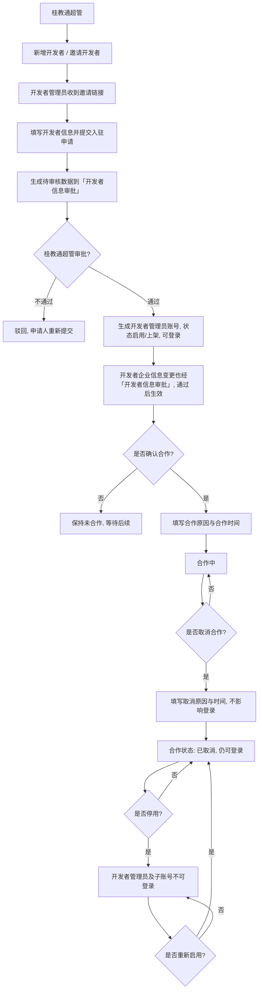
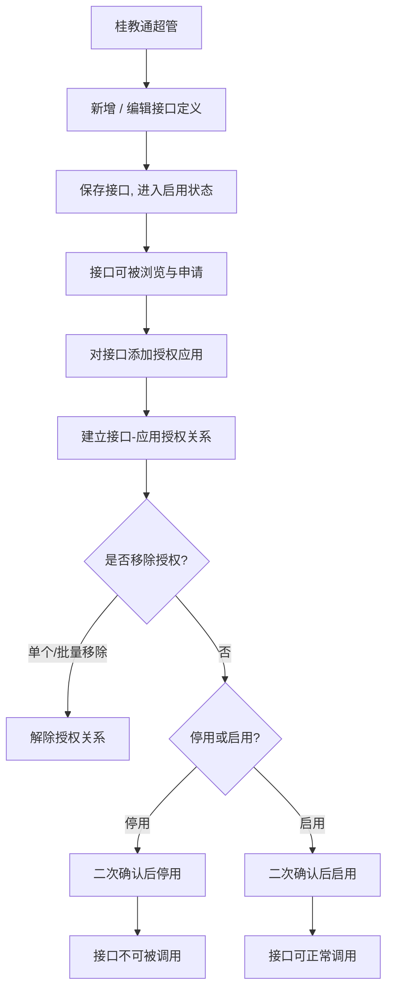
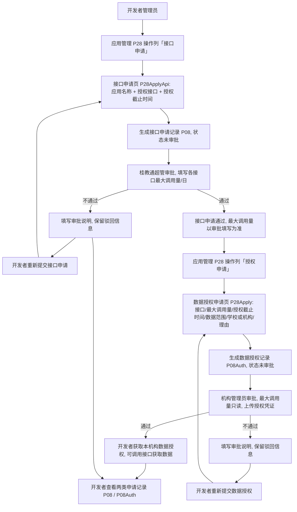
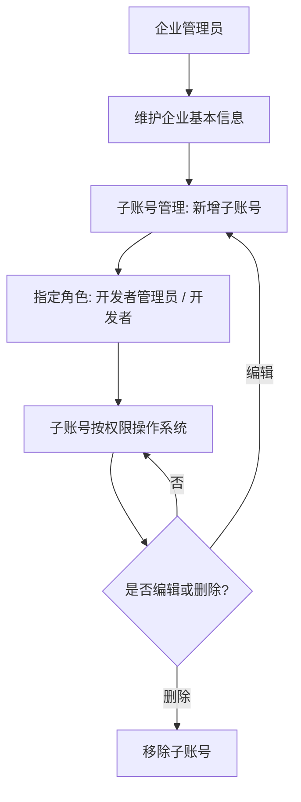
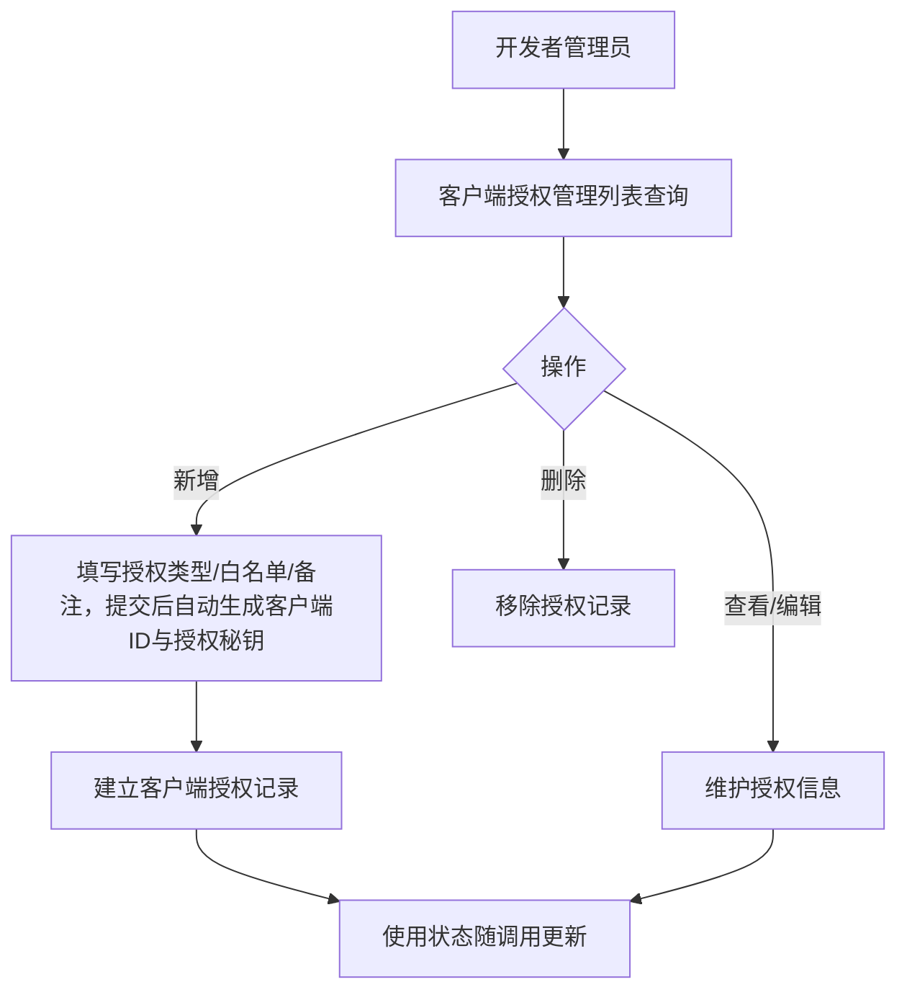
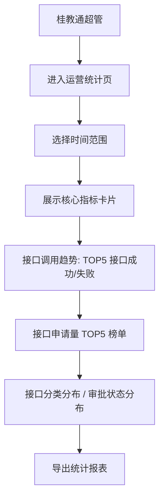
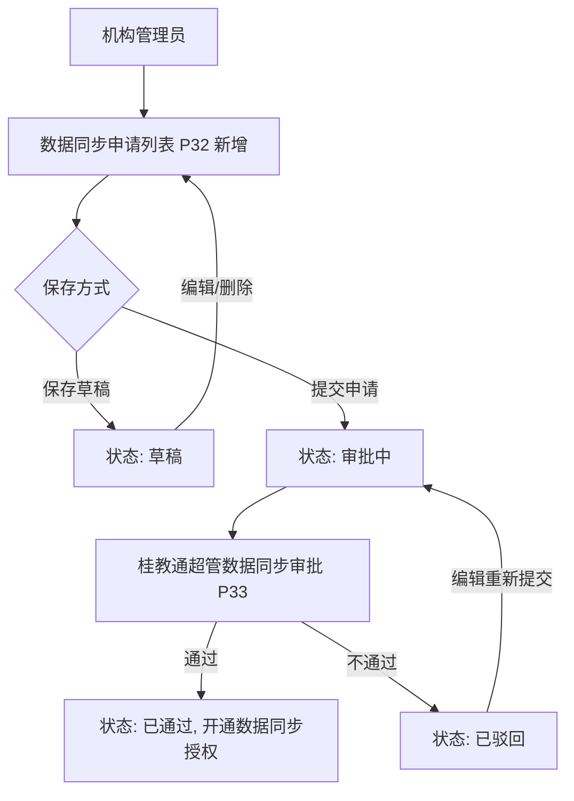
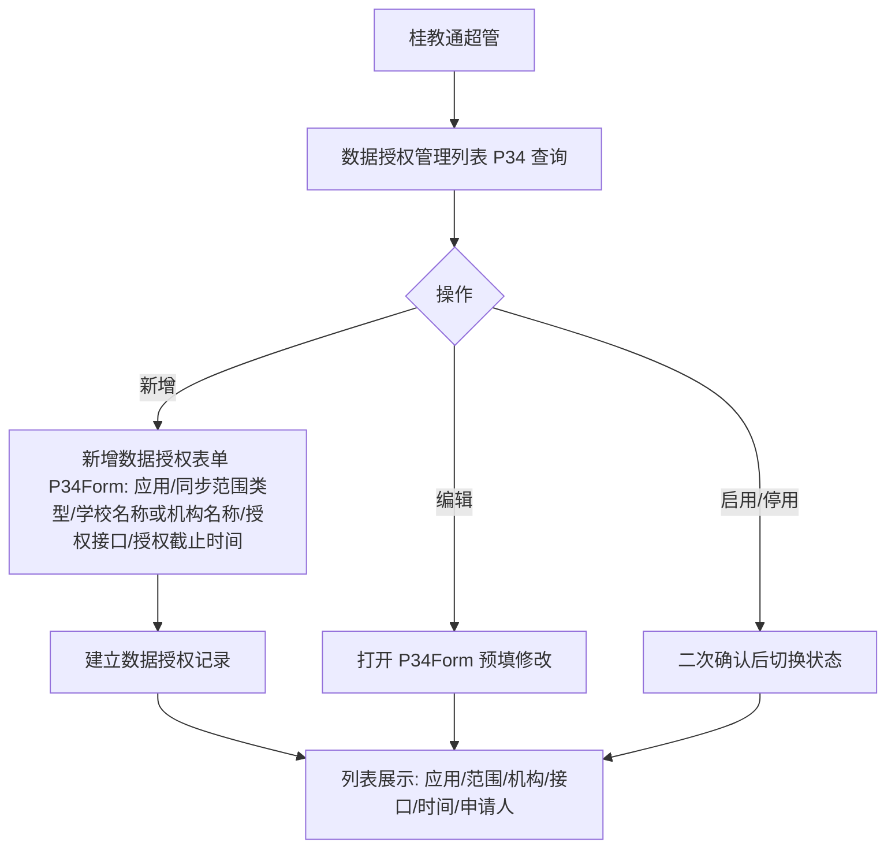
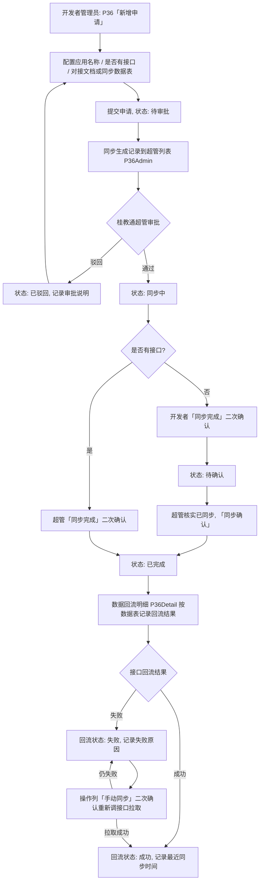

# 能力管理平台 — 产品需求文档（PRD）

## 一、文档概述

本 PRD 依据已确认的设计基线（`output/design/design.md`）展开，是研发、测试与评审的规格依据。设计基线中的字段定义、状态定义、权限定义与业务规则是唯一事实源，本 PRD 只做展开说明，不新增、不改写任何已确认语义。

本平台在桂教通平台上以迭代方式扩展建设，作为平台级能力开放枢纽，覆盖开发者入驻、能力上架、应用授权、接口申请审批与调用的全链路，服务机构管理员、桂教通超管、开发者管理员三类角色。一期一次交付全部功能，目标 2026 年 8 月底上线。

本文档章节构成：范围、业务流程、详细需求说明（按模块、页面、动作组织）、权限汇总、数据字典、状态机、验收标准汇总、风险与待确认。

## 二、范围

### （一）建设范围

| 模块 | 核心功能 | 涉及角色 |
|------|---------|---------|
| 开发者管理 | 开发者信息 CRUD、邀请注册、联系合作、取消/重新合作 | 桂教通超管 |
| API 接口管理 | 接口 CRUD、接口文档、应用授权、授权/取消授权、接口停用/启用 | 桂教通超管 |
| 接口能力管理 | 能力基础信息维护（新增/编辑）、能力关联接口管理（添加/移出） | 桂教通超管 |
| 接口申请与审批 | 两步申请流程：接口申请（桂教通超管审批）、数据授权（机构管理员审批），含两类申请记录与审批/查看 | 机构管理员、桂教通超管、开发者管理员 |
| 接口调用记录 | 记录各开发者调用接口的调用流水（按接口/开发者/结果筛选、汇总统计） | 桂教通超管 |
| 运营统计 | 接口/开发者/应用统计看板，支持时间范围筛选和导出 | 桂教通超管 |
| 客户端授权管理 | 客户端授权 CRUD、启用/停用 | 桂教通超管 |
| 数据授权管理 | 应用数据授权配置（新增/编辑/启用/停用） | 桂教通超管 |
| 数据同步申请与审批 | 数据同步申请新增/编辑/删除、数据同步审批 | 机构管理员、桂教通超管 |
| 开发者账号 | 企业信息管理、企业子账号管理 | 开发者管理员 |
| 开发者接口管理 | 接口列表、文档查看 | 开发者管理员 |
| 接口数据申请管理 | 应用查看/新增、接口申请记录（P08）、数据授权记录（P08Auth）、应用授权关联（应用ID、suiteKey 由桂教通体系提供） | 开发者管理员 |
| 数据回流管理 | 数据回流申请新增、列表查看（含对接文档预览）、同步完成标记、范围配置（API接口与同步字段多选/对接文档上传）；桂教通超管侧审批与同步确认、数据回流明细台账 | 开发者管理员、桂教通超管 |

### （二）建设方式

建设类型为 iteration，在桂教通平台上扩展，挂载点如下。

- 桂教通超管 → 超管后台 → 能力管理
- 机构管理员 → 组织中心 → 能力管理
- 开发者管理员 → 开发者后台 → 接口管理

进入模块后，侧栏直接展示二级菜单（不含一级包裹）：

- 机构管理员：数据授权记录（P08Auth，顶层菜单，原接口申请记录改名，审批开发者数据授权申请）、数据同步申请（P32，与数据授权记录同层级，顶层菜单；已删除"API接口管理"一级菜单）
- 桂教通超管：开发者管理（→开发者管理 P01、开发者信息审批 P01a）、能力管理（→API接口管理 P04、接口能力管理 P35、接口分类管理 P04a、接口申请记录 P08、接口调用记录 P27、运营统计 P13）、授权管理（→客户端授权管理 P30、数据授权管理 P34、数据同步审批 P33、数据回流管理 P36Admin、数据回流明细 P36Detail）
- 开发者管理员：账号管理（→P16/P17）、接口管理（→P19）、接口数据申请管理（→P28、接口申请记录 P08、数据授权记录 P08Auth）、数据回流管理（→P36）

用户体系、组织树、消息通知、审计日志、角色权限、门户、开发者应用实体与密钥等基础能力均复用桂教通现有体系，本平台只新增能力管理业务模块与页面。

## 三、业务流程

> 本章梳理平台全部核心业务场景流程，并为每个流程提供流程图（mermaid）。流程涉及角色：桂教通超管、开发者管理员、机构管理员。

### （一）开发者入驻与合作流程

开发者入驻与合作流程分为信息审批、合作确认、取消合作、重新合作四个阶段，由平台侧（桂教通超管）与开发者方协作完成（取消合作入口仅提供于开发者列表页，开发者详情页不提供该按钮）。审批通过即生成开发者管理员账号并启用（上架），可登录开发者平台。

1. 平台侧新增开发者，或通过"邀请开发者"向开发者管理员发送邀请链接；开发者管理员收到链接后填写开发者信息并提交入驻申请，生成一条待审核数据到桂教通超管「开发者信息审批」（P01a）。
2. 桂教通超管在「开发者信息审批」审批入驻申请：审批通过后生成开发者管理员账号（状态为启用/上架，可登录开发者平台），该开发者进入开发者列表；审批不通过则驳回，申请人需重新提交。
3. 开发者通过企业信息管理（P16）修改企业信息并提交后，同样生成一条待办到「开发者信息审批」，审批通过后修改才生效，审批不通过则维持原状。
4. 确认合作时填写合作原因与合作时间；确认合作仅做业务状态记录（合作状态变为合作中），开发者登录权限已在入驻审批通过（启用）时开通。
5. 取消合作时填写取消合作原因与时间；取消合作不影响登录权限（开发者管理员及子账号仍可登录），仅"停用"状态会影响登录。
6. 已取消的开发者可重新合作，重新合作后合作状态回到合作中。
7. 平台侧可对开发者执行"停用/启用"：停用后其开发者管理员及对应子账号均不可登录开发者平台；启用后恢复登录。

· 开发者管理员姓名与手机号在列表中默认脱敏展示，点击小眼睛可查看完整值。

### （二）API 接口授权流程

桂教通超管新增或编辑接口定义并发布后，对已授权应用建立授权关系，接口可停用/启用。

1. 桂教通超管新增或编辑接口基础信息与参数定义，保存后接口进入启用状态，可被开发者浏览与申请。
2. 对接口添加授权应用，在接口与应用之间建立授权关系；已授权应用可单个移除，也可勾选多条后批量移除。
3. 接口停用或启用前均需二次确认；停用后接口不可被调用，已授权应用不受影响但调用失败。

· 接口授权仅允许选择本机构/平台的应用。
· 接口新增时参数列表至少保留一条记录。

桂教通超管在接口能力管理（P35）中维护能力基础信息（能力名称、能力说明），并为能力关联/移出平台接口；能力作为接口分组维度，在接口新增/编辑时作为「接口能力」字段的选项来源。

### （三）接口申请与审批流程

接口申请与数据授权流程由开发者管理员发起，平台侧审批，采用**两步申请**：先申请接口（桂教通超管审批），再申请数据授权（机构管理员审批）。

**第一步：接口申请（桂教通超管审批）**

1. 开发者管理员在应用管理（P28）操作列点击"接口申请"，打开接口申请页（P28ApplyApi），仅展示当前选择的应用名称与授权接口，选择授权接口后提交。
2. 申请写入接口申请记录（P08），审批状态为未审批，桂教通超管收到申请通知。
3. 桂教通超管在接口申请记录（P08）审批，审批时可在申请接口列表中编辑各接口最大调用量/日（最终值以审批通过时填写为准）；结论为通过或不通过，不通过时审批说明必填。
4. 审批通过后，开发者可对该应用发起数据授权申请（第二步）；不通过则保留驳回信息，开发者可在接口申请记录中重新提交。

**第二步：数据授权（机构管理员审批）**

5. 开发者管理员在应用管理（P28）操作列点击"授权申请"，打开数据授权申请页（P28Apply），填写授权接口、最大调用量/日、授权截止时间、同步范围类型、学校名称（勾选学校时）或机构名称（勾选教育局时）、是否包含下级、申请理由并同意免责声明后提交。
6. 申请写入数据授权记录（P08Auth），审批状态为未审批，机构管理员收到申请通知（系统按机构名称精确匹配机构管理员）。
7. 机构管理员在数据授权记录（P08Auth）审批，各接口最大调用量/日只读（以接口申请审批时填写为准），可上传机构授权凭证；结论为通过或不通过，不通过时审批说明必填。
8. 审批通过后，授权 key 自动取申请应用对应的 suiteKey，并标记开发者已获取当前机构的数据授权，可调用接口获取数据；不通过则保留驳回信息，开发者可在数据授权记录中重新提交。
9. 开发者管理员在接口申请记录（P08）与数据授权记录（P08Auth）中分别查看两类申请的审批结果与审批信息（数据授权记录按机构逐条展示，含授权凭证等）。

· 两类申请记录均按最新未审批数据排最前。
· 审批不通过的两类申请，开发者可在对应记录列表点击「重新提交」进入申请界面编辑后再次提交（接口申请带出原应用与授权接口，数据授权带出原申请接口）。

### （四）开发者账号与子账号管理流程

开发者企业管理员维护企业基本信息与子账号，子账号按角色权限使用平台功能。

1. 企业管理员在开发者企业信息页维护企业基本信息（企业名称、统一社会信用代码、联系人等）。
2. 企业管理员在子账号管理页新增子账号，指定角色（开发者管理员 / 开发者）。
3. 子账号使用被分配的权限操作系统，企业管理员可编辑或删除子账号。

### （五）客户端授权管理流程

桂教通超管维护客户端授权，按应用与授权类型建立客户端级授权关系。

1. 桂教通超管在客户端授权管理列表查询客户端授权（按客户端ID、使用状态、授权类型筛选）。
2. 点击新增，填写授权类型、回调地址、白名单、备注等信息，提交后系统自动生成客户端ID与授权秘钥，建立客户端授权记录。
3. 对已有记录可查看、编辑或删除；点击"授权"跳转授权配置页（P31）维护授权信息（是否全部数据/是否全部接口/同步范围类型/学校名称或机构名称/授权接口/授权截止时间）；使用状态随实际调用情况更新（使用中 / 未使用）。

### （六）接口调用与运营监控流程

平台侧通过运营统计监控接口调用情况，按申请量 TOP5 接口统计成功/失败数，并按分类、审批状态分布掌握全局运行状况。

1. 桂教通超管进入运营统计页，选择时间范围（今日 / 近7天 / 近30天 / 自定义）。
2. 系统展示核心指标卡片、接口调用趋势（TOP5 接口成功/失败堆叠）、接口申请量 TOP5、接口分类分布、申请审批状态分布。
3. 超管可导出当前统计报表用于复盘。

### （七）数据同步申请与审批流程

机构管理员为本机构业务系统提交数据同步申请，桂教通超管对全部机构的数据同步申请进行审批。

1. 机构管理员在数据同步申请列表（P32）点击"新增"，弹窗填写业务系统名称、业务系统对接人、对接人联系电话、白名单（均必填，白名单支持新增多个），可"保存草稿"或"提交申请"。
2. 提交申请后记录状态为"审批中"，进入桂教通超管的数据同步审批列表（P33）。
3. 桂教通超管对"审批中"记录审核：通过 → 状态"已通过"（为该机构开通对应业务系统的数据同步授权）；不通过 → 状态"已驳回"（审核说明必填）。
4. 机构管理员对"草稿""已驳回"记录可编辑；对"草稿"记录可删除；已驳回记录编辑后可重新提交进入审批。

### （八）数据授权管理流程

桂教通超管为应用配置数据授权（应用、同步范围类型、学校名称/机构名称、授权接口、授权截止时间），并管理启用/停用。

1. 桂教通超管在授权管理 → 数据授权管理（P34）列表查询数据授权记录（按应用名称、状态筛选）。
2. 点击"新增数据授权"，打开新增数据授权表单页（P34Form）：应用名称（可搜索下拉框，按应用名称模糊匹配，单选，必填，最多匹配 30 个）、同步范围类型（必填，可多选，枚举学校/教育局；勾选「学校」时展示「学校名称」，勾选「教育局」时展示「机构名称」）、学校名称/机构名称（必填多行文本框，多个用英文分号(;)隔开，如：南宁市教育局;南宁市第三中学）、授权接口（必填，弹窗接口列表选择，可多选，支持按接口名称搜索）、授权截止时间（时间控件，必填，不可选择当前时间之前，只能选择当前时间的三年内的时间）。
3. 保存后建立数据授权记录；对已有记录可编辑（打开 P34Form 预填当前值）或启用/停用（二次确认）。停用后应用不可再调用被授权接口。

### （九）数据回流流程

开发者管理员为本企业应用提交数据回流申请，桂教通超管对全部回流申请进行审批与同步确认，并按接口维度记录回流明细与回流结果。

1. 开发者管理员在数据回流管理（P36）点击"新增申请"，填写应用名称、是否有接口（有接口上传对接文档并填写认证key与对接域名，无接口选择已上架数据表与同步字段）并提交，状态为"待审批"，同时同步生成一条记录到桂教通超管数据回流列表（P36Admin）。
2. 桂教通超管在数据回流管理（P36Admin）审批：通过 → 状态"同步中"；不通过 → 状态"已驳回"（审批说明必填），开发者可编辑后重新提交。
3. 有接口场景由超管「同步完成」（二次确认）直接进入"已完成"；无接口场景由开发者「同步完成」进入"待确认"，超管核实数据已同步成功后「同步确认」进入"已完成"。
4. 回流执行结果按数据表维度记录在数据回流明细（P36Detail）：成功记录最近同步时间，失败记录失败原因；有接口回流失败时明细页操作列出现「手动同步」，超管二次确认后重新调用接口拉取数据。

流程图源码（mermaid）

### （一）开发者入驻与合作

本模块覆盖开发者从入驻邀请到合作的全生命周期，含开发者信息审批（入驻申请与企业信息变更）、开发者信息维护与合作状态变更，对应设计基线模块 4.1（开发者管理）。包含开发者列表（P01）、开发者信息审批（P01a）、新增/编辑开发者（P02）、开发者详情（P03）四个页面。桂教通超管可见全平台开发者；新增或邀请注册提交的入驻信息、开发者提交的企业信息变更均生成待审核数据，经「开发者信息审批」审批通过后才生效。

#### 开发者列表（P01）

页面由查询区、结果列表与行操作区组成。用户进入页面后应先能判断当前有哪些开发者、各自处于什么合作阶段，并直接发起新增、邀请或对单条开发者的合作、启用/停用操作。列表上方展示提示"本列表展示审批通过的开发者（审批通过即启用/上架，可登录开发者平台）；停用后其开发者管理员及对应子账号均不可登录开发者平台，取消合作不影响登录"。

（1）查询开发者

列表展示当前筛选条件下的开发者记录，供用户快速判断开发者身份与合作状态。列表列包含：开发者名称、开发者类型、管理员姓名、手机号码、合作状态、状态（启用/停用）、是否在门户展示、申请日期。

- 管理员姓名与手机号码默认脱敏展示（姓名如"张**"，手机号保留部分位数），点击行内"小眼睛"图标查看完整值，再次点击恢复脱敏；两种角色脱敏规则一致。
- 支持按开发者名称、开发者类型筛选，查询后列表刷新。
- 列表默认按申请日期倒序排列，每页 20 条。
- 无匹配数据时列表区域显示"暂无开发者数据"；查询失败时显示失败提示并提供重试入口。

（2）新增开发者

点击右上角"新增开发者"跳转新增开发者页 P02，页面为三段可折叠区表单（基础信息 / 财务信息 / 开票信息），填写流程见页面 2 的（1）。

（3）邀请开发者

点击"邀请开发者"弹出邀请成功弹窗，弹窗内容为蓝色对勾图标 + 提示文字"邀请链接已复制，可将此链接发给开发商进行注册；开发商注册提交的入驻信息需经审批通过后，方可登录开发者平台"，底部两个按钮：

- "我知道了"：关闭弹窗。
- "查看链接"：在新浏览器页签中打开新增开发者页（P02），该页面不显示头部导航栏和侧栏菜单（standalone 模式），开发者管理员收到链接后填写开发者信息并提交入驻申请，生成一条待审核数据到「开发者信息审批」（P01a）；审批通过后生成开发者管理员账号并进入本列表（状态为"启用/上架"，可登录；停用后不可登录），合作状态为"未合作"、申请日期为提交（审批通过）时间。

- standalone 模式下保存成功后展示成功提示界面（圆形渐变背景 + 白色对勾图标 + 提示文案"恭喜您已提交入驻申请，麻烦您耐心等待桂教通超管审批，审批通过后即可登录开发者平台"），不显示返回按钮。

（4）查看开发者

点击行尾"查看"跳转开发者详情页，进入流程见页面 3 的（1）。

（5）编辑开发者

点击行尾"编辑"跳转编辑开发者页，已审批通过的开发者均可编辑（编辑保存直接生效，不走入驻申请审批）。

（6）确认合作

点击行尾"确认合作"弹出确认框，填写合作原因与合作时间后确认，合作状态变为"合作中"。合作状态为"未合作"的开发者可直接确认合作

- 确认合作仅做业务状态记录：开发者登录权限在入驻审批通过（启用）时已开通，确认合作不再涉及登录权限变更（租户体系复用桂教通）。

（7）启用/停用

点击行尾"启用"或"停用"弹出二次确认框，确认后该开发者"状态"在启用、停用间切换。停用后其开发者管理员及对应子账号均不可登录开发者平台；取消合作（合作状态变为"已取消"）不影响登录权限，仅停用会影响登录。

（8）分配应用

开发者合作状态为"合作中"时，操作列展示"分配应用"按钮。点击后弹出分配应用弹窗，弹窗以列表形式展示所有生态应用，展示字段：应用名称、应用ID、应用分类。支持多选（checkbox），选中后点击"确认分配"完成应用分配。

- 至少选择一个应用才可确认分配。

#### 开发者信息审批（P01a）

页面用于桂教通超管审批两类待审核数据：入驻申请（新增开发者 P02 / 邀请注册提交）与企业信息变更（开发者 P16 提交），页面顶部展示提示"新增开发者或邀请注册提交的入驻信息、开发者修改企业信息提交的变更申请，均在此审批；入驻申请审批通过后生成开发者管理员账号，方可登录开发者平台"。

（1）查询待审核数据

- 查询条件：申请类型（全部 / 入驻申请 / 企业信息变更）。
- 列表列：开发者名称、申请类型（标签展示：入驻申请 / 企业信息变更）、提交时间、申请来源（新增 / 邀请注册 / 企业信息变更）、状态（待审核）、操作（查看 / 审批）。

（2）查看

点击"查看"单开厂商信息界面（新页面），厂商信息以只读表单（form-item）方式展示，内容同开发者管理的查看界面（P03，只读）：
- 入驻申请：展示提交的入驻信息（开发者名称、开发者类型、是否归属公海、统一社会信用代码、法人代表、管理员、管理员手机号、公司电话、营业期限、是否在门户展示、工商注册地址、详细地址、开发者简介、营业执照[简介下方一行多图，文件名下方展示]）。
- 企业信息变更：展示当前（变更前）厂商信息。
- 该界面仅查看厂商信息，不提供审批操作，返回后回到待审核列表。

（3）审批

点击"审批"打开新界面（布局参考「接口申请审批」P09）：审批通过与审批不通过整合为一次审批。
- 顶部"申请信息"：开发者名称、申请类型、申请来源、提交时间、审批状态。
- 内容区：入驻申请 → 展示厂商信息（只读表单 form-item 方式，同查看界面）；企业信息变更 → 展示修改前后记录对照表（变更字段 / 原值 / 新值）。
- 底部"审批意见"：通过 / 不通过单选（默认通过），"审批说明"文本域（不通过时必填）。
- 提交审批后按结论执行：
  - 通过：入驻申请 → 生成开发者管理员账号（状态为"启用/上架"，可登录开发者平台），该开发者进入开发者列表（P01），申请从待审核列表移除，提示"审批通过，开发者管理员账号已生成，可登录开发者平台"；企业信息变更 → 修改生效（覆盖企业信息），申请从待审核列表移除，提示"审批通过，企业信息修改已生效"。
  - 不通过：驳回，申请从待审核列表移除；入驻/修改不生效，申请人可重新提交，提示"已审批不通过，入驻/修改不生效，申请人可重新提交"。

#### 新增/编辑开发者（P02）

页面为开发者信息表单，用于新建开发者或维护开发者的信息。整体分为三个可折叠区：基础信息（必填集中）、财务信息（选填）、开票信息（选填）。页面底部提供保存与返回按钮。新增模式（非 standalone）页面顶部展示提示"提交的入驻信息将生成待审核数据，经桂教通超管在『开发者信息审批』中审批通过后，才生成开发者管理员账号并展示在开发者列表"。

（1）新增开发者

**基础信息区（可折叠，默认展开）**——采用左右两列布局，全部字段必填：

左列字段：
- 开发者名称：文本输入，最多 100 字符。
- 开发者类型：单选，企业 / 个人。
- 法人代表：文本输入，最多 50 字符。
- 管理员：文本输入，最多 50 字符。
- 产品材料：附件上传，文件数量不超过 10 个，单个附件大小不得超过 20M。
- 工商注册地址：多行文本输入，最多 500 字符。
- 增值税一般纳税人：单选，是 / 否。
- 详细地址：多行文本输入，最多 500 字符。

右列字段：
- 是否归属公海：单选，是 / 否。
- 统一社会信用代码：文本输入，18 位统一编码。
- 管理员手机号：文本输入，11 位数字。
- 开发者简介：多行文本输入，最多 500 字符。
- 公司电话：文本输入。
- 营业期限：日期选择控件。
- 是否在门户展示：单选，是 / 否，选填，默认否。

开发者logo 与营业执照字段采用同行布局：
- 开发者logo：图片上传，建议尺寸 100×100px，大小不超过 2M。
- 营业执照：多图上传，支持 jpg / jpeg / png / bmp 格式，单张图片大小不超过 500KB。

**财务信息区（可折叠，默认展开，全部选填）**：银行类别、开户行名称、开户行账号、账户用途，四个字段左右两列展示。

**开票信息区（可折叠，默认展开，全部选填）**：单位地址、纳税人识别号、电话号码、开户银行、银行账户、联行号，六个字段左右两列展示。

保存时校验：
- 基础信息区全部必填项非空；
- 管理员手机号 11 位数字格式；
- 统一社会信用代码 18 位；
- 开发者logo 大小 ≤2M；
- 产品材料 ≤10 个，单个 ≤20M；
- 营业执照单张 ≤500KB；
- 校验不通过时对应字段标红并提示，页面不关闭、不跳转。

- 新增提交成功后不直接生成开发者账号：生成一条入驻申请待审核数据到桂教通超管「开发者信息审批」（P01a），提示"已提交入驻申请，待桂教通超管审批通过后生成开发者账号"并返回开发者列表；审批通过后开发者才进入列表（合作状态为"未合作"、申请日期为提交时间）。
- 保存失败（如网络异常）时保留已填写内容，提示"保存失败，请重试"。

（2）编辑开发者

已审批通过的开发者均可进入编辑。表单结构与新增一致并回显当前值，保存规则同新增；编辑保存为直接生效（维护已审批通过的开发者信息），不走入驻申请审批。

#### 开发者详情（P03）

页面以只读表单形式展示开发者完整信息，分为两个可折叠区（开发者基础信息、合作信息），并承载合作、重新合作状态变更操作（取消合作入口在开发者列表页，详情页不提供该按钮）。

（1）查看开发者详情

**折叠区 1：开发者基础信息（可折叠，默认展开）**

展示字段：开发者名称、开发者类型、法人代表、统一社会信用代码、管理员姓名、管理员手机号、工商注册地址、详细地址、公司电话、营业期限、增值税一般纳税人、是否公海、开发者简介、开发者logo（图片展示）、营业执照（多图展示）、产品材料（文件标签列表）、是否在门户展示、申请日期。

- 管理员姓名与手机号码默认脱敏展示，点击字段右侧"小眼睛"图标查看完整值。

**折叠区 2：合作信息（可折叠，默认展开）**

展示字段：合作状态、合作时间、合作原因、取消合作时间、取消合作原因、重新合作时间、重新合作原因。

- 合作状态以标签形式展示（未合作/合作中/已取消）。

（1）确认合作

点击"确认合作"弹出确认框，填写合作原因（必填）、合作时间（必填）后确认。合作状态为"未合作"的开发者可直接确认合作，无"确认联系"前置环节。

（2）取消合作
（3）重新合作

点击"重新合作"弹出确认框，填写重新合作原因（必填）、重新合作时间（必填）后确认。仅"已取消"状态可操作。

- 确认后合作状态变为"合作中"，开通开发者管理员登录权限（租户体系复用桂教通）。

### （二）API 接口定义与授权

本模块覆盖机构自建 API 接口的全生命周期，含接口分类定义、接口定义、接口文档与应用授权，对应设计基线模块 4.2（API 接口管理）。包含接口分类管理（P04a）、接口列表（P04）、新增/编辑接口（P05）、接口文档查看（P06）、接口信息查看（P22）、应用授权（P07）六个页面。桂教通超管管理全平台接口。

#### 接口分类管理（P04a）

页面为树形分类维护页，桂教通超管维护接口分类树（最多五层），作为接口新增/编辑时"接口分类"字段的选项来源。支持新增、编辑、删除、启用/停用。

（1）查看分类树

页面顶部为查询区，支持按分类名称（文本，模糊匹配）、分类状态（下拉：启用/停用）筛选；下方树形列表展示分类：分类名称、分类编码、排序、分类状态。分类按父子层级展开显示，同级按排序值从小到大排列；工具栏含"新增顶级分类"按钮。查询命中子节点时自动展开其父级路径，未命中时展示"暂无匹配分类"。

（2）新增分类

点击"新增顶级分类"或行内"新增子分类"打开弹窗填写：

- 父级分类：树形选择，选填。新增顶级分类时可为空；新增子分类时自动带入当前分类。
- 分类名称（必填，文本输入）
- 分类编码（必填，文本输入，全局唯一不可重复）
- 排序（选填，默认 0，非负整数）

提交校验：所选父级分类已达第五层时禁止新增子分类并提示"最多支持五层分类"；分类编码重复时提示"编码已存在"。

（3）编辑分类

点击行内"编辑"打开弹窗并回显当前值，字段与新增一致；父级分类不可选择自身或其子孙分类。保存规则同新增。

（4）停用/启用分类

点击行内"停用"弹出二次确认框，确认后分类状态变为"停用"，按钮变为"启用"。停用后该分类及其子孙分类不再出现在接口新增/编辑时的分类选项中，已选用该分类的接口不受影响。

（5）删除分类

点击行内"删除"弹出二次确认框。该分类存在子分类或被接口引用时禁止删除并提示"存在子分类或被接口引用，无法删除"。删除后分类从树中移除。

#### 接口列表（P04）

页面由查询区、结果列表与行操作区组成。用户进入页面后应先能判断当前有哪些接口、处于什么运行状态，并直接查看文档、编辑、授权或停用/启用。

（1）查询接口

列表展示当前筛选条件下的接口记录，列包含：序号、接口名称、请求路径、接口能力、数据敏感等级、最大调用量/日、接口状态。支持按接口名称、数据敏感等级、接口能力筛选。

- 操作列"查看文档"跳转接口文档查看页（P06），所有角色（含开发者管理员）均显示该按钮。
- 桂教通超管视角：列表展示桂教通平台接口 + 机构新增接口，拥有完整管理权限。
- 列表默认按创建时间倒序排列，每页 20 条。
- 无匹配数据时显示"暂无接口数据"；查询失败时显示失败提示并提供重试入口。

（2）新增接口

点击右上角"新增接口"跳转新增接口页，填写流程见页面 5 的（1）。桂教通超管可见并可新增。

（3）查看文档

点击行尾"查看文档"跳转接口文档查看页，进入流程见页面 6 的（1）。所有角色（含开发者管理员）均显示该按钮。

（4）编辑接口

点击行尾"编辑"跳转编辑接口页，填写流程见页面 5 的（2）。桂教通超管对全平台接口可编辑。

（5）应用授权

点击行尾"应用授权"跳转应用授权页，进入流程见页面 7。桂教通超管对全平台接口可授权。

（6）停用/启用接口

点击行尾"停用"或"启用"弹出二次确认框，确认后接口状态在启用、停用间切换。停用后接口不可被调用，已授权应用不受影响但调用失败。桂教通超管对全平台接口可操作。

- 取消确认时接口状态保持不变。
- 操作失败时提示失败原因并保留原状态。

（7）批量授权

接口列表支持多选（复选框列，所有角色可见）：桂教通超管 / 机构管理员勾选一个或多个接口后，点击工具栏"批量授权（N）"按钮（N 为已选接口数，未勾选时禁用），打开批量授权弹窗。弹窗顶部展示已勾选接口列表（接口名称、请求路径、接口能力、数据敏感等级，只读），下方选择应用名称（必填，可搜索下拉框：根据应用名称模糊匹配应用，单选，最多匹配 30 个数据；仅展示非生态应用）。确认后为所选接口批量建立授权关系，授权后接口拉取的数据范围为该应用的上架范围。

- 未勾选任何接口时按钮显示"批量授权（0）"且不可点击，点击后提示"请先勾选至少一个接口"。
- 桂教通超管可对全平台接口批量授权；机构管理员仅可对本机构接口批量授权。

#### 新增/编辑接口（P05）

页面为接口编辑表单，包含接口基础信息。信息密度较高，用户需完整填写接口定义后保存。

（1）新增接口

接口基础信息包含：接口名称（必填）、接口服务名（必填，英文/数字/下划线，不含中文）、数据敏感等级（必填，单选：敏感接口/非敏感接口）、接口分类（必填，单选下拉，来源接口分类管理）、接口能力（必填，单选下拉：待办/用户信息/组织信息等，以能力维度分组）、**接口类型（个人/机构，单选，必填）**、版本号（必填，文本框，如 v1.0）、最大调用量/日（必填，数字输入框，正整数）、接口请求方式（必填，单选：POST/GET）、是否需要授权（必填，radio 单选：是/否，标记接口调用时是否需要申请才可使用）、**是否机构审批**（必填，radio 单选：是/否，标记接口申请时流程是否需要机构审批）、接口请求地址（必填，URL 格式，**全局唯一**，保存时若已存在相同地址（排除自身）则禁止保存）、文档链接（必填，前缀 https:// + 文本框）、是否对外可见（必填，radio 单选：是/否，与"文档链接"同处一行）。

- 注：「接口签名类型」「调用身份」字段已删除。
- 保存时校验：必填项齐全（含数据敏感等级、接口分类、接口能力、接口类型、版本号、最大调用量/日、是否机构审批、文档链接、接口请求地址全局唯一）；校验不通过时对应项标红并提示。
- 保存成功后跳转接口列表，接口状态为"启用"，请求路径由系统生成。
- 保存失败时保留已填写内容，提示"保存失败，请重试"。

（2）编辑接口

表单字段与新增一致并回显当前值，保存规则同新增。

#### 接口文档查看（P06）

页面为接口文档的只读展示页，以专业 API 文档风格呈现接口定义与调用说明。

（1）查看接口文档

页面顶部蓝色文档头展示接口名称（大标题）和使用场景描述（含服务名）。下方依次排列以下区域：

- **权限说明表格**：展示三行权限项——"应用是否需要申请白名单"（根据接口配置显示需要/不需要）、"用户凭证"（未支持）、"机构凭证"（支持），各含说明和备注列。
- **请求信息**：展示请求方式（GET/POST + HTTPS）和请求地址（可点击超链接）。
- **返回参数表格**：展示基础返回字段（errcode、errmsg、data 对象）。
- **请求示例**：代码块展示完整请求命令。
- **返回示例**：JSON 代码块展示返回数据示例。

- 文档内容较长时支持页面滚动查看。

#### 应用授权（P07）

页面管理接口已授权的应用列表，标题展示当前接口名称（只读）。仅支持为非生态应用授权，授权后接口拉取的数据范围为该应用的上架范围（适用机构+适用学段）。支持添加、移除、批量移除授权。

（1）查看已授权应用

已授权应用列表展示：多选框、应用ID、应用名称、应用属性、数据范围（应用上架范围，格式"适用机构 / 适用学段"）。支持按应用名称、应用ID 筛选。

- 列表默认按添加时间倒序排列，每页 20 条。
- 无已授权应用时显示"暂无已授权应用"。

（2）添加授权

点击"添加授权"打开应用选择弹窗，弹窗中的应用列表仅展示**非生态应用**（应用属性≠"生态应用"），左侧为应用列表表格（应用名称、应用ID、应用属性），支持按应用名称、应用ID、应用属性搜索筛选，表格可多选，支持分页（10/20/50 条每页），表头全选当前页；右侧展示已选应用面板，每项可点击 × 移除。点击确认后所选应用进入已授权列表，系统自动将其上架范围（适用机构+适用学段）作为接口拉取的数据范围并刷新。

（3）移除授权

勾选已授权应用后点击行尾"移除授权"，弹出二次确认框，确认后该应用解除与当前接口的授权关系。

- 取消确认时授权关系保持不变。

（4）批量移除授权

勾选多个已授权应用后点击"批量移除授权"，弹窗展示所选应用名称，确认后批量解除授权关系。

- 未勾选任何应用时批量移除按钮不可点击。

#### 接口能力管理（P35）

页面采用**左右分栏**布局：左侧展示平台全部能力列表，右侧展示所选能力关联的接口列表。桂教通超管维护能力基础信息及能力-接口关联关系。

（1）能力列表（左侧）

左侧展示平台全部能力（卡片形式），每项展示能力名称、能力说明摘要。顶部含「新增能力」按钮，点击打开新增能力界面（P35Form）。

- 点击某能力后该能力高亮，右侧联动展示其关联接口列表。
- 鼠标经过能力项时显示「详情」「编辑」按钮：点击「详情」打开只读的能力详情界面（P35View）；点击「编辑」打开编辑能力界面（P35Form），并带出该能力当前信息。
- 无能力时展示空状态提示。

（2）新增/编辑能力（P35Form，新界面）

新增/编辑能力均以**新界面方式**打开（非弹窗），界面内容**铺满容器**。页面为表单布局：

- 能力名称（**必填**，文本输入，不超过 20 个字符）
- 能力说明（**必填**，富文本编辑器，支持加粗、标题、列表、链接、图片等）

提交校验：能力名称为空时提示「能力名称为必填项」；超过 20 字符时提示「能力名称不超过20个字符」；能力说明为空时提示「能力说明为必填项」。保存后返回来源页，列表实时刷新。

（3）关联接口列表（右侧）

右侧展示当前选中能力已关联的接口，列包含：接口名称、接口服务名称、数据敏感等级、接口路径、**文档链接（蓝色超文本展示，点击新窗口打开对应接口文档）**。列表顶部展示关联数量与「添加接口」按钮，操作列提供「移出」。

- 未选择能力时提示先在左侧选择能力。
- 无关联接口时显示「暂无关联接口」。

（4）添加接口

点击「添加接口」打开弹窗，展示所有未关联当前能力的接口列表（接口名称、接口服务名称、数据敏感等级、接口路径），支持多选（复选框）。确认后将所选接口加入当前能力的关联列表。

- 未选择任何接口时点击确定提示「请至少选择一个接口」。

（5）移出接口

点击行尾「移出」弹出二次确认框，确认后将该接口从当前能力的关联列表中移除。

- 取消确认时关联关系保持不变。

（6）能力详情（P35View，只读界面）

点击能力项「详情」按钮打开只读的能力详情界面（P35View），界面内容**铺满容器**，展示内容与编辑界面一致：

- 能力名称（只读文本展示）。
- 能力说明：按富文本**图文格式**渲染展示（加粗、标题、列表、链接、图片等样式与编辑时对应），不可编辑。
- 底部「返回」按钮返回来源页。

### （三）接口申请与审批

本模块管理外部开发者对平台接口的申请与数据授权，对应设计基线模块 4.3，采用**两步申请流程**：

1. **接口申请**：开发者从应用管理（P28）操作列"接口申请"发起，仅申请当前应用可调用的授权接口，提交后生成接口申请记录（P08），由**桂教通超管**审批；审批通过后开发者可发起数据授权申请。
2. **数据授权**：开发者从应用管理（P28）操作列"授权申请"发起，申请数据范围（同步范围类型、机构、最大调用量等），提交后生成数据授权记录（P08Auth），由**机构管理员**审批；审批通过后开发者获取数据授权，可调用接口获取数据。

本模块包含接口申请记录（P08）、数据授权记录（P08Auth）、接口申请审批（P09）、数据授权审批（P09Auth）、接口申请记录查看（P10）、数据授权记录查看（P10Auth）六个页面。桂教通超管审批接口申请，机构管理员审批数据授权，开发者管理员可查看本企业两类申请记录。

#### 接口申请记录（P08）

页面由查询区、结果列表与行操作区组成。记录开发者提交的接口申请（仅含应用名称与授权接口），由桂教通超管审批。

（1）查询申请记录

列表展示当前筛选条件下的接口申请记录，列包含：应用名称、开发者名称（桂教通超管可见）、授权接口、申请时间、授权截止时间、审批状态。支持按接口名称、审批状态筛选。

- 列表按最新未审批数据排最前，其余按申请时间倒序排列，每页 20 条。
- 无匹配数据时显示"暂无申请记录"。

（2）审批申请

点击行尾"审批"跳转接口申请审批页（P09）。仅审批状态为"未审批"的记录显示"审批"按钮；已审批记录不显示审批按钮。

（3）查看申请记录

点击行尾"查看"跳转接口申请记录查看页（P10）。

（4）重新提交

开发者对审批状态为"已驳回"的接口申请可点击"重新提交"，跳转接口申请界面（P28ApplyApi）并带出原申请的应用与授权接口，编辑后重新提交，重新进入桂教通超管审批流程。

#### 数据授权记录（P08Auth）

页面分两个Tab：「授权记录」（默认）与「已审批通过」。记录开发者提交的数据授权申请（含数据范围、机构、最大调用量等），由机构管理员审批；审批通过后开发者获取数据授权。

（1）授权记录 Tab

展示开发者申请的所有数据授权记录。**申请时一个机构为一条数据**：一次申请可输入多个机构名称（多个用英文分号(;)隔开），提交后按机构拆分生成多条授权记录，每条记录机构名称为单个机构。

查询条件支持接口名称、应用ID、审批状态（未审批/已审批/已驳回）筛选。列表列包含：应用名称、同步数据范围、机构名称（单机构）、申请理由、申请时间、授权截止时间、审批状态。

- 列表按最新未审批数据排最前，其余按申请时间倒序排列，每页 20 条。
- 无匹配数据时显示"暂无授权申请记录"。

（2）审批申请

点击行尾"审批"跳转数据授权审批页（P09Auth）。仅审批状态为"未审批"的记录显示"审批"按钮；已审批记录不显示审批按钮。

（3）查看申请记录

点击行尾"查看"跳转数据授权记录查看页（P10Auth）。

（4）重新提交

开发者对审批状态为"已驳回"的数据授权记录可点击"重新提交"，跳转批量接口申请（P21m）并带出原申请的接口，重新提交后再次进入机构管理员审批流程。

（5）已审批通过 Tab

展示所有审批通过的授权记录（审批状态为"已审批"且结论为"通过"），同样按机构拆分、一个机构一条数据。列表列包含：应用名称、同步数据范围、机构名称（单机构）、申请理由、审批时间、授权截止时间、审批状态；操作仅提供"查看"，跳转数据授权记录查看页（P10Auth），不提供审批与重新提交入口。

#### 接口申请审批（P09）

页面供桂教通超管查看接口申请详情并作出审批结论，含申请信息只读表单、申请接口列表（含可编辑最大调用量/日）与审批操作区。接口申请仅申请当前应用可调用的接口，不涉及数据范围；各接口最大调用量/日由审批时填写，最终值以审批通过时填写为准。

（1）查看申请详情

页面布局顺序为：先展示"申请信息"区块，再展示"申请接口"列表。

- 申请信息区块以只读表单展示：应用名称、开发者名称、申请时间、授权截止时间、审批状态。
- 申请接口列表位于申请信息下方，列包含：接口名称、接口服务名、接口能力、数据敏感等级、接口分类、**最大调用量/日（可编辑，正整数，必填）**、**文档链接（蓝色超文本展示，点击新窗口打开对应接口文档）**；列表分页展示，每页默认 5 条，可翻页查看全部接口。

（2）提交审批

审批操作区填写：审批意见（必填，通过/不通过）、审批说明（文本框占满宽度，不通过时必填）。点击"提交审批"完成审批，各接口最大调用量/日以本次审批填写为准。

- 审批通过后，申请状态变为已审批，开发者可对该应用发起数据授权申请（由机构管理员审批）；审批不通过时开发者可在接口申请记录中重新提交。
- 审批说明超长时支持滚动展示；提交失败时保留已填意见并提示重试。

#### 数据授权审批（P09Auth）

页面供机构管理员查看数据授权申请详情并作出审批结论，含申请信息只读表单、申请接口列表（最大调用量/日只读）与审批操作区。

（1）查看申请详情

页面布局顺序为：先展示"申请信息"区块，再展示"申请接口"列表。

- 申请信息区块以只读表单展示：应用名称、开发者名称、同步范围类型、机构名称、是否包含下级、授权截止时间、申请理由、白名单域名。
- 申请接口列表位于申请信息下方，列包含：接口名称、接口服务名、接口能力、数据敏感等级、接口分类、**最大调用量/日（按接口维度只读展示，以接口申请审批时填写为准，不可修改）**、**文档链接（蓝色超文本展示，点击新窗口打开对应接口文档）**；列表分页展示，每页默认 5 条，可翻页查看全部接口。

（2）提交审批

审批操作区填写：审批意见（必填，通过/不通过）、审批说明（文本框占满宽度，不通过时必填）、机构授权凭证（非必填，图片上传，支持多个，单个图片不可超过 10MB）。点击"提交审批"完成审批。

- 审批通过后，授权 key 自动取申请应用对应的 suiteKey（如应用 app_1003 → gjt_7d2e9a1c4b8f3056），审批状态变为已审批，并标记开发者已获取当前机构的数据授权，可调用接口获取数据；机构授权凭证随审批记录留存。
- 审批说明超长时支持滚动展示；提交失败时保留已填意见并提示重试。

#### 接口申请记录查看（P10）

页面为接口申请记录的只读查看页，以文本只读方式展示，分为"申请信息""申请接口""审批信息"三个区块。

（1）查看申请记录

申请信息区块（始终展示）：应用名称、开发者名称、申请时间、授权截止时间、审批状态。

申请接口列表位于申请信息下方，列包含：接口名称、接口服务名、接口能力、数据敏感等级、接口分类、文档链接（蓝色超文本展示，点击新窗口打开对应接口文档）；列表分页展示，每页默认 5 条，可翻页查看全部接口。

审批状态为"已审批"时，额外展示审批信息区块：审批人、审批时间、审批意见、审批说明。

#### 数据授权记录查看（P10Auth）

页面为数据授权记录的只读查看页，以文本只读方式展示，分为"申请信息""申请接口""审批信息"三个区块。

（1）查看申请记录

申请信息区块（始终展示）：应用名称、开发者名称、同步范围类型、机构名称、是否包含下级、授权截止时间、申请理由、白名单域名、申请时间（**不展示审批状态**）。

申请接口列表位于申请信息下方，列包含：接口名称、接口服务名、接口能力、数据敏感等级、接口分类、最大调用量/日（按接口维度只读展示）、文档链接（蓝色超文本展示，点击新窗口打开对应接口文档）；列表分页展示，每页默认 5 条，可翻页查看全部接口。

审批信息以**列表展示（始终展示，按机构逐条）**：机构名称、审批人、审批状态、审批说明、审批时间、授权凭证（机构管理员审批时上传的附件，点击可预览，非授权key）；对应机构未审批时相关字段展示为空。

### （五）运营统计

本模块提供平台运营数据看板，对应设计基线模块 4.5。包含运营统计看板（P13）一个页面。桂教通超管统计全平台数据。

#### 运营统计看板（P13）

页面由时间范围筛选区、数字卡片区、趋势图与排行榜区组成，按接口、开发者、应用四个维度展示统计。

（1）查看统计看板

时间范围筛选支持今日、近7天、近30天、自定义时间范围；切换范围后各统计区同步刷新。

- 接口统计卡片区：接口总数、按类型分布（敏感/非敏感）、接口申请量、审核通过率、接口授权量、被授权应用数。
- 开发者统计卡片区：开发者总数、合作状态分布（未合作/合作中/已取消）。
- 应用统计卡片区：已授权应用数、授权接口数。
- 接口分类分布区：按接口分类（基础服务/业务服务/数据服务）展示接口数量分布。
- 申请审批状态分布区：按审批状态（待审核/已通过/已驳回）展示申请笔数分布，并标注本月新增与审核通过率。
- 接口调用趋势图：横坐标为接口名称，统计申请量 TOP5 接口的调用量并区分成功数与失败数（堆叠展示，图例含成功数/失败数），鼠标悬停 tooltip 展示「接口名：成功X，失败Y，共Z」；时间范围联动：今日取当日量，近7天/近30天/自定义取近7天累计量，可直观查看高申请量接口的稳定性。

- 各统计数值按当前时间范围计算，来源于系统统计；无数据时显示 0。
- 排行榜条目较长时截断展示，悬停显示完整名称。

**各维度统计口径说明**（看板底部「统计口径说明」区同步展示）：

- 时间范围口径：今日 = 自然日 00:00–24:00；近7天 / 近30天 = 不含今日的最近 7 / 30 个自然日；自定义 = 用户所选起止日期（含首尾当日）。
- 存量指标（取当前实时值，不随所选时间范围变化）：接口总数（含敏感/非敏感分布）、开发者总数（含合作状态分布）、已授权应用数、接口分类分布。
- 期间指标（统计所选时间范围内新增/产生的数据量）：接口申请量、接口授权量、接口申请量 TOP5 榜单、申请审批状态分布——「今日」取当日数据，「近7天 / 近30天」取区间累计数据，「自定义」取所选区间累计数据。
- 审核通过率 = 所选时间范围内已审批申请中「已通过」笔数 ÷（已通过 + 已驳回）× 100%。
- 接口调用趋势：统计接口申请量 TOP5 接口在所选时间范围内的成功/失败调用量——「今日」取当日调用量，「近7天 / 近30天」取区间累计调用量，「自定义」取所选区间累计调用量。

（2）导出统计报表

点击"导出"导出当前统计报表，报表内容与当前筛选时间范围一致。

- 导出进行中按钮进入加载态，完成后恢复可点击；导出失败时提示"导出失败，请重试"。

### （六）开发者账号

本模块管理开发者方企业信息与子账号体系，对应设计基线模块 4.7。包含企业信息管理（P16）、企业子账号管理（P17）两个页面，仅开发者管理员使用。

#### 企业信息管理（P16）

页面展示开发者企业信息。默认查看模式展示的内容为邀请开发者时填写的开发者基础信息，纯文本只读；点击"编辑"展示开发者完整信息（基础信息 + 财务信息 + 开票信息）。

（1）查看模式（只读）

展示基础信息：企业LOGO（单图只读展示）；开发者名称、开发者类型、是否归属公海、统一社会信用代码、法人代表、管理员、管理员手机号、增值税一般纳税人、公司电话、营业期限、工商注册地址、详细地址、是否在门户展示、开发者简介（均为只读文本）；营业执照（多图只读展示，位于开发者简介下方，多个执照可以一行展示，含文件名）。

（2）编辑模式

编辑模式展示开发者完整信息，包含三部分：
- 基础信息：企业LOGO（图片上传），开发者名称*、是否归属公海*、开发者类型*、统一社会信用代码*、法人代表*、管理员*、管理员手机号*、增值税一般纳税人*、公司电话*、营业期限*、工商注册地址*、详细地址*、是否在门户展示、开发者简介*；营业执照（多图上传，位于开发者简介下方，与查看样式一致）。
- 财务信息：银行类别、开户行名称、开户行账号、账户用途（选填）。
- 开票信息：单位地址、纳税人识别号、电话号码、开户银行、银行账户、联行号（选填）。

保存时校验：必填项非空；管理员手机号须为 11 位数字；统一社会信用代码须为 18 位。校验不通过时提示具体缺失项；校验通过后不直接生效，而是生成一条企业信息变更待办到桂教通超管「开发者信息审批」（P01a），提示「编辑已提交，待桂教通超管在『开发者信息审批』中审批通过后生效」，并回到查看模式。

（3）待审批状态

存在待审批的企业信息变更时，查看模式顶部提示「存在待桂教通超管审批的企业信息修改申请，审批通过后才生效，审批不通过则维持原企业信息」，编辑按钮置灰不可编辑。

> **审批生效规则**：编辑提交后，企业信息维持原状，不立即生效，等待桂教通超管在「开发者信息审批」（P01a）审批。审批通过（企业信息更新生效）或审批不通过（本次编辑不生效，企业信息维持原状，可重新编辑提交）。

#### 企业子账号管理（P17）

页面为子账号列表，支持查询与新增（弹窗）。

（1）查询子账号

查询条件：员工姓名（文本）、状态（下拉：启用 / 停用）。

列表展示：员工姓名、员工手机号、添加时间、状态（启用 / 停用）。

- 无子账号时显示"暂无子账号"。

（2）新增子账号（弹窗）

点击"新增子账号"弹出对话框，表单字段包含：员工姓名（必填，文本）、员工手机号（必填，文本，校验 11 位手机号格式）。保存时校验必填项与手机号格式，校验通过后新增子账号并刷新列表，状态默认为"启用"（可登录开发者平台）。

（3）启用/停用子账号

点击行尾"启用"或"停用"弹出二次确认框，确认后该子账号状态在启用、停用间切换。停用后该子账号不可登录开发者平台；启用状态的子账号不可删除（删除按钮置灰，点击提示需先停用）。

（4）删除子账号

点击行尾"删除"弹出二次确认框，确认后删除该子账号，删除后不可恢复；启用状态的子账号不可删除。

- 取消确认时子账号保持不变。

### （八）开发者接口管理

本模块面向开发者管理员提供接口浏览与文档查看能力，对应设计基线模块 4.8。包含开发者接口列表（P19）、开发者接口文档（P20）两个页面，仅开发者管理员使用。

#### 开发者接口列表（P19）

页面为开发者管理员的 API 接口管理列表，与桂教通超管的 API 接口管理（P04）一致：接口维度展示全部对外可见接口，操作列仅提供"查看文档""查看"（无申请、批量申请入口，列表无多选框）。

（1）查询接口

列表展示当前筛选条件下的接口，列包含：序号、接口名称、请求路径、接口能力、数据敏感等级、最大调用量/日、接口状态。支持按接口名称、数据敏感等级、接口能力、接口分类筛选。

- 列表默认按创建时间排列，每页 20 条。
- 无匹配数据时显示"暂无接口"。
- 点击行尾"查看文档"跳转接口文档查看页（P06，与桂教通超管一致）。
- 点击行尾"查看"跳转接口信息查看页（P22，只读展示接口完整信息，与桂教通超管一致）。

#### 开发者接口文档（P20）

页面为接口文档的只读展示页，以专业 API 文档风格呈现接口调用说明，供开发者了解接口定义。

（1）查看接口文档

页面顶部蓝色文档头展示接口名称（大标题）和使用场景描述（含服务名）。下方依次排列以下区域：

- **权限说明表格**：展示三行权限项——"应用是否需要申请白名单"（根据接口配置显示需要/不需要）、"用户凭证"（未支持）、"机构凭证"（支持），各含说明和备注列。
- **请求信息**：展示请求方式（GET/POST + HTTPS）和请求地址（可点击超链接）。
- **Query参数表格**：蓝色表头，固定首行 access_token（接口调用凭证），下方展示接口自有参数（参数名、类型、必填、说明）。表格下方显示全量查询注意事项提示文字。
- **返回参数表格**：两张表格——第一张展示基础返回字段（errcode、errmsg）；第二张展示完整返回结构含 data 对象及其子字段。
- **请求示例**：代码块展示完整请求命令。
- **返回示例**：JSON 代码块展示返回数据示例。

- 文档内容较长时支持页面滚动查看。

#### 接口信息查看（P22）

页面为接口信息的只读查看页（文本只读模式），由 API 接口管理（P04 超管）操作列"查看"按钮打开，展示内容与新增/编辑接口（P05）一致。

（1）查看接口信息

接口基础信息以只读表单展示：接口名称、接口服务名、数据敏感等级、接口分类、接口能力、接口类型、版本号、最大调用量/日、接口请求方式、是否需要授权、是否机构审批、接口请求地址、文档链接、是否对外可见。

- 本页为只读查看，不展示审核信息。
- 页面底部"返回"按钮回到来源列表（从 P04 进入回 P04，从 P19 进入回 P19，默认开发者回 P19、超管/机构回 P04）。

#### 开发者接口申请（P21）

页面为接口使用申请的提交页，本页（P21）作为数据授权申请页（P28Apply）的基础参考。> 注：本页（P21）作为数据授权申请页（P28Apply）的基础参考，开发者接口列表（P19）不再提供申请入口；开发者管理-应用管理（P28）操作列「授权申请」按钮跳转 P28Apply（完整独立表单，字段详见下方 P28Apply 说明）。

（1）提交接口申请

接口信息区展示接口名称、接口服务名（只读引用）。申请表单包含：应用名称（必填，下拉选择；开发者管理员仅展示本人已申请且通过审核的应用，其他角色展示全部应用）、申请理由（选填）、白名单（必填，至少一条；每条含前缀下拉 http/https + 域名文本框，支持动态新增多条）。点击"提交申请"后弹窗二次确认"确认提交该接口的申请？提交后将进入审批流程"，确认后提交成功并提示，返回来源列表。

- 提交成功后跳转回接口列表，数据授权记录（P08Auth）审批状态为"未审批"，机构管理员可审批。
- 提交失败时保留已填内容，提示"提交失败，请重试"。

#### 批量接口申请（P21m）

> 本页面（P21m）由接口列表（P04）"新增申请（N）"按钮、以及数据授权记录列表（P08Auth）"重新提交"按钮进入。

页面为开发者管理员 / 机构管理员对多个接口一并提交数据授权申请的页面，由接口列表（P04）"新增申请（N）"按钮、数据授权记录列表（P08Auth）"重新提交"按钮跳转，并带出所选接口（只读表格展示接口名称、接口服务名、接口能力、数据敏感等级，可一次提交多个接口）。页面包含以下字段：

（1）提交批量接口申请

页面顶部展示"所选接口（共 N 个）"列表（接口名称不可编辑，最大调用量/日按接口维度可编辑），下方为申请表单，字段如下：

- 应用名称（必填，下拉单选）：开发者管理员仅展示本人已申请且通过审核的应用，其他角色展示全部应用（含已授权或本人申请的应用）。
- 最大调用量/日（必填，按接口维度）：在所选接口表格中为每个接口分别填写每日最大调用次数上限（正整数），接口名称不可编辑。
- 同步范围类型（必填，可多选：学校 / 教育局）：标记本批次接口调用的同步范围；勾选"教育局"时，默认同步教育局的下属机构。
- 机构名称（必填，多行文本框）：填写完整机构名称，多个机构用英文分号（;）隔开（如：南宁市教育局;广西大学;广西科技大学）。系统按机构名称精确匹配其机构管理员。
- 是否包含下级（当同步范围类型含"教育局"时显示且必填，单选：是 / 否，默认是）：勾选"教育局"时默认同步教育局的下属机构，选择"否"则仅同步该教育局本级；仅影响数据范围，审批/待办仍只推送至所列机构管理员，不发送至机构的下级单位。
- 申请理由（必填，文本框）：填写申请用途与理由。
- 白名单（必填，结构化多条）：每条含前缀下拉（http:// / https://）+ 域名文本框，点击"+ 新增白名单"可动态新增多条，每条可单独删除（仅剩一条时删除按钮禁用）；至少填写一条且域名非空方可提交。
- 免责声明（必填，勾选同意，位于白名单下方）：展示"我已阅读并同意《API接口调用免责声明》"，声明文本为可点击链接，点击弹出声明明细（数据使用范围、数据安全义务、保密义务、禁止行为、数据保留与销毁、合规要求、责任承担、其他八章）；未勾选时提交被拦截并提示。声明内容同接口调用申请的免责声明。

点击"提交申请"弹窗二次确认"确认提交所选 N 个接口的调用申请？提交后将进入审批流程，并向以下 M 个机构的机构管理员发送待办与审批：<机构名称清单>（勾选【教育局】时，数据范围默认同步其下属机构）"，确认后提交成功并提示，返回接口列表（P19/P04）。校验拦截项：未选择应用、未填写各接口最大调用量/日（或非正整数）、未选择同步范围类型、未填写机构名称、同步范围类型含"教育局"时未选择是否包含下级、未勾选免责声明、未填写申请理由时分别提示对应错误，不提交。

- 提交成功后数据授权记录（P08Auth）审核状态为"未审批"，机构管理员可审核。
- 提交失败时保留已填内容，提示"提交失败，请重试"。

### （十）接口调用记录（P27）

本模块记录各开发者调用桂教通平台接口的调用流水，仅桂教通超管可见，对应设计基线模块 4.10。

#### 接口调用记录（P27）

页面为调用流水列表页，桂教通超管查看全平台各开发者调用接口的记录。

（1）筛选与汇总统计

支持按接口名称（模糊）、开发者名称（模糊）、调用结果（成功/失败）筛选。页面顶部汇总展示当前筛选条件下的调用总次数、成功次数、失败次数与成功率。

（2）调用流水明细

列表列包含：序号、调用时间、接口名称、开发者名称、调用应用、应用ID、调用结果（成功/失败，标签展示）、状态码、耗时(ms)。调用结果以彩色标签区分（成功绿色、失败红色）。

### （十一）接口数据申请管理（P28/P29）

本模块面向开发者管理员提供应用注册与管理能力，对应设计基线模块 6.11。

#### 应用申请完整流程

1. 开发者管理员在 P28 点击"新增应用"进入 P29，填写应用信息并提交，应用状态为"待审批"。
2. 桂教通超管在现有应用中心完成审核；审核通过后系统自动生成应用ID（appId）与 SuiteKey，状态变为"审批通过"。
3. 开发者基于已通过的应用，在 P28 操作列点击"接口申请"打开接口申请页（P28ApplyApi，仅选择授权接口）提交接口申请，由桂教通超管审批；接口申请通过后，点击"授权申请"打开数据授权申请页（P28Apply，含数据范围与最大调用量）提交数据授权申请，由机构管理员审批；审批通过后开发者获取数据授权，可调用接口获取数据。同时完成应用单点对接（SSO）。
4. 对接完成后开发者点击"联调完成"，记录联调完成时间，状态变为"待确认联调"。
5. 桂教通超管对联调进行验证，验证通过后上架到测试机构，状态变为"待确认联调"。
6. 测试机构验证完成后点击"确认联调完成"，应用状态变为"已完成"，应用申请流程结束。
7. 桂教通超管可对已完成的应用执行上架操作，指定上架范围。

> 注：桂教通超管的审核、联调验证、上架等操作在现有应用中心完成，不在本平台内。

#### 应用管理列表（P28）

页面为应用列表页，展示本企业已注册的全部应用。

**（1）查询条件**

| 条件 | 控件 | 说明 |
|------|------|------|
| 应用名称 | 文本输入框 | 模糊搜索 |
| 状态 | 下拉选择 | 待审批 / 审批通过 / 已驳回 / 待联调 / 待确认联调 / 已完成 |
| 应用分类 | 下拉选择 | 教学管理 / 校园办公 / 教务管理 |

**（2）列表字段**

| 字段 | 说明 |
|------|------|
| Logo | 应用图标，32×32px |
| 应用名称 | 应用显示名称 |
| 应用ID | 审批通过后由系统生成，列表始终展示 |
| suiteKey | 审批通过后由系统生成，列表脱敏展示（小眼睛图标可查看完整值） |
| 应用分类 | 如"教学管理" |
| 应用属性 | 原生应用/低代码应用 / 生态应用 / 原生应用/自建应用 |
| 适用机构 | 学校 / 学校+上级单位 |
| 学段 | 所有学段 / 小学、初中 / 初中、高中 等 |
| 状态 | 待审批（橙）/ 审批通过（绿）/ 已驳回（红）/ 待联调（橙）/ 待确认联调（蓝）/ 已完成（绿） |
| 操作 | 编辑（待审批/已驳回时显示）、查看（始终）、接口申请（始终）、授权申请（始终）、联调完成（审批通过时显示） |

**（3）操作说明**

- **新增应用**：工具栏"新增应用"按钮，跳转 P29 新增页。
- **编辑**：仅当应用状态为"待审批"或"已驳回"时显示；打开 P29 编辑页（表单同新增界面），携带当前应用的 appId。
- **查看**：始终显示；打开 P29 查看模式，以文本只读形式展示应用基础信息、接入凭证（仅审批通过后展示应用ID与 suiteKey）及审核信息。
- **接口申请**：始终显示；点击打开「接口申请页（P28ApplyApi）」，表单仅包含应用名称（只读，当前选择的应用）、授权接口（多选，已选接口以分页表格展示，可单独删除）、授权截止时间（时间控件必填，不可选择今天之前，最长不超过当前时间三年）与免责声明（勾选同意《API接口调用免责声明》）；提交后生成接口申请记录（P08），由桂教通超管审批。
- **授权申请**：始终显示；点击打开「数据授权申请页（P28Apply）」，表单包含应用名称（只读）、授权接口（多选，已选接口以分页可编辑表格展示，接口名称不可编辑、最大调用量/日按接口维度可编辑）、授权截止时间（时间控件必填，不可选择今天之前，最长不超过当前时间三年）、同步范围类型（学校/教育局可多选，勾选教育局时默认同步其下属机构，可改是否包含下级）、学校名称（勾选学校时展示，必填多行文本框，多个学校用英文分号(;)隔开，如：南宁市教育局;南宁市第三中学）、机构名称（勾选教育局时展示，必填多行文本框，多个机构用英文分号(;)隔开，如：南宁市教育局;桂林市教育局）、是否包含下级、申请理由、免责声明（勾选同意《数据使用免责申明》）；提交后生成数据授权记录（P08Auth），由机构管理员审批。> 注：白名单字段已移至应用新增界面（P29），由可见性配置地址回填。
- **联调完成**：仅当应用状态为"审批通过"时显示；点击弹出二次确认"确认联调完成？"，确认后记录联调完成时间，状态更新为"待确认联调"，等待桂教通超管确认完成联调。

#### 新增/编辑应用（P29）

页面支持三种模式：新增（无 appId）、编辑（appId + mode=edit，表单同新增界面）、查看（appId + mode=view，文本只读）。

新增/编辑为表单页，分四个区块：基础信息、适用范围、应用属性、可见性配置。表单中所有文本输入框、多行文本输入框、下拉选择框的长度保持一致，**统一占容器宽度的 65%**（应用详情介绍富文本、Logo/视频上传等非文本框控件除外）。

**（1）基础信息**

| 字段 | 类型 | 必填 | 说明 |
|------|------|------|------|
| 应用 Logo | 图片上传 | 是 | 单张，建议 200×200px，≤2MB |
| 应用名称 | 文本输入 | 是 | 最大 20 字符，字数统计 |
| 应用简介 | 多行文本 | 是 | 最大 100 字符，字数统计 |
| 所属分类 | 下拉选择 | 是 | 教学管理 / 校园办公 / 教务管理 |
| 是否数据同步 | 单选 | 是 | 否 / 是 |
| 打开方式 | 多选复选框 | 是 | PCweb / H5 / 独立小程序（默认勾选 PCweb + H5） |
| 应用详情介绍 | 富文本编辑器 | 是 | 支持 B/I/U 加粗斜体下划线、插入图片/视频/超链接；支持图文混排和多媒体嵌入 |
| 应用视频介绍 | 文件拖拽上传 | 否 | 最多 5 个视频，单个 ≤10MB |

**（2）适用范围**

| 字段 | 类型 | 必填 | 说明 |
|------|------|------|------|
| 适用机构 | 复选框组 | 是 | 学校 / 上级单位（可多选） |
| 适用学段 | 单选+条件复选框 | 是 | 所有学段 / 部分学段（选部分时展开小学/初中/高中复选框） |

**（3）应用属性**

| 字段 | 类型 | 必填 | 说明 |
|------|------|------|------|
| 应用属性 | 只读文本 | 是 | 固定值"生态应用"，默认选中且不可修改 |

**（4）可见性配置**

| 字段 | 类型 | 必填 | 说明 |
|------|------|------|------|
| PC 端角色 | 复选框组 | 是（PCweb 时） | 教育局职工、学生、学校教职工、家长、毕业生 |
| PC 端地址 | 前缀下拉（http/https）+ 文本框 | 是（PCweb 时） | 协议下拉选择 http 或 https，文本框填写域名/地址 |
| H5 角色 | 复选框组 | 是（H5 时） | 同 PC 端角色选项 |
| H5 地址 | 前缀下拉（http/https）+ 文本框 | 是（H5 时） | 同 PC 端地址格式 |
| 移动端角色 | 复选框组 | 是（独立小程序时） | 教育局职工、学生、学校教职工、家长、毕业生（默认勾选前3个） |
| 移动端地址 | 前缀下拉（http/https）+ 文本框 | 是（独立小程序时） | 同 PC 端地址格式 |
| 微信 appid | 文本输入 | 否（独立小程序时） | wx... 开头的小程序 appid |
| 白名单配置 | 标签回填 + 结构化多条 | 否 | 顶部以**标签（Tag）形式展示默认回填项**（仅展示，不自动追加到编辑列表），每条标签关闭后可快速添加到下方编辑区；下方为手动编辑区（协议下拉 + 域名输入 + 红色"删除"文字按钮）；底部"+ 新增白名单"按钮为 plain 样式；提示：最多可配置 5 个白名单地址（含默认回填） |

> PC/H5/移动端 角色和地址仅在对应的"打开方式"被勾选时显示。

**（5）查看模式（只读文本）**

点击列表"查看"进入，不允许编辑，按区块以"标签+文本"形式展示，每个区块内字段采用**一行两列**网格布局（整宽字段如应用简介、应用详情介绍、应用属性单独占一行）：

- **基础信息**：Logo、应用名称、应用ID、应用简介、所属分类、是否数据同步、打开方式、应用详情介绍。
- **适用范围**：适用机构、适用学段。
- **应用属性**：应用属性。
- **可见性配置**：PC 端角色/地址（仅 PCweb 时）、H5 角色/地址（仅 H5 时）、移动端角色/地址/微信 appid（仅独立小程序时）。
- **接入凭证**：仅当状态为"审批通过 / 待联调 / 待确认联调 / 已完成"时展示；包含应用ID（appId）与 suiteKey。
- **审核信息**：审批结果（审批通过/已驳回/待审批标签）、审批意见、审批时间、**联调完成时间**、**确认联调完成时间**（未完成/未确认时显示占位提示）。

#### 数据授权申请页（P28Apply）

本页面由开发者管理-应用管理（P28）操作列「授权申请」按钮打开，用于为指定应用提交数据授权申请（内容为原接口申请）。表单包含以下字段：

| 字段 | 类型 | 必填 | 说明 |
|------|------|------|------|
| 应用名称 | 文本输入（只读） | 是 | 从 P28 携带，不可修改 |
| 授权接口 | 多选弹框 | 是 | 点击「选择授权接口」按钮弹出 API 列表弹框，支持多选；弹框内仅展示**是否需要授权=是**的接口（对外可见）；已选接口以分页可编辑表格展示（接口名称不可编辑，最大调用量/日按接口维度可编辑），可单独删除 |
| 最大调用量/日 | 数字输入（按接口维度） | 是 | 在授权接口表格中为每个接口分别填写每日最大调用次数上限（正整数），接口名称不可编辑 |
| 授权截止时间 | 时间控件 | 是 | 授权到期时间；不可选择今天之前的时间，最长不超过当前时间三年 |
| 同步范围类型 | 复选框组（可多选） | 是 | 学校 / 教育局；勾选「教育局」时，默认同步教育局的下属机构 |
| 学校名称 | 多行文本框 | 是（勾选「学校」时下方展示） | 多个学校用英文分号（;）隔开，如：南宁市教育局;南宁市第三中学；系统按学校名称精确匹配其机构管理员 |
| 机构名称 | 多行文本框 | 是（勾选「教育局」时下方展示） | 多个机构用英文分号（;）隔开，如：南宁市教育局;桂林市教育局；系统按机构名称精确匹配其机构管理员 |
| 申请理由 | 多行文本 | 是 | 填写申请用途与理由 |
| 免责声明 | 勾选同意 | 是 | 「我已阅读并同意」+ 可点击的《数据使用免责申明》链接（点击弹窗展示声明全文，含使用范围、数据安全义务、保密义务、禁止行为、数据保留与销毁、合规要求、责任承担、其他八章），弹窗内也可一键勾选同意 |

> 注：白名单字段已移至应用新增界面（P29），由可见性配置地址自动回填，不在本页重复填写。

**提交校验**：
- 未选择授权接口时提示「请至少选择一个授权接口」
- 未选择授权截止时间时提示「请选择授权截止时间」
- 勾选「学校」但未填写学校名称时提示「请填写学校名称」
- 勾选「教育局」但未填写机构名称时提示「请填写机构名称」
- 白名单存在空域名时提示「请填写完整的白名单域名」
- 未勾选免责声明时提示「请阅读并同意免责声明」

点击「提交申请」后弹窗二次确认，确认后提交成功并返回 P28。提交后生成数据授权记录（P08Auth），由机构管理员审批；审批通过后开发者获取数据授权，可调用接口获取数据。

本页为独立维护界面，内容铺满容器；「提交申请」「取消」按钮居中展示。

#### 接口申请页（P28ApplyApi）

本页面由开发者管理-应用管理（P28）操作列「接口申请」按钮打开，用于为指定应用提交接口申请，界面仅展示当前选择的应用名称及授权接口。表单包含以下字段：

| 字段 | 类型 | 必填 | 说明 |
|------|------|------|------|
| 应用名称 | 文本输入（只读） | 是 | 从 P28 携带，显示当前选择的应用名称，不可修改 |
| 授权接口 | 多选弹框 | 是 | 点击「选择授权接口」按钮弹出 API 列表弹框，支持多选；弹框内仅展示**是否需要授权=是**的接口（对外可见）；已选接口以分页表格展示（接口名称、接口服务名、数据敏感等级），可单独删除 |
| 授权截止时间 | 时间控件 | 是 | 授权到期时间；不可选择今天之前的时间，最长不超过当前时间三年 |
| 免责声明 | 勾选同意 | 是 | 「我已阅读并同意」+ 可点击的《API接口调用免责声明》链接（点击弹窗展示声明全文，含调用范围、数据安全义务、保密义务、禁止行为、数据保留与销毁、合规要求、责任承担、其他八章），弹窗内也可一键勾选同意；声明内容同数据授权申请原免责声明 |

**提交校验**：
- 未选择授权接口时提示「请至少选择一个授权接口」
- 未选择授权截止时间时提示「请选择授权截止时间」
- 未勾选免责声明时提示「请阅读并同意免责声明」

点击「提交申请」后弹窗二次确认，确认后提交成功并返回 P28。提交后生成接口申请记录（P08），由桂教通超管审批；审批通过后开发者可对该应用发起数据授权申请。

本页为独立维护界面，内容铺满容器；「提交申请」「取消」按钮居中展示。

### （十二）数据回流管理（P36/P36Form/P36Admin/P36Detail）

本模块由开发者管理员维护本企业的数据回流申请，桂教通超管在授权管理下对申请进行审批与同步确认，并通过数据回流明细台账查看各开发者回流数据的明细。对应菜单：开发者后台 → 数据回流管理 → 数据表管理（P36Table）、数据回流管理（P36）；超管后台 → 授权管理 → 数据回流管理（P36Admin）、数据回流明细（P36Detail）。包含数据表管理（P36Table，开发者）、数据回流管理列表（P36）、新增/查看数据回流申请（P36Form）、数据回流管理列表（P36Admin，超管）、数据回流明细（P36Detail，超管只读台账）、回流明细查看（P36DetailView，超管只读）六个页面。开发者先「数据表管理」维护可被无接口回流引用的数据表，再在「数据回流申请」中按是否有接口选择同步数据表或上传对接文档。

**状态机**：待审批（开发者提交后）→ 同步中（超管审批通过）→ 已完成；无接口场景：同步中 →（开发者「同步完成」）→ 待确认 →（超管核实同步成功后「同步确认」）→ 已完成；审批驳回则状态为「已驳回」。

**业务流程**：完整业务流程与流程图见「三、业务流程 →（九）数据回流流程」。

**数据表管理（P36Table，开发者）**

开发者维护本企业可用于「无接口」数据回流的数据表台账。已被回流申请引用的数据表不可编辑、不可删除。对应菜单：开发者后台 → 数据回流管理 → 数据表管理（P36Table）。

- **查询条件**：表key（文本模糊匹配）、使用状态（下拉单选：使用中/未使用）、状态（下拉单选：已上架/未上架）。
- **列表列**：序号、表名称、表key、表json（超过两行时仅展示前两行，鼠标经过以 tooltip 展示完整 JSON）、使用状态（标签：「使用中」绿/「未使用」灰）、备注、状态（标签：「展示」绿=已上架/「未展示」灰=未上架）、操作。
- **操作列**（按状态/使用状态组合展示）：
  - 上架：仅状态为「未上架」时显示，点击二次确认弹窗后状态置为「已上架」，上架后可供数据回流申请选择。
  - 下架：仅「已上架」且「未被使用」时显示（被使用的数据表不展示下架按钮），点击二次确认弹窗后状态置为「未上架」。
  - 编辑：仅「未被使用」时显示；已使用的数据表不展示修改按钮（不可修改）。
  - 删除：仅「未被使用」且「未上架」时显示（被使用或已上架数据表不展示删除按钮），点击二次确认弹窗后删除成功。
- **新增（点击「新增」按钮）**：跳转新增数据表独立页面（P36TableForm，新开表单页），字段：
  - 表名称：文本，必填，长度不超过 20 字符，显示字数统计。
  - 表key：文本，必填。
  - 表json：JSON 编辑器（顶部工具栏含「格式化」「清空」「复制结果」；支持 Text/Tree/Table 视图切换；点击「格式化」将文本解析为标准 JSON 格式输出到「输出预览（只读）」框，校验未通过时在预览框以红字提示错误；保存时再次校验为合法 JSON 对象），必填。
  - 备注：选填，多行文本，长度不超过 200 字符，显示字数统计。
  - 保存后返回列表，状态默认为「未上架」，使用状态默认为「未使用」。
- **编辑（点击「编辑」按钮）**：跳转编辑数据表独立页面（P36TableForm，携带数据表 id），字段与新增一致；当数据表已被使用时不展示编辑按钮（不可修改）；未被使用时展示并允许修改表名称/表key/表json/备注。

**（1）数据回流管理列表（P36，开发者）**

- **查询条件**：名称（文本模糊匹配）、同步状态（下拉单选：待审批/同步中/待确认/已完成）。
- **列表列**：序号、名称、应用名称、是否有接口（是/否，文本展示）、数据表、对接文档、同步状态（标签展示）、申请时间。
  - 数据表列：有接口时展示「接口对接」（对接文档独立成列）；无接口时展示同步数据表名称（多个以英文逗号隔开），如「学生基础信息表,成绩明细表」。
  - 对接文档列：是否有接口为「是」时展示对接文档名称列表（每个文档名可点击，弹窗预览文档内容）；为「否」时展示「—」。
- **操作列**：
  - 同步完成：仅是否有接口为「否」且状态为「同步中」时显示，点击二次确认后状态变为「待确认」；有接口时不展示（由超管同步完成）。
  - 查看：始终显示，跳转 P36Form（只读模式，ctx.view=true，返回 P36）。
- **工具栏**：「新增申请」按钮，跳转 P36Form 新增模式（ctx.view=false）。

**（2）新增/查看数据回流申请（P36Form）**

新开表单页，内容区最大宽度 960px，底部按钮居中展示。查看模式只读展示全部字段（含应用名称、开发者名称）。开发者新增时自动带出当前开发者名称；桂教通超管也可从 P36Admin 工具栏「新增申请」进入。无接口场景下，查看模式逐卡片只读展示对应的「数据表」名称（含表key，如「学生基础信息表（tbl_student_base）」）及其「数据 json」完整内容；有接口场景只读展示对接文档与认证key（已加密）、对接域名。

- **名称**：文本输入，必填，最多 50 字符。
- **应用名称**：下拉选择（可搜索），必填；根据应用名称模糊匹配，最多展示 30 个匹配应用；查看时只读展示应用名称。
- **开发者（超管模式）**：仅桂教通超管从 P36Admin 进入新增时展示；下拉选择（可搜索），必填；根据开发者名称模糊匹配，最多展示 30 个；提交的记录归属所选开发者。开发者模式自动带出当前开发者名称。
- **是否有接口**：单选（是/否，默认否）。
  - 选「是」：展示「对接文档」区域（支持上传多附件：PDF、PPT、Word、照片，已上传附件以标签展示可删除，至少上传一个文档），并新增：
    - 「认证key」：文本输入，必填；内容以加密方式存储与展示（查看模式显示为「••••••（已加密）」）。
    - 「对接域名」：文本输入，选填；需以 http:// 或 https:// 开头，否则提交校验不通过。
  - 选「否」：展示「同步数据表」区域，包含多个数据表卡片（替代原 API 接口）：
    - 每个数据表卡片含「数据表」（下拉选择，数据来源为「数据表管理（P36Table）」中状态为「已上架」的数据表，可搜索，单选，必填）与「数据 json」（只读展示，选择数据表后自动带出该数据表 json；超过两行时仅展示前两行，鼠标经过 tooltip 查看完整 JSON，不可编辑）。
    - 每个卡片顶部展示「数据表 N」标题，可删除（至少保留一个）。
    - 底部「+ 添加数据表」按钮，可新增数据表卡片，即一次申请同步多个数据表，每个数据表各带出其 json。
- **申请理由**：多行文本，必填，最多 500 字符，显示字数统计。
- **免责声明**：「我已阅读并同意」+ 可点击的《数据使用免责申明》链接（点击弹窗展示声明全文，内容同数据授权申请的免责声明），弹窗内也可一键勾选同意。查看时只读展示「已同意免责声明」。
- **提交校验**：名称必填；应用名称必选；超管模式开发者必选；有接口时至少上传一个对接文档、认证key 必填、对接域名若存在须以 http:// 或 https:// 开头；无接口时每个数据表卡片必须选择数据表；申请理由必填；免责声明必须勾选。
- **提交后**：生成数据回流记录（含应用名称，超管模式记录所选开发者），状态为「待审批」，同时生成一条待审批数据到桂教通超管数据回流列表（P36Admin），返回来源列表（开发者提交返回 P36，超管新增返回 P36Admin）。

**（3）数据回流管理列表（P36Admin，桂教通超管）**

桂教通超管在本页仅进行审批、同步确认与查看；本页不提供「新增申请」功能（新增入口已在需求中明确移除，开发者自行提交申请）。

- **查询条件**：名称（文本模糊匹配）、开发者名称（文本模糊匹配）、同步状态（下拉单选：待审批/同步中/待确认/已完成）。
- **列表列**：序号、名称、应用名称、开发者名称、是否有接口（是/否，文本展示）、数据表、对接文档（有接口时展示文档名称列表，可点击弹窗预览）、同步状态（标签展示）、申请时间。
  - 数据表列：有接口时展示「接口对接」（对接文档独立成列）；无接口时展示同步数据表名称（多个以英文逗号隔开），如「学生基础信息表,成绩明细表」。
- **操作列**：
  - 审批：状态为「待审批」时显示；点击弹窗（申请名称/开发者名称/是否有接口只读展示 + 审批结果：通过/驳回单选 + 审批说明，驳回时审批说明必填）。通过后状态变为「同步中」并记录审批人/审批时间；驳回后状态变为「已驳回」并记录审批说明。
  - 同步完成：状态为「同步中」且是否有接口为「是」时显示；点击二次确认后状态变为「已完成」。
  - 同步确认：状态为「待确认」（无接口场景，开发者已同步完成）时显示；超管检查确认数据已同步成功后点击，二次确认后状态变为「已完成」。
  - 查看：始终显示，跳转 P36Form（只读模式，ctx.view=true，返回 P36Admin）。
- **工具栏**：仅查询条件与重置，无「新增申请」按钮（本页不提供新增入口）。

**（4）数据回流明细（P36Detail，桂教通超管）**

台账页，按接口维度记录各开发者回流数据的明细（一个接口记录一行），记录每次回流的执行结果（成功/失败）与失败原因。与 P36/P36Admin 共享同一份数据源（DATA_BACKFLOW），开发者提交的申请及后续状态流转自动体现在本页；本页不提供申请新增/编辑与审批操作，仅支持对失败的有接口回流执行「手动同步」。

- **数据粒度**：一个接口/一个数据表一行。无接口回流数据按同步数据表中的每个数据表各展开一行；有接口回流数据整体一行（接口名称展示为「平台接口回流（对接文档）」）。
- **查询条件**：开发者名称（文本模糊匹配）、应用名称（文本模糊匹配）、回流状态（下拉单选：成功/失败）。
- **列表列**：序号、开发者名称、应用名称、数据表key、接口名称、同步数据量、回流状态（成功/失败，标签展示）、失败原因、最近同步时间。
  - 数据表key列：无接口时展示该数据表的表key（如 tbl_student_base）；有接口时展示「—」。
  - 接口名称列：无接口时展示同步数据表名；有接口时展示「平台接口回流（对接文档）」。
  - 同步数据量列：展示本次回流同步的数据条数（如「1,804 条」）。
  - 回流状态列：成功/失败（标签展示，成功绿色、失败红色）。
  - 失败原因列：回流状态为「失败」时红色展示失败原因（如「接口返回超时（504）」「接口鉴权失败（401）」）；成功时展示「—」。
  - 最近同步时间列：未同步展示「—」；已同步展示最近一次同步时间。
- **操作列**：
  - 手动同步：仅是否有接口为「是」且回流状态为「失败」时展示；点击弹出二次确认（提示「将手动调用接口拉取回流数据，是否继续？」），确认后模拟调用接口拉取数据，回流状态更新为「成功」、清空失败原因、刷新最近同步时间并提示「接口调用成功，回流数据已拉取」。
  - 查看：始终显示，跳转回流明细查看（P36DetailView）只读页，按明细行类别展示与该行一致的查看信息（返回 P36Detail）。
- **工具栏**：提示文案「按接口维度记录各开发者回流数据的明细与回流结果」。

**（5）回流明细查看（P36DetailView，桂教通超管）**

数据回流明细（P36Detail）行内「查看」跳转的只读页，展示与该明细行类别一致的查看信息，不做任何操作。

- **基本信息**：开发者名称、应用名称、回流类别（接口回流 / 数据表回流）、同步数据量、回流状态（成功/失败标签）、最近同步时间、失败原因（失败时红色展示）。
- **类别内容**：
  - 接口回流：接口名称（「平台接口回流（对接文档）」）、对接文档列表（文档名展示，点击「预览」弹窗查看文档图片）。
  - 数据表回流：数据表名称（key）展示（如「学生基础信息表（tbl_student_base）」）、同步字段（以 label（name）形式罗列）、数据 json（只读展示原始 JSON 内容）。
- **操作**：仅「返回」按钮（返回 P36Detail）。

## 四、客户端授权管理（桂教通超管，P30/P31）

本模块由桂教通超管维护 OAuth 客户端与平台的授权关联关系，对应菜单：桂教通超管后台 → 授权管理 → 客户端授权管理。包含客户端授权管理列表（P30）与新增/编辑客户端授权（P31）两个页面。

### （一）客户端授权管理列表（P30）

**（1）查询条件**

| 条件 | 控件 | 说明 |
|------|------|------|
| 客户端ID | 文本输入 | 模糊匹配 |
| 使用状态 | 下拉选择 | 使用中 / 未使用 |
| 授权类型 | 下拉选择 | authorization_code / client_credentials / implicit / password |

**（2）列表字段**

| 字段 | 说明 |
|------|------|
| 客户端ID | 客户端唯一标识，提交时系统自动生成 |
| 客户端秘钥 | client_secret，提交时系统自动生成，列表脱敏展示（如 sct_8f3a****f60），行内小眼睛图标可查看完整值 |
| 授权范围 | 由授权配置页（P31）数据拼出：是否全部数据=是时显示"全部数据"；否则按"同步范围类型 + 学校名称/机构名称"拼出（如"学校：南宁市第三中学；教育局：南宁市教育局"）；是否全部接口=是时附加"接口：全部"；未维护授权信息时为空 |
| 授权截止时间 | 授权到期时间（YYYY-MM-DD），无值时展示"—" |
| 使用状态 | 使用中（绿标签）/ 未使用（灰标签） |
| 授权类型 | authorization_code / client_credentials / implicit / password |
| 回调地址 | redirect_uri |
| 登出后回调地址 | logout_redirect_uri |
| 访问令牌有效期(秒) | access_token 有效期，正整数 |
| 刷新令牌有效期(秒) | refresh_token 有效期，0 表示不颁发刷新令牌 |
| 操作 | 编辑、启用、停用、授权、信息查看 |

**（3）操作说明**

- **新增**：工具栏"新增"按钮，打开 P31 新增弹窗（同列表字段，不含使用状态、授权范围与客户端ID/授权秘钥；客户端ID 与授权秘钥提交时自动生成）。
- **编辑**：打开 P31 编辑弹窗，预填当前记录，使用状态不可编辑（沿用原值）。
- **启用/停用**：点击二次确认后切换"使用状态"（使用中 ↔ 未使用）。
- **授权**：点击跳转授权配置页（P31，新开表单页），展示并维护该客户端的授权信息（客户端ID/密钥只读）。页面字段：
  - **是否全部数据**（单选，必填：是 / 否）：选择「是」时授权数据为全区数据，不展示同步范围类型、学校名称与机构名称；选择「否」时展示。
  - **是否全部接口**（单选，必填：是 / 否）：选择「是」时授权的是全部接口，不展示授权接口；选择「否」时展示授权接口。
  - **同步范围类型**（可多选：学校 / 教育局）：勾选「学校」时展示「学校名称」（必填多行文本框，多个学校用英文分号 `;` 隔开，如：南宁市教育局;南宁市第三中学）；勾选「教育局」时展示「机构名称」（必填多行文本框，多个机构用英文分号 `;` 隔开，如：南宁市教育局;桂林市教育局）。
  - **授权接口**（是否全部接口=否时展示，必填）：弹窗接口列表多选，已选接口以标签展示可逐个移除。
  - **授权截止时间**（时间控件，必填）：不可选择当前时间之前的时间，只能选择当前时间的三年内的时间。
  - 已删除「是否包含下级」。保存后更新列表「授权范围」字段。
- **信息查看**：点击打开「信息查看」弹窗，以表单文本只读展示该客户端新增/维护的全部信息（客户端ID、客户端密钥、授权类型、回调地址、登出后回调地址、访问令牌有效期、刷新令牌有效期、白名单、备注、使用状态、授权范围），样式同申请记录查看（P10）。若已维护授权信息，弹窗内额外展示「授权信息」区块（含是否全部数据、是否全部接口、同步范围类型、学校名称、机构名称、授权接口、授权截止时间）；若未维护授权信息，则不展示「授权信息」区块。

### （二）新增/编辑客户端授权（P31）

弹窗表单（工具栏「新增」与列表操作列「编辑」打开），字段与列表一致（不含"使用状态"与"授权范围"；客户端ID 与授权秘钥不在表单中填写，提交时系统自动生成），**除备注外均必填**。

**（1）字段表**

| 字段 | 类型 | 必填 | 说明 |
|------|------|------|------|
| 授权类型 | 下拉选择 | 是 | authorization_code / client_credentials / implicit / password |
| 回调地址 | 文本输入（URL） | 是 | redirect_uri，https:// 开头 |
| 登出后回调地址 | 文本输入（URL） | 是 | logout_redirect_uri，https:// 开头 |
| 访问令牌有效期(秒) | 数字输入 | 是 | 正整数，范围 1–86400 |
| 刷新令牌有效期(秒) | 数字输入 | 是 | 0–2592000，0 表示不颁发刷新令牌 |
| 白名单 | 结构化多条 | 是 | 每条含前缀下拉（https:// / http://）+ 域名文本框，可逐条删除，点击"+ 新增白名单"可动态新增多条；至少一条且域名非空方可提交；样式及交互同数据同步申请（P32）白名单 |
| 备注 | 文本域 | 否 | 选填，最长 500 字 |

> 提交后系统自动生成客户端ID与授权秘钥（客户端ID 格式 `client_xxx`，授权秘钥 `sct_xxx`），可在列表「信息查看」中查看。

### （三）授权配置（P31，新开表单页）

由列表操作列「授权」跳转的新开表单页，客户端ID 与客户端密钥以只读展示，维护该客户端的授权信息（已删除「是否包含下级」）。

**（1）字段表**

| 字段 | 类型 | 必填 | 说明 |
|------|------|------|------|
| 客户端ID | 文本只读 | — | 当前客户端唯一标识 |
| 客户端密钥 | 文本只读 | — | 当前客户端 client_secret |
| 是否全部数据 | 单选 | 是 | 是 / 否；选择「是」时授权数据为全区数据，不展示同步范围类型、学校名称与机构名称；选择「否」时展示 |
| 是否全部接口 | 单选 | 是 | 是 / 否；选择「是」时授权的是全部接口，不展示授权接口；选择「否」时展示授权接口 |
| 同步范围类型 | 复选框组（可多选） | 是（是否全部数据=否时） | 学校 / 教育局；勾选「学校」时展示学校名称，勾选「教育局」时展示机构名称 |
| 学校名称 | 多行文本框 | 是（勾选「学校」时展示） | 多个学校用英文分号（;）隔开，如：南宁市教育局;南宁市第三中学 |
| 机构名称 | 多行文本框 | 是（勾选「教育局」时展示） | 多个机构用英文分号（;）隔开，如：南宁市教育局;桂林市教育局 |
| 授权接口 | 弹窗多选 | 是（是否全部接口=否时） | 点击「选择授权接口」弹窗选择接口（仅需授权接口），可多选、支持搜索，已选接口以标签展示可逐个移除 |
| 授权截止时间 | 时间控件 | 是 | 不可选择当前时间之前的时间，只能选择当前时间的三年内的时间 |

**（2）提交校验**

- 未选择授权截止时间时提示「请选择授权截止时间」。
- 是否全部数据=否时：未选同步范围类型提示「请选择同步范围类型」；勾选学校未填学校名称提示「请填写学校名称」；勾选教育局未填机构名称提示「请填写机构名称」。
- 是否全部接口=否时：未选择授权接口提示「请至少选择一个授权接口」。

## 五、数据同步申请与审批（P32/P33）

本模块由机构管理员提交本机构的数据同步申请（新增/编辑/删除），由桂教通超管对全部机构的数据同步申请进行审批。机构管理员菜单：组织中心 → 能力管理 → 数据同步申请（P32，与接口申请记录同层级，顶层菜单；原"API接口管理"一级菜单已删除，接口申请记录提升为顶层菜单）；桂教通超管菜单：超管后台 → 授权管理 → 数据同步审批（P33）。

### （一）数据同步申请列表（P32，机构管理员）

**（1）查询条件**

| 条件 | 控件 | 说明 |
|------|------|------|
| 业务系统名称 | 文本输入 | 模糊匹配 |
| 状态 | 下拉选择 | 审批中 / 已驳回 / 已通过 / 草稿 |

**（2）列表字段**

| 字段 | 说明 |
|------|------|
| 申请机构名称 | 本机构名称（机构管理员仅见本机构记录） |
| 申请机构ID | 本机构ID |
| 申请人 | 发起申请的机构管理员 |
| 申请时间 | 提交/编辑保存时间 |
| 业务系统名称 | 申请数据同步的业务系统 |
| 业务系统对接人 | 业务系统对接人姓名 |
| 对接人联系电话 | 业务系统对接人电话 |
| 白名单 | 每条以标签展示（前缀 http/https + 域名），可多条 |
| 状态 | 审批中（橙）/ 已驳回（红）/ 已通过（绿）/ 草稿（灰） |
| 操作 | 编辑（草稿、已驳回）、删除（草稿） |

**（3）操作说明**

- **新增**：工具栏"新增"按钮，打开新增弹窗，填写业务系统名称、业务系统对接人、对接人联系电话、白名单（均必填）。
- **编辑**：仅"草稿""已驳回"状态展示编辑入口；弹窗预填当前记录。
- **删除**：仅"草稿"状态展示删除入口；点击弹窗二次确认"确认删除该数据同步申请？删除后不可恢复"，确认后删除。
- **保存草稿**：弹窗底部"保存草稿"按钮，保存后状态为"草稿"。
- **提交申请**：弹窗底部"提交申请"按钮，保存后状态为"审批中"，进入桂教通超管审批列表。

**（4）新增/编辑弹窗字段**

| 字段 | 类型 | 必填 | 说明 |
|------|------|------|------|
| 业务系统名称 | 文本输入 | 是 | 申请数据同步的业务系统名称 |
| 业务系统对接人 | 文本输入 | 是 | 业务系统对接人姓名 |
| 对接人联系电话 | 文本输入 | 是 | 业务系统对接人电话 |
| 白名单 | 结构化多行 | 是 | 支持新增多个，每条含前缀下拉（https:// / http://）+ 域名文本框，可逐条删除，样式交互同新增应用（P29）的白名单配置 |

### （二）数据同步审批列表（P33，桂教通超管）

**（1）查询条件**

| 条件 | 控件 | 说明 |
|------|------|------|
| 申请机构名称 | 文本输入 | 模糊匹配 |
| 业务系统名称 | 文本输入 | 模糊匹配 |
| 状态 | 下拉选择 | 审批中 / 已驳回 / 已通过 / 草稿 |

**（2）列表字段**

| 字段 | 说明 |
|------|------|
| 申请机构名称 / 申请机构ID | 全部机构的数据同步申请（桂教通超管可见全平台） |
| 申请人 | 发起申请的机构管理员 |
| 申请时间 | 提交时间 |
| 业务系统名称 | 申请数据同步的业务系统 |
| 业务系统对接人 / 对接人联系电话 | 业务系统对接人信息 |
| 白名单 | 每条以标签展示（前缀 http/https + 域名），可多条 |
| 状态 | 审批中 / 已驳回 / 已通过 / 草稿 |
| 操作 | 审核（审批中）、查看 |

**（3）操作说明**

- **审核**：仅"审批中"记录展示；打开审核弹窗，顶部以表单文本只读展示申请信息（申请机构名称/ID、申请人、申请时间、业务系统名称、业务系统对接人、对接人联系电话、白名单），样式同申请记录查看（P10）；下方填写审核意见（通过/不通过单选）、审核说明（不通过时必填）；点击"提交审批"完成审核，通过 → "已通过"（为该机构开通对应业务系统的数据同步授权），不通过 → "已驳回"。
- **查看**：打开详情弹窗，以表单文本只读展示申请信息（样式同申请记录查看 P10）；状态非"草稿""审批中"时额外展示审批信息区块（审批人、审批时间、审核意见、审核说明，同样为表单文本只读）。

## 六、数据授权管理（桂教通超管，P34/P34Form）

本模块由桂教通超管为应用配置数据授权（应用名称、同步范围类型、学校名称/机构名称、授权接口、授权截止时间），支持新增/编辑/启用/停用，对应菜单：桂教通超管后台 → 授权管理 → 数据授权管理。包含数据授权管理列表（P34）与新增/编辑数据授权表单页（P34Form）两个页面，新增/编辑以新开表单页方式完成。

### （一）数据授权管理列表（P34）

**（1）查询条件**

| 条件 | 控件 | 说明 |
|------|------|------|
| 应用名称 | 文本输入 | 模糊匹配 |
| 状态 | 下拉选择 | 启用 / 停用 |

**（2）列表字段**

| 字段 | 说明 |
|------|------|
| 应用名称 | 被授权应用，由应用ID关联展示 |
| 同步数据范围 | 同步范围类型（学校/教育局，可多选） |
| 机构名称 | 学校名称/机构名称合并，多个用英文分号(;)隔开 |
| 授权的接口 | 多个接口用英文逗号隔开 |
| 申请时间 | 记录创建时间 |
| 授权截止时间 | 授权到期时间（YYYY-MM-DD），无值时展示"—" |
| 申请人 | 创建/维护该记录的操作者（桂教通超管） |
| 状态 | 启用 / 停用 |
| 操作 | 编辑、启用/停用 |

**（3）操作说明**

- **新增数据授权**（工具栏按钮）：跳转新增数据授权表单页（P34Form），字段如下：

| 字段 | 控件 | 必填 | 说明 |
|------|------|------|------|
| 应用名称 | 可搜索下拉框 | 是 | 根据应用名称模糊匹配应用，单选，最多匹配 30 个 |
| 同步范围类型 | 多选 | 是 | 枚举学校 / 教育局；勾选「学校」时展示「学校名称」，勾选「教育局」时展示「机构名称」 |
| 学校名称 | 多行文本 | 是（勾选「学校」时展示） | 多个学校用英文分号(;)隔开，如：南宁市教育局;南宁市第三中学 |
| 机构名称 | 多行文本 | 是（勾选「教育局」时展示） | 多个机构用英文分号(;)隔开，如：南宁市教育局;桂林市教育局 |
| 授权接口 | 弹窗接口列表选择 | 是 | 可多选，弹窗内支持按接口名称搜索，已选接口以标签展示可逐个移除 |
| 授权截止时间 | 时间控件 | 是 | 不可选择当前时间之前的时间，只能选择当前时间的三年内的时间 |

- **编辑**：打开 P34Form 表单页（预填当前值），可修改同步范围类型、学校名称/机构名称、授权接口、授权截止时间；应用名称编辑时只读。
- **启用/停用**：弹窗二次确认后切换状态；停用后应用不可再调用被授权接口。

本页为独立维护界面，内容铺满容器；「保存」「取消」按钮居中展示。

## 七、权限汇总

### （一）访问范围矩阵

| 页面 | 机构管理员 | 桂教通超管 | 开发者管理员 |
|------|-----------|-----------|-----------|
| 开发者列表（P01） | — | 全平台开发者 | — |
| 新增/编辑开发者（P02） | — | 全平台开发者 | — |
| 开发者详情（P03） | — | 全平台开发者 | — |
| 接口列表（P04） | — | 全平台接口 | — |
| 接口能力管理（P35） | — | 全平台能力及能力-接口关联 | — |
| 新增/编辑能力（P35Form） | — | 全平台能力基础信息维护 | — |
| 能力详情（P35View） | — | 全平台能力详情只读查看 | — |
| 接口分类管理（P04a） | — | 全平台接口分类 | — |
| 新增/编辑接口（P05） | — | 全平台接口 | — |
| 接口文档查看（P06） | — | 全平台接口 | — |
| 接口信息查看（P22） | — | 全平台接口 | 可见所有对外可见接口 |
| 应用授权（P07） | — | 全平台接口 | — |
| 接口申请记录列表（P08） | — | 全平台接口申请 | 本企业接口申请 |
| 数据授权记录列表（P08Auth） | 本机构数据授权 | — | 本企业数据授权 |
| 接口申请审批（P09） | — | 全平台接口申请 | — |
| 数据授权审批（P09Auth） | 本机构数据授权 | — | — |
| 接口申请记录查看（P10） | — | 全平台接口申请 | 本企业接口申请 |
| 数据授权记录查看（P10Auth） | 本机构数据授权 | 全平台数据授权 | 本企业数据授权 |
| 运营统计看板（P13） | — | 全平台数据 | — |
| 企业信息（P16） | — | — | 本企业 |
| 子账号管理列表（P17） | — | — | 本企业子账号 |
| 新增子账号（P18） | — | — | 本企业 |
| 开发者接口列表（P19） | — | — | 可见所有对外可见接口 |
| 开发者接口文档（P20） | — | — | 可见所有对外可见接口 |
| 开发者接口申请（P21） | — | — | 本企业 |
| 批量接口申请（P21m） | 本机构接口（机构管理员） | — | 本企业 |
| 应用管理列表（P28） | — | — | 本企业应用 |
| 新增/编辑应用（P29） | — | — | 本企业应用 |
| 接口调用记录（P27） | — | 全平台 | — |
| 客户端授权管理列表（P30） | — | 全平台客户端 | — |
| 新增/编辑客户端授权（P31） | — | 全平台客户端 | — |
| 数据同步申请列表（P32） | 本机构数据同步申请 | — | — |
| 数据同步审批（P33） | — | 全平台数据同步申请 | — |
| 数据授权管理（P34） | — | 全平台数据授权 | — |
| 新增/编辑数据授权（P34Form） | — | 全平台数据授权 | — |
| 数据回流管理列表（P36） | — | — | 本企业数据回流申请 |
| 数据回流管理列表（P36Admin） | 全平台数据回流申请 | — | — |
| 数据回流明细（P36Detail） | 全平台数据回流明细（只读台账） | — | — |
| 回流明细查看（P36DetailView） | 回流明细行查看（只读，按类别展示） | — | — |
| 新增/查看数据回流申请（P36Form） | — | — | 本企业数据回流申请 |

### （二）操作权限矩阵

| 操作 | 机构管理员 | 桂教通超管 | 开发者管理员 | 条件 |
|------|-----------|-----------|-----------|------|
| 新增开发者 | — | ✅ | — | — |
| 编辑开发者 | — | ✅ | — | — |
| 查看开发者详情 | — | ✅ | — | — |
| 确认合作 | — | ✅ | — | 合作状态为"未合作" |
| 取消合作 | — | ✅ | — | 合作中 |
| 分配应用 | — | ✅ | — | 合作中 |
| 重新合作 | — | ✅ | — | 已取消 |
| 新增接口 | — | ✅ | — | — |
| 编辑接口 | — | ✅（仅本机构接口） | — | — |
| 新增接口分类 | — | ✅ | — | — |
| 编辑接口分类 | — | ✅ | — | 父级不可选为自身或子孙 |
| 删除接口分类 | — | ✅ | — | 无子分类且未被接口引用 |
| 停用/启用接口分类 | — | ✅ | — | 需二次确认；停用后分类不进入接口分类选项 |
| 查看接口文档 | — | ✅ | ✅ | 开发者仅可见对外可见接口 |
| 查看接口信息 | — | ✅ | ✅ | 只读查看，开发者仅可见对外可见接口 |
| 授权应用（应用授权） | — | ✅（仅本机构接口） | — | — |
| 批量授权接口 | — | ✅（仅本机构接口） | — | P04 勾选多个接口后点"批量授权"弹窗选择应用，仅非生态应用 |
| 添加授权 | — | ✅（仅本机构接口） | — | — |
| 移除授权 | — | ✅（仅本机构接口） | — | — |
| 批量移除授权 | — | ✅（仅本机构接口） | — | — |
| 接口停用/启用 | — | ✅（仅本机构接口） | — | 需二次确认 |
| 接口申请（两步流程第一步） | — | ✅（审批接口申请） | ✅（提交接口申请） | 开发者通过应用管理（P28）操作列"接口申请"打开 P28ApplyApi（应用名称+授权接口）提交，桂教通超管在 P08 审批 |
| 数据授权申请（两步流程第二步） | ✅（审批数据授权） | — | ✅（提交数据授权申请） | 开发者通过应用管理（P28）操作列"授权申请"打开 P28Apply（含数据范围/机构/最大调用量）提交，机构管理员在 P08Auth 审批，通过后可获取数据授权 |
| 提交接口申请 | — | — | ✅ | — |
| 删除接口（开发者注册） | — | — | ✅ | 仅未上线状态 |
| 管理企业信息 | — | — | ✅ | — |
| 管理子账号 | — | — | ✅ | — |
| 提交接口申请 | — | — | ✅ | — |
| 数据同步申请新增 | ✅ | — | — | 弹窗必填业务系统名称/对接人/联系电话/白名单，可保存草稿或提交申请 |
| 数据同步申请编辑 | ✅ | — | — | 仅草稿、已驳回状态可编辑 |
| 数据同步申请删除 | ✅ | — | — | 仅草稿状态可删除，需二次确认 |
| 数据同步审批 | — | ✅ | — | 审批中记录可审核，含全部机构数据 |
| 数据授权管理新增/编辑 | — | ✅ | — | 应用可搜索下拉（最多匹配30个）/同步范围类型可多选/机构名称分号隔开/授权接口弹窗多选 |
| 数据授权管理启用/停用 | — | ✅ | — | 二次确认 |
| 数据回流申请新增 | — | ✅ | ✅ | 新开表单页提交，校验名称/应用名称（模糊匹配最多30个）/开发者（超管模式必选）/是否有接口/对接文档或同步范围/申请理由/免责声明；提交后状态为待审批并同步到超管列表；超管模式记录所选开发者 |
| 数据回流同步完成（开发者） | — | — | ✅ | 仅是否有接口为「否」且状态为「同步中」可点击，二次确认后状态变为待确认 |
| 数据回流审批 | — | ✅ | — | 待审批状态弹窗审批（通过→同步中，驳回→已驳回，驳回时审批说明必填） |
| 数据回流同步完成（超管） | — | ✅ | — | 同步中且有接口时展示，二次确认后状态变为已完成 |
| 数据回流同步确认（超管） | — | ✅ | — | 待确认状态展示，确认数据已同步成功后二次确认，状态变为已完成 |
| 数据回流查看 | — | ✅ | ✅ | 跳转 P36Form 只读模式 |
| 数据回流明细查看（超管） | — | ✅ | — | 数据回流明细（P36Detail）台账页只读查看，支持按开发者名称/应用名称/回流状态筛选；行内「查看」跳转回流明细查看（P36DetailView） |
| 数据回流手动同步（超管） | — | ✅ | — | 数据回流明细页操作列，仅是否有接口为「是」且回流状态为「失败」时展示；二次确认弹窗后手动调接口拉取数据，确认后回流状态更新为成功并刷新最近同步时间 |

### （三）字段级权限例外

开发者列表（P01）管理员姓名、手机号码脱敏字段：

| 角色 | 默认显示 | 点击小眼睛后 |
|------|---------|------------|
| 桂教通超管 | 脱敏（如 张**） | 显示完整 |

接口列表（P04）接口文档列：

| 角色 | 权限 |
|------|------|
| 桂教通超管 | 可见全平台接口文档链接 |

开发者接口列表（P19）数据范围：

| 接口字段 | 权限 |
|---------|------|
| 接口名称、接口服务名、接口能力、数据敏感等级、请求方式 | 开发者管理员可见所有"对外可见"的接口 |
| 是否需要授权 | 对开发者管理员不可见 |
| 是否对外可见=否的接口 | 对开发者管理员完全不可见 |

| 角色 | 权限 |
|------|------|
| 桂教通超管 | 可见 SecretKey 完整值 |
| 开发者管理员 | 可见 AppKey，SecretKey 脱敏展示 |

## 八、数据字典

数据字典按实体分组，字段定义以设计基线为准。长度、默认值、枚举值、格式、业务来源仅在影响实现或联调判断时写入说明。

### （一）开发者实体

| 字段 | 类型 | 长度 | 必填 | 默认值 | 枚举值 | 格式 | 业务来源 | 说明 |
|------|------|------|------|--------|--------|------|----------|------|
| 开发者名称 | string | 100 | 是 | — | — | — | 用户输入 | 企业或个人名称 |
| 开发者类型 | string | 10 | 是 | — | 企业、个人 | — | 用户选择 | 开发者主体类型 |
| 管理员姓名 | string | 50 | 是 | — | — | — | 用户输入 | 开发者管理员姓名，列表脱敏展示 |
| 手机号码 | string | 11 | 是 | — | — | 11位数字 | 用户输入 | 开发者管理员手机号，列表脱敏展示 |
| 合作状态 | string | 10 | 是 | 未合作 | 未合作、合作中、已取消 | — | 系统记录 | 当前合作状态 |
| 是否在门户展示 | boolean | — | 否 | false | — | — | 用户选择 | 是否在门户展示开发者信息 |
| 申请日期 | datetime | — | 是 | 当前时间 | — | YYYY-MM-DD HH:mm | 系统生成 | 开发者信息创建时间 |
| 合作原因 | string | 500 | 是 | — | — | — | 用户输入 | 确认合作时填写 |
| 合作时间 | datetime | — | 是 | — | — | YYYY-MM-DD | 用户选择 | 确认合作的时间 |
| 取消合作原因 | string | 500 | 是 | — | — | — | 用户输入 | 取消合作时填写 |
| 取消合作时间 | datetime | — | 是 | — | — | YYYY-MM-DD | 用户选择 | 取消合作的时间 |
| 重新合作原因 | string | 500 | 是 | — | — | — | 用户输入 | 重新合作时填写 |
| 重新合作时间 | datetime | — | 是 | — | — | YYYY-MM-DD | 用户选择 | 重新合作的时间 |

### （二）接口能力实体

| 字段 | 类型 | 长度 | 必填 | 默认值 | 枚举值 | 格式 | 业务来源 | 说明 |
|------|------|------|------|--------|--------|------|----------|------|
| 能力ID | int | — | 是 | — | — | — | 系统生成 | 能力主键 |
| 能力名称 | string | 20 | 是 | — | — | — | 用户输入 | 能力显示名称，不超过20字符 |
| 能力说明 | longtext | — | 是 | — | — | — | 用户输入 | 能力详细描述，必填，富文本编辑器录入，存储HTML内容；查看界面按富文本图文格式只读渲染 |
| 关联接口ID列表 | array<int> | — | 否 | — | — | — | 系统维护 | 当前能力已关联的接口ID集合 |

### （三）接口实体

| 字段 | 类型 | 长度 | 必填 | 默认值 | 枚举值 | 格式 | 业务来源 | 说明 |
|------|------|------|------|--------|--------|------|----------|------|
| 接口名称 | string | 20 | 是 | — | — | — | 用户输入 | 接口的中文名称 |
| 接口服务名 | string | 50 | 是 | — | — | 英文/数字/下划线，不含中文 | 用户输入 | 接口的服务标识 |
| 数据敏感等级 | string | 10 | 是 | — | 敏感接口、非敏感接口 | — | 用户选择 | 接口的数据敏感等级 |
| 接口能力 | string | 20 | 是 | — | 待办、用户信息、组织信息 | — | 用户选择 | 接口所属能力分组 |
| 接口分类 | string | 20 | 是 | — | — | — | 系统引用 | 接口所属分类，来源接口分类管理 |
| 最大调用量/日 | int | — | 是 | 10000 | — | 正整数 | 用户输入 | 接口每日最大允许调用次数 |
| 接口请求方式 | string | 10 | 是 | — | POST、GET | — | 用户单选 | 支持的 HTTP 方法，单选 |
| 是否需要授权 | boolean | — | 是 | — | — | — | 用户选择 | 调用是否需要授权 |
| 是否机构审批 | boolean | — | 是 | — | — | — | 用户选择 | 申请时流程是否需要机构审批 |
| 接口请求地址 | string | 200 | 是 | — | — | URL格式 | 用户输入 | 对外暴露的请求地址 |
| 版本号 | string | 20 | 是 | — | — | — | 用户输入 | 接口版本号，如 v1.0 |
| 文档链接 | string | 200 | 是 | — | — | URL超链接（前缀 https://） | 用户输入 | 接口文档链接 |
| 是否对外可见 | boolean | — | 是 | — | — | — | 用户选择 | 是否对开发者平台可见 |
| 接口状态 | string | 10 | 是 | 启用 | 启用、停用 | — | 系统记录 | 接口当前运行状态 |
| 请求路径 | string | 200 | 是 | — | — | — | 系统生成 | 接口的完整请求路径 |

### （三）接口分类实体

接口的"接口分类"字段引用分类主键（接口实体）。分类在接口分类管理页（P04a）维护，树形最多五层。

| 字段 | 类型 | 长度 | 必填 | 默认值 | 枚举值 | 格式 | 业务来源 | 说明 |
|------|------|------|------|--------|--------|------|----------|------|
| 分类ID | int | — | 是 | — | — | — | 系统生成 | 分类唯一标识 |
| 分类名称 | string | 50 | 是 | — | — | — | 用户输入 | 分类显示名称 |
| 父级分类ID | int | — | 否 | — | — | — | 系统引用 | 父级分类标识，顶级分类为空 |
| 分类编码 | string | 50 | 是 | — | — | — | 用户输入 | 分类全局唯一编码 |
| 排序 | int | — | 否 | 0 | — | 非负整数 | 用户输入 | 同级显示顺序，数值越小越靠前 |
| 分类状态 | string | 10 | 是 | 启用 | 启用、停用 | — | 用户选择 | 分类是否可用 |
| 层级 | int | — | 是 | 1 | — | 1-5 | 系统记录 | 分类在树中的层级，最高五层 |

### （四）接口申请

| 字段 | 类型 | 长度 | 必填 | 默认值 | 枚举值 | 格式 | 业务来源 | 说明 |
|------|------|------|------|--------|--------|------|----------|------|
| 申请接口名称 | string | 20 | 是 | — | — | — | 系统引用 | 被申请的接口（批量申请时为多个接口列表） |
| 同步范围类型 | string | 20 | 是 | 学校 | 学校、教育局 | 逗号分隔可多选 | 用户多选 | 本批次接口调用的同步范围，勾选"教育局"时默认同步其下属机构 |
| 学校名称 | string | 500 | 是（同步范围类型含"学校"时必填） | — | — | 多个学校用英文分号（;）隔开 | 用户输入（多行文本） | 数据授权申请（P28Apply）勾选「学校」时展示；同步覆盖的学校名称，按名称精确匹配其机构管理员，如：南宁市教育局;南宁市第三中学；客户端授权配置（P31）是否全部数据=否且勾选学校时、数据授权管理（P34Form）勾选学校时同样展示 |
| 机构名称 | string | 500 | 是（同步范围类型含"教育局"时必填） | — | — | 多个机构用英文分号（;）隔开 | 用户输入（多行文本） | 数据授权申请（P28Apply）勾选「教育局」时展示；同步覆盖的机构名称，按名称精确匹配其机构管理员，如：南宁市教育局;桂林市教育局；客户端授权配置（P31）是否全部数据=否且勾选教育局时、数据授权管理（P34Form）勾选教育局时同样展示 |
| 授权截止时间 | date | — | 是 | — | — | YYYY-MM-DD（时间控件） | 用户选择 | 授权到期时间；接口申请（P28ApplyApi）、数据授权申请（P28Apply）、客户端授权配置（P31）、数据授权管理（P34Form）均必填；不可选择今天之前的时间，最长不超过当前时间三年 |
| 是否全部数据 | string | 2 | 是 | 否 | 是、否 | 单选 | 用户选择 | 客户端授权配置（P31）专用；选「是」时授权数据为全区数据，不展示同步范围类型、学校名称与机构名称 |
| 是否全部接口 | string | 2 | 是 | 否 | 是、否 | 单选 | 用户选择 | 客户端授权配置（P31）专用；选「是」时授权的是全部接口，不展示授权接口 |
| 最大调用量/日 | int | 8 | 是 | — | — | 正整数 | 用户输入（按接口维度） | 按接口维度分别设置，每个接口各自的最大调用次数上限 |
| 文档链接 | string | 200 | 否 | — | — | URL | 系统引用 | 接口文档地址，在接口能力管理关联接口列表（P35）、接口申请审批（P09）/查看（P10）、数据授权审批（P09Auth）/记录查看（P10Auth）的接口列表中蓝色超文本展示，点击新窗口打开 |
| 申请理由 | string | 500 | 否 | — | — | — | 用户输入 | 申请使用接口的原因说明 |
| 白名单前缀 | string | 5 | 是 | https | http、https | — | 用户选择 | 每条白名单的前缀协议 |
| 白名单域名 | string | 253 | 是 | — | — | 合法域名，可含端口 | 用户输入 | 可调用该接口的开发者域名，支持多条 |
| 应用ID | string | 50 | 是 | — | — | — | 系统引用 | 申请方的应用ID |
| 接口分类 | string | 20 | 否 | — | — | — | 系统引用 | 接口所属分类 |
| 开发者名称 | string | 100 | 否 | — | — | — | 系统引用 | 申请方开发者 |
| 审批状态 | string | 10 | 是 | 未审批 | 未审批、已审批、已驳回 | — | 系统记录 | 申请当前审批状态 |
| 审批意见 | string | 10 | 是 | — | 通过、不通过 | — | 用户选择 | 审批结论 |
| 审批说明 | string | 500 | 否 | — | — | — | 用户输入 | 不通过时必填，说明原因 |
| 审批人 | string | 50 | 否 | — | — | — | 系统记录 | 执行审批的操作人 |
| 审批时间 | datetime | — | 否 | — | — | YYYY-MM-DD HH:mm | 系统记录 | 审批完成时间 |
| 授权key | string | 32 | 否 | — | — | 应用 suiteKey | 系统生成 | 审批通过时取申请应用对应的 suiteKey 作为授权 key，列表脱敏展示，可查看完整值 |

### （五）授权关系

| 字段 | 类型 | 长度 | 必填 | 默认值 | 枚举值 | 格式 | 业务来源 | 说明 |
|------|------|------|------|--------|--------|------|----------|------|
| 应用名称 | string | 100 | 是 | — | — | — | 桂教通应用体系 | 被授权应用的名称 |
| 应用属性 | string | 20 | 否 | — | — | — | 桂教通应用体系 | 应用的属性分类 |

### （六）开发者账号实体

| 字段 | 类型 | 长度 | 必填 | 默认值 | 枚举值 | 格式 | 业务来源 | 说明 |
|------|------|------|------|--------|--------|------|----------|------|
| 企业名称 | string | 100 | 是 | — | — | — | 用户输入 | 开发者企业全称 |
| 企业联系人 | string | 50 | 是 | — | — | — | 用户输入 | 企业联系人姓名 |
| 企业联系电话 | string | 20 | 是 | — | — | — | 用户输入 | 企业联系电话 |
| 子账号名称 | string | 50 | 是 | — | — | — | 用户输入 | 子账号登录名 |
| 子账号角色 | string | 20 | 是 | — | — | — | 用户选择 | 子账号权限角色 |

### （七）数据同步申请

| 字段 | 类型 | 长度 | 必填 | 默认值 | 枚举值 | 格式 | 业务来源 | 说明 |
|------|------|------|------|--------|--------|------|----------|------|
| 申请机构名称 | string | 100 | 是 | — | — | — | 系统引用 | 发起申请的机构名称（机构管理员仅本机构） |
| 申请机构ID | string | 50 | 是 | — | — | — | 系统引用 | 发起申请的机构标识 |
| 申请人 | string | 50 | 是 | — | — | — | 系统记录 | 发起申请的机构管理员 |
| 申请时间 | datetime | — | 是 | 当前时间 | — | YYYY-MM-DD HH:mm | 系统生成 | 提交/编辑保存时间 |
| 业务系统名称 | string | 100 | 是 | — | — | — | 用户输入 | 申请数据同步的业务系统名称 |
| 业务系统对接人 | string | 50 | 是 | — | — | — | 用户输入 | 业务系统对接人姓名 |
| 对接人联系电话 | string | 20 | 是 | — | — | — | 用户输入 | 业务系统对接人电话 |
| 白名单前缀 | string | 5 | 是 | https | http、https | — | 用户选择 | 每条白名单的前缀协议 |
| 白名单域名 | string | 253 | 是 | — | — | 合法域名，可含端口 | 用户输入 | 支持多条 |
| 状态 | string | 10 | 是 | 草稿 | 草稿、审批中、已通过、已驳回 | — | 系统记录 | 申请当前状态 |
| 审核意见 | string | 10 | 否 | — | 通过、不通过 | — | 用户选择 | 审核结论 |
| 审核说明 | string | 500 | 否 | — | — | — | 用户输入 | 不通过时必填 |
| 审批人 | string | 50 | 否 | — | — | — | 系统记录 | 执行审批的操作人 |
| 审批时间 | datetime | — | 否 | — | — | YYYY-MM-DD HH:mm | 系统记录 | 审批完成时间 |

### （八）数据授权管理

| 字段 | 类型 | 长度 | 必填 | 默认值 | 枚举值 | 格式 | 业务来源 | 说明 |
|------|------|------|------|--------|--------|------|----------|------|
| 应用ID | string | 50 | 是 | — | — | — | 用户选择 | 关联应用（可搜索下拉框，按应用名称模糊匹配，最多匹配30个） |
| 同步范围类型 | string | 20 | 是 | — | 学校、教育局 | — | 用户多选 | 可多选；勾选「学校」时展示「学校名称」，勾选「教育局」时展示「机构名称」 |
| 学校名称 | string | 500 | 是（勾选「学校」时必填） | — | — | 多个用英文分号(;)隔开 | 用户输入 | 如：南宁市教育局;南宁市第三中学 |
| 机构名称 | string | 500 | 是（勾选「教育局」时必填） | — | — | 多个用英文分号(;)隔开 | 用户输入 | 如：南宁市教育局;桂林市教育局 |
| 授权接口 | array | — | 是 | — | — | — | 用户多选 | 弹窗接口列表选择，可多选 |
| 授权截止时间 | date | — | 是 | — | — | YYYY-MM-DD（时间控件） | 用户选择 | 不可选择今天之前的时间，只能选择当前时间的三年内的时间 |
| 申请时间 | datetime | — | 是 | 当前时间 | — | YYYY-MM-DD HH:mm | 系统生成 | 记录创建时间 |
| 申请人 | string | 50 | 是 | — | — | — | 系统记录 | 创建/维护该记录的操作者 |
| 状态 | string | 10 | 是 | 启用 | 启用、停用 | — | 系统记录 | 停用后应用不可再调用被授权接口 |

### （十）通用与内部字段

内部关联主键与审计字段不落页面展示，仅用于系统留痕与关联。

| 字段 | 原因 |
|------|------|
| 开发者 ID | 内部关联主键，不在页面展示 |
| 接口 ID | 内部关联主键，不在页面展示 |
| 申请 ID | 内部关联主键，不在页面展示 |
| 企业 ID | 内部关联主键，不在页面展示 |
| 子账号 ID | 内部关联主键，不在页面展示 |
| 创建人 | 审计字段，系统留痕 |
| 更新人 | 审计字段，系统留痕 |
| 更新时间 | 审计字段，系统留痕 |
| 创建时间 | 页面列表展示用（P17 子账号管理列表），系统记录 |

## 九、状态机

### （一）开发者合作状态机

状态集合：未合作、合作中、已取消。

- 未合作 → 合作中：确认合作（无"确认联系"前置，合作状态为"未合作"即可操作），确认后仅记录合作状态（合作原因、合作时间）；开发者管理员登录权限在入驻审批通过时已开通，确认合作不涉及登录权限变更。
- 合作中 → 已取消：取消合作（填写取消原因与时间，入口在开发者列表页），取消后不影响登录权限（开发者管理员及子账号仍可登录）。
- 已取消 → 合作中：重新合作（填写重新合作原因与时间），合作状态回到合作中。
- 状态（启用/停用）与合作状态相互独立：停用后开发者管理员及对应子账号均不可登录开发者平台；启用后恢复登录。取消合作不影响登录，仅停用会影响登录。

### （二）接口状态机

状态集合：启用、停用。

- 启用 ↔ 停用：停用/启用均需弹窗二次确认。
- 停用后接口不可被调用，已授权应用不受影响但调用失败。

### （三）接口申请状态机

状态集合：未审批、已审批、已驳回。

- 未审批 → 已审批：审批（通过/不通过）。
- 已审批 → 已驳回：审批不通过。
- 不通过时审批说明必填；数据授权审批通过后自动为申请方应用建立接口授权关系。

### （四）数据同步申请状态机

状态集合：草稿、审批中、已通过、已驳回。

- 草稿 → 审批中：提交申请；草稿记录可编辑、可删除。
- 已驳回 → 审批中：编辑后重新提交。
- 审批中 → 已通过：审批通过（为该机构开通对应业务系统的数据同步授权）。
- 审批中 → 已驳回：审批不通过（审核说明必填）；已驳回记录可编辑后重新提交。

### （五）业务规则汇总

| 规则编号 | 规则内容 | 触发条件 | 适用范围 |
|---------|---------|---------|---------|
| R01 | 开发者管理员姓名和手机号在列表中脱敏展示，点击小眼睛可查看完整 | 列表渲染 | 开发者列表 |
| R02 | 已审批通过的开发者均可编辑，编辑保存直接生效（不走入驻申请审批） | 编辑操作 | 开发者管理 |
| R03 | 合作状态为"未合作"的开发者可直接确认合作（无"确认联系"前置环节） | 确认合作按钮 | 开发者管理 |
| R04 | 入驻审批通过后开发者管理员可登录开发者平台（租户体系复用桂教通）；确认合作仅记录合作状态（合作原因、合作时间），不涉及登录权限变更 | 入驻审批通过、确认合作完成 | 开发者管理 |
| R05 | 取消合作不影响登录权限（开发者管理员及子账号仍可登录）；仅"停用"状态会导致开发者管理员及对应子账号不可登录开发者平台，启用后恢复登录 | 取消合作完成、启用/停用 | 开发者管理 |
| R06 | 接口新增时参数列表至少有一条记录 | 提交校验 | 接口管理 |
| R07 | 接口授权仅允许选择本机构/平台的应用 | 添加授权弹窗 | 授权管理 |
| R08 | 接口申请记录/数据授权记录按最新未审批数据排最前 | 列表排序 | 申请记录 |
| R09 | 审批不通过时审批说明必填 | 提交校验 | 审批 |
| R11 | 数据授权审批通过后系统自动为申请方建立接口授权关系 | 数据授权审批通过 | 数据授权 |
| R13 | 驳回后申请人可重新编辑并重新提交 | 驳回操作 | 接口申请/数据授权 |
| R14 | 数据授权审批通过后授权 key 取申请应用对应的 suiteKey | 数据授权审批通过 | 数据授权 |
| R18 | 接口最大调用量/日以接口申请审批通过时填写为准，数据授权审批界面只读展示 | 数据授权审批（P09Auth） | 接口申请/数据授权 |
| R15 | 接口分类树最多五层，所选父级已达第五层时禁止新增子分类 | 新增子分类 | 接口分类管理 |
| R16 | 分类编码全局唯一，重复时禁止保存 | 新增/编辑分类提交 | 接口分类管理 |
| R17 | 删除分类须无子分类且未被接口引用；分类停用后其分类（含子孙）不可再被接口选用 | 删除/启停操作 | 接口分类管理 |
| R19 | 数据授权管理（P34/P34Form）新增/编辑必填：应用名称（可搜索模糊匹配，最多匹配30个）、同步范围类型（可多选，学校/教育局）、学校名称（勾选「学校」时必填，多个用英文分号(;)隔开）、机构名称（勾选「教育局」时必填，多个用英文分号(;)隔开）、授权接口（弹窗接口列表多选）、授权截止时间（不可选择今天之前的时间，只能选择当前时间的三年内的时间） | 新增/编辑提交校验 | 数据授权管理 |
| R20 | 数据授权管理启用/停用需二次确认；停用后应用不可再调用被授权接口 | 启用/停用操作 | 数据授权管理 |
| R21 | 开发者数据授权记录审批信息中的授权凭证为机构管理员审批时上传的附件（支持预览），不展示授权key | 数据授权审批（P09Auth） | 数据授权记录查看（P10Auth） |
| R22 | 接口能力管理（P35）新增/编辑能力以新界面方式打开（P35Form，非弹窗），新增/编辑界面内容铺满容器；能力名称必填且不超过20个字符；能力说明必填，使用富文本编辑器；能力项「详情」按钮打开只读查看界面（P35View），展示内容同编辑界面，富文本按图文格式渲染，内容铺满容器；添加接口时至少选择一个接口；移出接口需二次确认 | 新增/编辑能力提交、能力详情查看、添加接口、移出接口 | 接口能力管理 |
| R23 | 接口能力管理（P35）关联接口列表、接口申请审批（P09）/记录查看（P10）、数据授权审批（P09Auth）/记录查看（P10Auth）的接口列表均展示「文档链接」列，蓝色超文本展示，点击新窗口打开对应接口文档 | 接口列表展示、文档链接点击 | 接口能力管理、接口申请与审批 |
| R24 | 数据授权记录（P08Auth）分两个Tab：「授权记录」展示开发者申请的所有记录，「已审批通过」展示所有审批通过的授权记录（仅查看）；申请时一个机构为一条数据，一次申请输入多个机构名称（英文分号分隔）则按机构拆分生成多条授权记录 | 数据授权记录列表展示 | 数据授权记录 |
| R25 | 接口申请（P28ApplyApi）与数据授权申请（P28Apply）均必填「授权截止时间」（时间控件）；不可选择今天之前的时间，最长不超过当前时间三年 | 授权截止时间选择与提交校验 | 接口申请、数据授权申请 |
| R26 | 数据授权申请（P28Apply）按同步范围类型展示名称输入：勾选「学校」时展示「学校名称」（必填多行文本框，多个学校用英文分号(;)隔开，如：南宁市教育局;南宁市第三中学）；勾选「教育局」时展示「机构名称」（必填多行文本框，多个机构用英文分号(;)隔开，如：南宁市教育局;桂林市教育局） | 同步范围类型切换、提交校验 | 数据授权申请 |
| R27 | 接口申请记录查看（P10）、接口申请审批（P09）、数据授权记录查看（P10Auth）、数据授权审批（P09Auth）的申请信息均展示「授权截止时间」 | 查看/审批展示 | 接口申请、数据授权申请 |
| R28 | 客户端授权配置（P31）为新增授权新开表单页：①是否全部数据（单选是/否，选「是」时授权数据为全区数据，不展示同步范围类型、学校名称与机构名称；选「否」时展示）②是否全部接口（单选是/否，选「是」时不展示授权接口、授权全部接口；选「否」时展示）③同步范围类型勾选「学校」展示「学校名称」、勾选「教育局」展示「机构名称」（多行文本框，英文分号隔开）④授权接口（弹窗多选）⑤授权截止时间（不可选择今天之前的时间，只能选择当前时间的三年内的时间）；不包含「是否包含下级」 | 授权配置表单展示与提交校验 | 客户端授权 |
| R29 | 接口申请记录（P08）、数据授权记录（P08Auth，含「授权记录」与「已审批通过」两个Tab）、客户端授权管理（P30）、数据授权管理（P34）四个列表均新增「授权截止时间」列（YYYY-MM-DD，无值时展示"—"） | 列表展示 | 接口申请与审批、数据授权记录、客户端授权管理、数据授权管理 |
| R30 | 开发者入驻申请审批：新增开发者（P02）或邀请方式提交入驻信息后，生成一条待审核数据到桂教通超管「开发者信息审批」（P01a）；审批通过后生成开发者管理员账号，方可登录开发者平台；审批不通过则驳回（申请人需重新提交）；开发者列表（P01）仅展示审批通过的开发者 | 入驻申请提交与审批 | 开发者管理 |
| R31 | 开发者企业信息变更审批：开发者通过企业信息管理（P16）提交信息修改后，生成一条待办到桂教通超管「开发者信息审批」（P01a），审批通过后修改才生效，审批不通过则维持原状（可重新编辑提交）；存在待审批变更时查看模式提示且编辑按钮置灰；企业信息查看样式：营业执照位于开发者简介下方，多个执照可以一行展示 | 企业信息修改提交与审批、展示样式 | 开发者账号、开发者管理 |
| R32 | 数据回流管理（P36/P36Admin/P36Form/P36Detail）：开发者列表（P36）查询支持名称模糊匹配与同步状态筛选（待审批/同步中/待确认/已完成），超管列表（P36Admin）查询支持名称、开发者名称模糊匹配与同步状态筛选；数据表列有接口时展示「接口对接」，无接口时展示同步数据表名称（多个以英文逗号隔开）；对接文档列有接口时展示对接文档名称列表且可点击弹窗预览，无接口时展示「—」；新增页「是否有接口」单选控制展示区域，选「是」时展示对接文档上传（多附件，PDF/PPT/Word/照片），选「否」时展示同步数据表（多个数据表卡片，每个含数据表下拉单选[数据来源为数据表管理中已上架的数据表]与同步字段多选[展示该数据表全部字段，以 label（name）形式展示]，切换数据表清空已选字段，可添加多个数据表）；名称必填、申请理由必填最多 500 字符、免责声明必须勾选；有接口时至少上传一个文档，无接口时每个数据表卡片必须选择数据表且至少选一个同步字段；提交后状态为「待审批」，并同步生成一条待审批数据到超管数据回流列表；开发者「同步完成」仅是否有接口为「否」且状态为「同步中」时可点击（有接口时不展示），二次确认后状态变为「待确认」；超管「审批」仅待审批可操作（弹窗通过/驳回，驳回时审批说明必填，通过→同步中，驳回→已驳回）；超管「同步完成」仅同步中且有接口时展示，二次确认后状态变为「已完成」；超管「同步确认」仅待确认时展示，二次确认后状态变为「已完成」；数据回流明细（P36Detail）为超管台账，按接口维度一行一条记录，与开发者/超管列表共享同一份数据，查询支持开发者名称、应用名称模糊匹配与回流状态（成功/失败）筛选；列表含序号、开发者名称、应用名称、数据表key、接口名称（无接口为同步数据表名，有接口为「平台接口回流（对接文档）」）、同步数据量、回流状态（成功/失败标签）、失败原因（失败红色展示）、最近同步时间（未同步「—」）；操作列「手动同步」仅是否有接口为「是」且回流状态为「失败」时展示，二次确认后手动调接口拉取数据并更新为成功、「查看」跳转回流明细查看（P36DetailView）只读页，按明细行类别展示与该行一致的查看信息（接口回流：接口名称与对接文档预览；数据表回流：数据表名称（key）、同步字段、数据 json） | 列表查询、新增/查看、审批、同步完成、同步确认 | 数据回流管理 |

## 十、验收标准汇总

### （一）开发者入驻与合作

- AC-V-01：桂教通超管可新增开发者，必填项缺失或手机号格式错误时表单阻止提交并标红提示。
- AC-V-02：开发者列表管理员姓名、手机号码默认脱敏，点击小眼睛显示完整值。
- AC-V-03：审批通过的开发者均可编辑，编辑保存直接生效（企业信息变更走「开发者信息审批」，基础信息编辑不走审批）。
- AC-V-04：合作状态为"未合作"的开发者可直接确认合作（无"确认联系"前置环节）。
- AC-V-05：确认合作后合作状态变为合作中，仅记录业务状态（合作原因、合作时间），不再涉及登录权限变更（登录权限在入驻审批通过时开通，见 AC-V-09）。
- AC-V-06：取消合作不影响开发者登录权限（管理员及子账号仍可登录开发者平台），合作状态变为已取消。
- AC-V-07：重新合作后合作状态回到合作中（登录权限不受合作状态影响）。
- AC-V-08：邀请开发者后开发者管理员可收到邀请链接并注册；注册提交的入驻信息生成待审核数据到「开发者信息审批」，审批通过后开发者进入列表，合作状态为未合作。
- AC-V-09：新增开发者或邀请注册提交入驻信息后，桂教通超管可在「开发者信息审批」审批通过/不通过；审批通过后生成开发者管理员账号（可登录开发者平台）且开发者进入列表；审批不通过则驳回，开发者不进入列表。
- AC-V-10：开发者通过企业信息管理提交修改后，桂教通超管可在「开发者信息审批」审批；审批通过后企业信息更新生效，审批不通过则维持原状；存在待审批变更时企业信息页编辑按钮置灰。
- AC-V-11：「开发者信息审批」操作列提供「查看」「审批」两个按钮：「查看」单开厂商信息界面（同开发者详情查看界面，仅查看，不提供审批操作）；「审批」打开新界面（布局参考「接口申请审批」），入驻申请展示厂商信息、企业信息变更展示修改前后记录对照表，审批意见通过/不通过单选（不通过时审批说明必填），提交后按结论执行。

### （二）API 接口定义与授权

- AC-A-01：新增接口必填项齐全、参数列表至少一条，否则提交被阻止。
- AC-A-02：接口停用/启用需二次确认；停用后接口不可被调用。
- AC-A-03：应用授权仅可选择本机构/平台应用；已授权应用可移除，移除需二次确认。
- AC-A-04：批量移除授权弹窗展示已选应用名称，确认后移除。
- AC-A-05：接口文档查看页展示接口基本信息与对接文档内容。
- AC-A-06：接口分类树最多五层，超层禁止新增子分类；编码重复禁止保存；删除分类须无子分类且未被接口引用；停用后分类不进入接口分类选项。
- AC-A-07：接口能力管理（P35）采用左右分栏：左侧能力列表（卡片形式，含名称、说明摘要）点击后高亮，右侧展示该能力关联接口（接口名称、接口服务名称、数据敏感等级、接口路径）。
- AC-A-08：新增/编辑能力以新界面（P35Form）打开，非弹窗，界面内容铺满容器；能力名称必填且不超过20个字符；能力说明必填，使用富文本编辑器；能力说明为空时提示「能力说明为必填项」；保存后返回来源页，列表实时刷新。
- AC-A-09：添加接口弹窗展示所有未关联当前能力的接口，支持多选；未选择时提示「请至少选择一个接口」；确认后接口进入当前能力关联列表。
- AC-A-10：移出接口需二次确认；确认后该接口从当前能力关联列表中移除。
- AC-A-11：能力项「详情」按钮打开只读能力详情界面（P35View），展示内容与编辑界面一致（能力名称、能力说明），内容铺满容器；能力说明按富文本图文格式渲染（加粗、标题、列表、链接、图片等），不可编辑；返回按钮回到来源页。

### （三）接口申请与审批

- AC-R-01：申请记录列表按最新未审批数据排最前。
- AC-R-02：未审批申请可进入审批；数据授权审批通过后系统自动为申请方应用建立接口授权关系。
- AC-R-03：审批不通过时审批说明必填，否则阻止提交。
- AC-R-04：已审批记录展示审批人、审批意见、审批说明、审批时间；数据授权记录查看页审批信息以列表按机构逐条展示，未审批机构对应字段为空。
- AC-R-05：审批页与查看页展示申请人填写的白名单域名（前缀 + 域名）。
- AC-R-06：数据授权记录查看页审批信息中的授权凭证为机构管理员审批时上传的附件，点击可预览，不展示授权key。
- AC-R-07：接口能力管理关联接口列表、接口申请审批/记录查看、数据授权审批/记录查看的接口列表均展示「文档链接」列，为蓝色超文本样式，点击后新窗口打开对应接口文档。
- AC-R-08：数据授权记录（P08Auth）分两个Tab；「授权记录」展示开发者申请的所有记录（含未审批/已审批/已驳回），「已审批通过」仅展示审批通过的记录（操作仅有查看）；一次申请输入四个机构名称时，两个Tab中均生成四条记录（一个机构一条）。
- AC-R-09：接口申请（P28ApplyApi）与数据授权申请（P28Apply）未选择授权截止时间时提示「请选择授权截止时间」且阻止提交；日期选择器中今天之前的时间与超过当前时间三年的日期不可选。数据授权申请勾选「学校」时展示「学校名称」必填多行文本框（多个用英文分号(;)隔开，未填写时提示「请填写学校名称」），勾选「教育局」时展示「机构名称」必填多行文本框（多个用英文分号(;)隔开，未填写时提示「请填写机构名称」）。
- AC-R-10：接口申请记录查看（P10）、接口申请审批（P09）、数据授权记录查看（P10Auth）、数据授权审批（P09Auth）的申请信息均展示「授权截止时间」。
- AC-R-11：客户端授权「授权」操作打开授权配置表单页（P31），非弹窗；是否全部数据选「是」时不展示同步范围类型、学校名称与机构名称（授权数据为全区数据），选「否」时展示；是否全部接口选「是」时不展示授权接口（授权全部接口），选「否」时展示；同步范围类型勾选「学校」展示「学校名称」、勾选「教育局」展示「机构名称」（多行文本框，英文分号隔开，未填写时提示「请填写学校名称/请填写机构名称」）；授权接口未选择时提示「请至少选择一个授权接口」；授权截止时间不可选择今天之前的时间，只能选择当前时间的三年内的时间，未选择时提示「请选择授权截止时间」；表单无「是否包含下级」字段。
- AC-R-12：数据授权管理「新增数据授权」打开新增数据授权表单页（P34Form），「编辑」打开 P34Form 预填当前值（应用名称只读）；同步范围类型勾选「学校」展示「学校名称」、勾选「教育局」展示「机构名称」（多行文本框，英文分号隔开）；授权截止时间不可选择今天之前的时间，只能选择当前时间的三年内的时间。
- AC-R-13：接口申请记录（P08）、数据授权记录（P08Auth，含「授权记录」与「已审批通过」两个Tab）、客户端授权管理（P30）、数据授权管理（P34）四个列表均新增「授权截止时间」列，展示 YYYY-MM-DD，无值时展示"—"。
- AC-R-14：新增开发者或邀请注册提交入驻信息后，在桂教通超管「开发者信息审批」（P01a）生成一条待审核数据；审批通过后生成开发者管理员账号（可登录开发者平台），开发者才进入开发者列表（P01）；审批不通过则驳回，开发者不进入列表。
- AC-R-15：开发者通过企业信息管理（P16）提交信息修改后，在「开发者信息审批」生成一条待办；审批通过后修改生效，审批不通过则维持原状；存在待审批变更时查看模式提示且编辑按钮置灰；企业信息查看时营业执照位于开发者简介下方，多个执照可以一行展示。
- AC-R-16：数据回流管理：① 开发者列表（P36）支持按名称模糊匹配与同步状态筛选（待审批/同步中/待确认/已完成），列表含对接文档列（有接口时展示文档名且点击弹窗预览，无接口时展示「—」）；数据表列有接口时展示「接口对接」，无接口时展示同步数据表名称（多个以英文逗号隔开）；② 开发者「同步完成」仅是否有接口为「否」且状态为「同步中」时展示，二次确认后状态变为「待确认」，有接口时不展示（由超管同步完成）；③ 开发者提交新增申请（P36Form）后状态为「待审批」，并同步生成一条待审批数据到超管数据回流列表（P36Admin），超管列表含开发者名称列；④ 超管「审批」（待审批）弹窗通过/驳回，通过→同步中、驳回→已驳回（驳回时审批说明必填）；⑤ 超管「同步完成」仅同步中且有接口时展示，二次确认后状态变为「已完成」；⑥ 超管「同步确认」仅待确认时展示，确认数据已同步成功后二次确认，状态变为「已完成」；⑦ 新增页「是否有接口」单选控制展示区域，选「是」时展示对接文档上传（多附件，支持 PDF/PPT/Word/照片），选「否」时展示同步数据表（多个数据表卡片，每个含数据表下拉单选与同步字段多选，切换数据表清空已选字段，可添加多个数据表）；名称必填、申请理由必填最多 500 字符、免责声明必须勾选；有接口时至少上传一个文档，无接口时每个数据表卡片必须选择数据表且至少选一个同步字段；查看页只读展示全部字段（含开发者名称）；⑧ 数据回流明细（P36Detail，桂教通超管）在授权管理下，按接口维度一行一条记录各开发者回流数据的明细，查询支持按开发者名称、应用名称模糊匹配与回流状态（成功/失败）筛选；列表含序号、开发者名称、应用名称、数据表key、接口名称（无接口为同步数据表名，有接口为「平台接口回流（对接文档）」）、同步数据量、回流状态（成功/失败标签）、失败原因（失败时红色展示原因，成功展示「—」）、最近同步时间（未同步展示「—」，已同步展示最近同步时间）；操作列「手动同步」仅是否有接口为「是」且回流状态为「失败」时展示，点击二次确认（提示将手动调用接口拉取回流数据）后模拟调用接口，确认后回流状态更新为「成功」、清空失败原因、刷新最近同步时间并提示成功；「查看」跳转回流明细查看（P36DetailView）只读页，按明细行类别展示与该行一致的查看信息（接口回流：接口名称与对接文档预览；数据表回流：数据表名称（key）、同步字段、数据 json）并返回本页；本页不提供申请新增/编辑与审批操作。

### （五）运营统计

- AC-O-01：看板支持今日/近7天/近30天/自定义时间范围筛选，切换后各统计区刷新。
- AC-O-02：展示接口、开发者、应用四类统计，含数字卡片、趋势图与排行榜。
- AC-O-03：支持导出当前统计报表，导出内容与当前筛选时间范围一致。
- AC-O-04：看板底部展示「统计口径说明」，明确各维度统计口径及不同时间范围（今日/近7天/近30天/自定义）的统计方式；存量指标不随时间范围变化，期间指标按所选范围统计。
- AC-O-04：桂教通超管统计全平台数据。

### （六）开发者账号

- AC-D-01：开发者管理员可注册/编辑企业信息，企业名称、企业联系人、企业联系电话必填。
- AC-D-02：可新增子账号（子账号名称、子账号角色必填），删除子账号需二次确认。

### （八）开发者接口管理

- AC-DC-01：开发者管理员接口列表（P19）仅展示对外可见接口；是否需要授权在列表中不可见。
- AC-DC-02：提交接口申请需选择应用、至少填写一条白名单域名（前缀 http/https + 合法域名，可含端口），否则提交被阻止；提交后申请进入未审批，平台侧可审核。
- AC-DC-03：接口文档页展示接口名称、服务名、类型、请求方式、签名类型、请求地址与完整文档；查看文档按钮打开新增接口时填写的文档链接。
- AC-DC-04：开发者接口列表（P19）操作列"查看"打开接口信息查看页（P22）、“查看文档”打开接口文档页（P06），与桂教通超管 API 接口管理（P04）一致。

### （九）数据同步申请与审批

- AC-S-01：机构管理员可新增数据同步申请，业务系统名称、业务系统对接人、对接人联系电话、白名单任一缺失时表单阻止提交并提示。
- AC-S-02：白名单支持新增多条，每条含前缀下拉与域名输入，可逐条删除；样式交互同新增应用（P29）白名单配置。
- AC-S-03：保存草稿后状态为"草稿"；草稿记录可编辑、可删除（删除需二次确认）。
- AC-S-04：提交申请后状态为"审批中"，进入桂教通超管数据同步审批列表。
- AC-S-05：桂教通超管可见全部机构的数据同步申请；仅"审批中"记录可审核。
- AC-S-06：审核通过后状态为"已通过"（为该机构开通对应业务系统的数据同步授权）；不通过时审核说明必填，状态为"已驳回"。
- AC-S-07："已驳回"记录可编辑并重新提交，重新提交后状态为"审批中"。
- AC-S-08：机构管理员仅见本机构的数据同步申请记录。

### （十）数据授权管理

- AC-D-01：列表展示应用名称、同步数据范围、机构名称（学校名称/机构名称合并，多个用英文分号(;)隔开）、授权的接口（多个用英文逗号隔开）、申请时间、申请人、状态。
- AC-D-02：「新增数据授权」打开新增数据授权表单页（P34Form），应用名称为可搜索下拉框，按应用名称模糊匹配，单选，必填，最多匹配 30 个；「编辑」打开 P34Form 预填当前值，应用名称编辑时只读。
- AC-D-03：同步范围类型必填且可多选（学校/教育局）；勾选「学校」时展示「学校名称」必填多行文本框（多个用英文分号(;)隔开），勾选「教育局」时展示「机构名称」必填多行文本框（多个用英文分号(;)隔开）。
- AC-D-04：授权接口通过弹窗接口列表选择，可多选，支持按接口名称搜索；未选择授权接口时阻止提交。
- AC-D-05：授权截止时间为时间控件，不可选择今天之前的时间，只能选择当前时间的三年内的时间；未选择时提示「请选择授权截止时间」。
- AC-D-06：启用/停用需二次确认；停用后应用不可再调用被授权接口。

## 十一、风险与待确认

- 开发者邀请链接的生成与短信/邮件触达复用桂教通消息中心，具体模板与发送渠道需对接桂教通消息中心确认。
- 接口申请被驳回后是否允许申请人补充材料后重新提交，本期按不可再次提交处理；如后续业务需要该能力，应回写设计基线确认。
